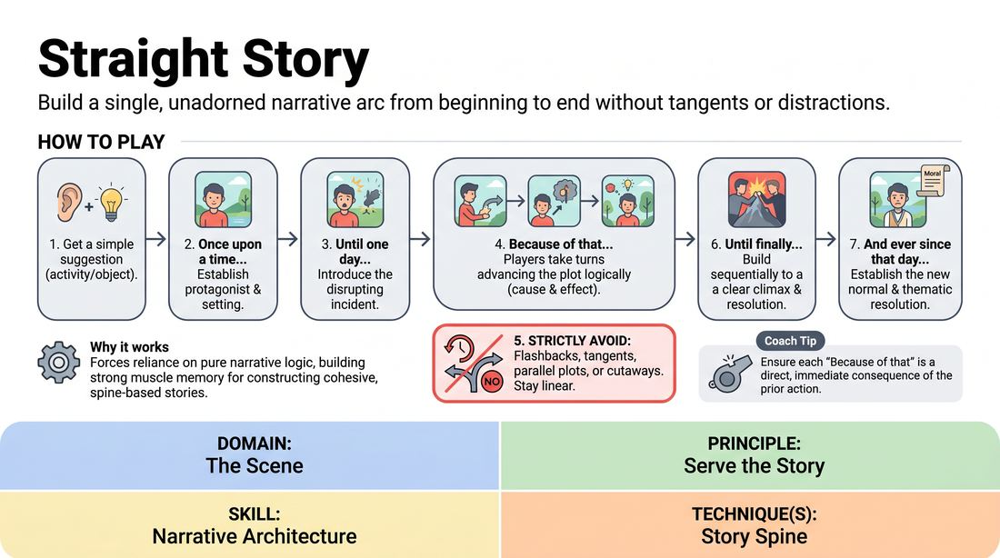

# Straight Story

{ .game-hero }

> Build a single, unadorned narrative arc from beginning to end without tangents or distractions.

## Overview
In this exercise, players collaboratively construct a single, strictly chronological narrative. Unlike scenes that rely on flashbacks, parallel subplots, or meta-commentary, this game demands absolute adherence to a linear timeline and a single protagonist's journey. The result is a clean, focused narrative that emphasizes cause-and-effect progression.

## What It Trains
- **Domain:** D3 — The Scene
- **Principle(s):** Serve the Story; Serve the Piece
- **Skill(s):** Narrative Architecture; Pacing & Rhythm; Thematic Synthesis
- **Technique(s):** Story Spine
- **Focus:** narrative

**Objective:** To master narrative architecture and pacing by utilizing the Story Spine technique, training players to resist distractions and serve the core story.

## At a Glance
| Aspect | Detail |
|---|---|
| Players | 2+ (ideal 4-8) |
| Time | ~15 min |
| Complexity | 3/5 |
| Skill level | competent |
| Energy | medium |
| Physicality | low |
| Modality | in_person |
| Space | moderate |
| Props | none |
| Audience | not required |

## Setup
Players stand in a semi-circle facing the facilitator. No props or special staging are required.

## How to Play
1. The facilitator obtains a simple suggestion of an everyday activity or mundane object to inspire the protagonist's starting point.
2. The first player steps forward to establish the protagonist, the setting, and the initial status quo using the classic opening: 'Once upon a time...'
3. The next player introduces the inciting incident that disrupts this status quo, beginning with: 'And every day... Until one day...'
4. Subsequent players take turns advancing the plot chronologically, with each contribution serving as a direct consequence of the previous line, using the prompt: 'And because of that...'
5. Players must strictly avoid flashbacks, parallel subplots, cutaway jokes, or introducing unrelated characters.
6. The narrative must build sequentially toward a clear climax where the main conflict is confronted and resolved: 'Until finally...'
7. The final players establish the new status quo and the thematic resolution of the journey: 'And ever since that day... and the moral of the story is...'

## Facilitation Notes
- Side-coach cause-and-effect by calling out: 'If that happened, what is the immediate, logical next step?'
- Watch out for the 'B-Plot Pitfall' where players introduce a new character's perspective. Fix this by pausing and asking the player to reframe their contribution through the main protagonist's eyes.
- Encourage players to spend time in the middle of the story spine. Rushing to the climax too quickly robs the narrative of tension and pacing.
- Remind players that being obvious and logical is more satisfying for the narrative than trying to be clever or wacky.

## Variations
- Physicalized Beats: Instead of just narrating, players step into the center to physically act out each linear beat as it is spoken, maintaining the strict chronological constraint.
- The Conducted Spine: The facilitator points to random players to continue the linear story mid-sentence, forcing absolute focus on the immediate narrative thread.
- Silent Linear Scene: Two players perform a silent scene where every action must be a direct, logical physical reaction to the previous action, with no jumps in time.

## Debrief
- How did it feel to resist the urge to introduce sudden twists, flashbacks, or side-gags?
- How does a strict chronological structure help the audience track and care about the protagonist?
- What did you notice about the pacing when we focused purely on cause-and-effect?

## Safety & Inclusion
Ensure that the narrative topics chosen remain inclusive and that players feel comfortable passing their turn if they get stuck on a narrative beat.

## Why It Works
By stripping away the safety nets of flashbacks, meta-comedy, and side-quests, players are forced to rely on pure narrative logic. This builds muscle memory for the Story Spine, teaching improvisers how to construct satisfying, cohesive story arcs that respect the audience's attention and serve the overall piece.
