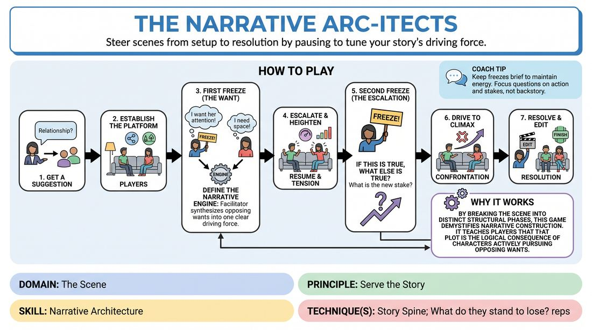

# Narrative Engine Room

{ .game-hero }

> Steer scenes from setup to resolution by pausing to tune your story's driving force.

## Overview
A structured, coach-guided scene exercise designed for virtual play where players build a complete narrative arc in real-time. By pausing at critical structural beats, the facilitator helps players identify character objectives, establish a central conflict engine, and escalate stakes to a satisfying climax.

## What It Trains
- **Domain:** D3 — The Scene
- **Principle(s):** Serve the Story; Yes, And
- **Skill(s):** Narrative Architecture; Stakes / The 'Want'; Justification; Active Listening
- **Technique(s):** Story Spine; What do they stand to lose? reps; Justify the absurd
- **Focus:** narrative

**Objective:** To develop a practical understanding of narrative architecture, specifically how to identify a scene's core driving conflict (the 'engine') and use character wants to fuel rising action, climax, and resolution.

## Setup
Played virtually via video conferencing with 3 to 5 players. The facilitator prepares to use verbal 'Freeze' cues. No physical props or space are required; players should ensure their cameras are framed well for virtual scene work.

## How to Play
1. 1. Get a Suggestion: The facilitator obtains a simple, relationship-focused suggestion to kick off the scene.
2. 2. Establish the Platform: Two players begin the scene, focusing on establishing their characters, their relationship, and the physical environment within the first 45 seconds.
3. 3. First Freeze (The Want): The facilitator calls 'Freeze!' and asks Player A to state their character's deep, immediate 'want' or problem, then asks Player B how this want impacts them or what opposing want they hold.
4. 4. Define the Narrative Engine: The facilitator synthesizes these two wants into a single, clear 'Narrative Engine' and instructs players to resume, focusing entirely on fueling this engine.
5. 5. Escalate and Heighten: Players resume the scene, actively making choices that raise the stakes and complicate the core engine.
6. 6. Second Freeze (The Escalation): If the scene plateaus, the facilitator freezes the action again and asks: 'If this is true, what else is true? What is the new, higher stake or surprising piece of information that raises the pressure?'
7. 7. Drive to Climax: Players resume, incorporating the new stakes to push the scene toward a critical turning point or confrontation where the central conflict must be addressed.
8. 8. Resolve and Edit: The players allow the climax to settle into a clear resolution (whether a compromise, a rupture, or a change in status), and the facilitator calls 'Scene' to conclude.

## Facilitation Notes
- Side-coaching cue: 'Play the consequence, not just the concept!' Encourage players to let the facilitator's prompts immediately alter their emotional state.
- Pitfall & Fix: Players might over-intellectualize during the freezes, losing their emotional connection. Fix: Keep the freeze questions rapid-fire and demand gut-level, character-first answers rather than clever plot-writing.
- Side-coaching cue: 'What is the cost of not getting what you want?' Use this to instantly raise low stakes.
- Pitfall & Fix: The scene becomes a debate. Fix: Remind players to use physical action (object work) or emotional shifts to advance the plot, rather than just arguing.

## Variations
- Player-Led Freezes: Once competent, players can call 'Freeze!' themselves to declare their own wants or name the emergent narrative engine.
- The Third Wheel: Introduce a third player during Phase 2 who enters with a complication that directly threatens or accelerates the established Narrative Engine.

## Debrief
- How did explicitly naming the 'Narrative Engine' change how you listened to your partner's offers?
- What did it feel like to transition from the analytical 'freeze' state back into the active, emotional scene?
- How did applying 'if this is true, what else is true' help us find a natural climax instead of forcing an artificial ending?

## Safety & Inclusion
Since this game involves frequent, sudden interruptions ('Freeze!'), establish a clear distinction between a pedagogical 'Freeze' and a safety 'Stop' or 'Cut' word. Ensure players know they can adjust their character's 'want' if the prompted direction feels uncomfortable or crosses personal boundaries.

## Why It Works
By breaking the scene down into distinct structural phases, this game demystifies narrative construction. It teaches players that plot is not a series of random events, but rather the logical consequence of characters actively pursuing opposing or high-stakes objectives. The 'freeze' mechanic acts as a training wheel, allowing players to build the cognitive muscle memory needed to identify and drive narrative arcs in uncoached, real-time play.
