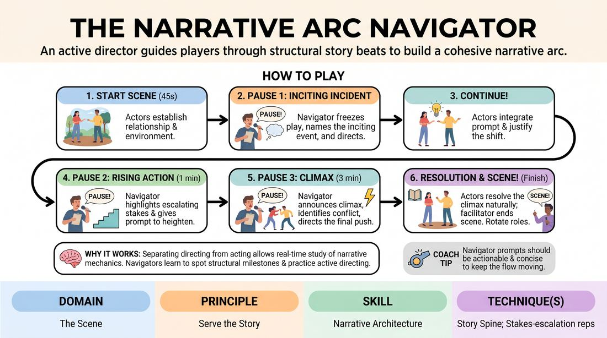

# The Narrative Arc Navigator

{ .game-hero }

> An active director guides players through structural story beats to build a cohesive narrative arc.

## Overview
In this exercise, two actors improvise a scene while a third player acts as the Navigator who periodically pauses the action. The Navigator explicitly names the current narrative stage (such as the inciting incident or rising action) and directs the actors with a specific prompt to propel the story forward. This makes the invisible architecture of storytelling visible, collaborative, and highly structured.

## What It Trains
- **Domain:** D3 — The Scene
- **Principle(s):** Serve the Story; Yes, And
- **Skill(s):** Narrative Architecture; Stakes / The 'Want'; Raising the Stakes; Offer Reception; Active Gifting
- **Technique(s):** Story Spine; Stakes-escalation reps; Endowment-acceptance; Endowment-gifting drills
- **Focus:** narrative

**Objective:** To develop a conscious, real-time awareness of narrative structure, genre conventions, and escalating stakes, transforming reactive play into deliberate story construction.

## Setup
Conducted in a virtual meeting space using Gallery View. Two players act as the Actors with cameras on, one player acts as the Navigator with camera on and microphone ready, and other participants turn their cameras off to act as the audience. Get a simple, non-narrative suggestion from the group to inspire the start.

## How to Play
1. Assign roles: two Actors and one Navigator. The remaining players observe with cameras off.
2. The Actors begin a scene based on the suggestion, focusing on establishing their relationship, environment, and initial point of view.
3. After about 45 seconds, the Navigator calls PAUSE! The Actors freeze in place. The Navigator identifies the Inciting Incident based on what just happened, names an emerging genre, and gives the Actors a specific directive to advance the plot.
4. The Navigator calls CONTINUE! The Actors unfreeze and immediately justify and integrate the Navigator's directive into their scene.
5. After another minute of play, the Navigator calls PAUSE! again. They declare the scene is in Rising Action, highlight how the stakes have escalated, and prompt the Actors with a new complication or a clear character want to drive toward a turning point.
6. The Navigator calls CONTINUE! and the Actors play out the heightened stakes and complications.
7. Near the three-minute mark, the Navigator calls PAUSE! a final time to announce the Climax. They identify the core thematic conflict and direct the Actors to execute a major revelation or decisive action.
8. The Navigator calls CONTINUE! and the Actors play the climax through to a natural, satisfying resolution, at which point the facilitator calls Scene!
9. Rotate roles so every participant experiences both active acting and structural navigation.

## Facilitation Notes
- Coaching Cue: Encourage the Navigator to base their prompts on what the actors have already established, rather than inventing completely random plot twists out of thin air.
- Pitfall: Actors sometimes over-intellectualize the Navigator's prompt, causing the scene's momentum to stall. Fix: Remind actors to react emotionally first, then justify the prompt physically or verbally.
- Coaching Cue: If the Navigator struggles to identify a genre, suggest they pick a broad, recognizable one (like melodrama, western, sci-fi, or soap opera) that matches the current emotional temperature of the scene.
- Pitfall: The Navigator waits too long to pause, letting the scene wander. Fix: Keep a strict timer or coach the Navigator to pause at the very first sign of an interesting disruption.

## Variations
- The Genre Shift: The Navigator changes the genre at each pause (e.g., starting as a kitchen-sink drama, shifting to a thriller, and ending as a sci-fi epic), forcing the actors to instantly adapt their style.
- Silent Navigator: Instead of speaking, the Navigator uses the chat window to type the narrative stage and the next prompt, keeping the auditory space clear for the actors.
- Audience Navigation: The audience uses virtual reaction emojis or chat to vote on the next narrative beat, and the Navigator synthesizes their input into the prompt.

## Debrief
- For the Actors: How did having an external force dictate your narrative direction change how you listened to your partner?
- For the Navigator: What cues did you look for to decide that an inciting incident or escalation had occurred?
- How did naming the genre explicitly help or hinder the choices you made in the scene?
- In what ways can we apply this meta-awareness of story structure when we do not have an external Navigator guiding us?

## Safety & Inclusion
Because the Navigator has direct control over the narrative trajectory, establish a boundary word or use standard virtual safety protocols if a prompt accidentally pushes a scene into uncomfortable territory. Ensure the Navigator's prompts respect the players' pre-stated boundaries.

## Why It Works
By separating the cognitive load of directing the story from the emotional load of acting the scene, this game allows players to study narrative mechanics in real-time. The Navigator learns to spot structural milestones and practice active gifting, while the Actors practice radical offer reception and justification, ultimately training the ensemble to serve the story over individual ego.
