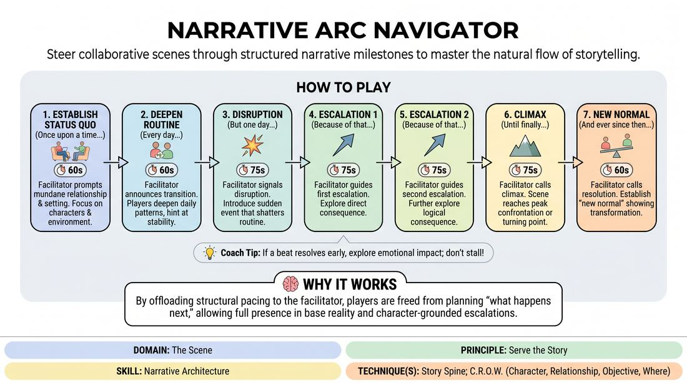

# Narrative Arc Navigator

{ .game-hero }

> Steer collaborative scenes through structured narrative milestones to master the natural flow of storytelling.

## Overview
This structured, facilitator-guided exercise helps players navigate the classic stages of a story arc in real time. Operating in a virtual space, players collaborate to build a stable reality, introduce a disruptive catalyst, escalate the stakes, and resolve the narrative. The guided pacing helps improvisers internalize story structure without losing the joy of spontaneous character play.

## What It Trains
- **Domain:** D3 — The Scene
- **Principle(s):** Serve the Story; Base Reality First; Yes, And
- **Skill(s):** Narrative Architecture; Stakes / The 'Want'; World-Building; Justification; Active Listening
- **Technique(s):** Story Spine; C.R.O.W. (Character, Relationship, Objective, Where); If this is true, what else is true?; Stakes-escalation reps
- **Focus:** narrative

**Objective:** To build intuitive narrative architecture skills by practicing the Story Spine framework, helping players establish a firm base reality, introduce high-stakes objectives, and execute logical cause-and-effect progression.

## At a Glance
| Aspect | Detail |
|---|---|
| Players | 3+ (ideal 3-12) |
| Time | ~15 min |
| Complexity | 3/5 |
| Skill level | advanced_beginner |
| Energy | medium |
| Physicality | low |
| Modality | virtual |
| Space | minimal |
| Props | yes |
| Audience | not required |

## Setup
Conducted in a virtual meeting room. The facilitator prepares a shared screen or chat template displaying the seven narrative milestones (Once upon a time, Every day, But one day, Because of that, Because of that, Until finally, And ever since then). Two to three active players turn their cameras on; all other participants turn their cameras off to act as the audience.

## How to Play
1. The facilitator displays the seven narrative milestones on screen and prompts the active players with a mundane, low-stakes relationship and setting.
2. Phase 1 (Once upon a time): The facilitator starts a 60-second timer. Players establish their characters, relationship, and environment, focusing entirely on ordinary, low-stakes routines.
3. Phase 2 (Every day): The facilitator announces the transition. For 60 seconds, players deepen this status quo, establishing repetitive daily patterns and hinting at unfulfilled desires.
4. Phase 3 (But one day): The facilitator signals the disruption. For 75 seconds, players introduce a sudden event that shatters their routine, forcing a character to declare a clear, high-stakes objective.
5. Phase 4 & 5 (Because of that): The facilitator guides two successive 75-second escalation phases. Players explore the direct, logical consequences of the disruption, using 'yes, and' to raise the stakes and complicate their objective.
6. Phase 6 (Until finally): The facilitator calls the climax. For 75 seconds, the scene reaches its peak confrontation or decisive turning point, forcing a permanent choice or revelation.
7. Phase 7 (And ever since then): The facilitator calls the resolution. For 60 seconds, players establish the 'new normal,' showing how their world has been transformed before the facilitator calls 'Scene!'
8. If a phase naturally resolves or reaches its narrative beat before the timer runs out, players should not stall; instead, they must explore the immediate emotional aftermath or deepen their character relationship within that new reality until the next prompt.

## Facilitation Notes
- Managing Cognitive Load: To reduce player anxiety during rapid transitions, the facilitator should drop a 10-second warning in the chat or use a gentle verbal cue (e.g., 'Preparing to transition...') before calling the next milestone.
- Handling Early Resolutions: If players resolve a conflict or reach a milestone ahead of schedule, coach them to explore the 'micro-beats'—focusing on character reactions, sensory details of the environment, or deepening the relationship rather than inventing new plot points.
- Dynamic Timer Adjustments: As facilitator, remain flexible. If a scene is flowing beautifully but needs more time to breathe, extend a phase by 15 seconds. Conversely, if a beat is fully realized, call the next transition early to keep the momentum high.
- Side-Coaching the 'Want': If players get bogged down in plot mechanics during the 'Because of that' phases, call out: 'What does your character want right now?' to ground the narrative back in character-driven stakes.

## Variations
- The Chat-Only Navigator: To lower cognitive load and support different processing styles, the facilitator posts the prompts silently in the chat window, allowing players to focus entirely on the verbal scene without auditory interruptions.
- The Relay Arc: For larger groups, when the facilitator calls a new narrative phase, the active players turn their cameras off, and a new set of players instantly turn their cameras on to inherit the characters and continue the story.
- The Solo Odyssey: A single player takes on all roles, narrating the story and playing multiple characters, using the milestones to practice solo narrative control and physical character differentiation.

## Debrief
- How did having the structural milestones called out for you change your focus during the scene?
- When a phase resolved early, how did you fill the remaining time without rushing the plot forward?
- What strategies helped you manage the cognitive load of listening to your partner while anticipating the next transition?

## Safety & Inclusion
To ensure a safe virtual environment, establish a 'Pause' gesture (like a hand to the camera) that any player can use if an escalation crosses a personal boundary. For accessibility, the facilitator should provide both verbal and visual cues (via chat or screen share) for all transitions to accommodate different processing and sensory needs.

## Why It Works
By offloading the structural pacing to the facilitator, players are freed from the cognitive burden of planning 'what happens next.' This allows them to stay fully present in the base reality, ensuring that escalations are grounded in character relationships rather than arbitrary plot twists. Over time, this builds an organic muscle memory for narrative pacing.
