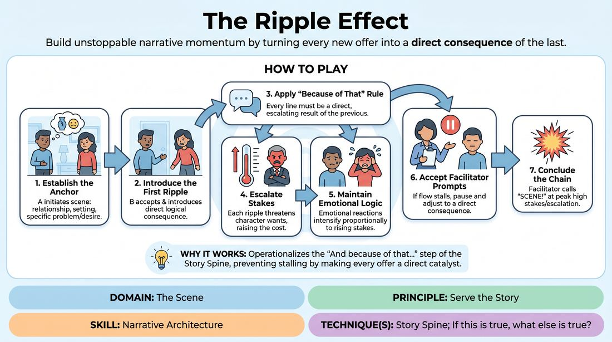

# The Ripple Effect

{ .game-hero }

> Build unstoppable narrative momentum by turning every new offer into a direct consequence of the last.

## Overview
A focused scene-work exercise where players construct a tight, high-stakes narrative by treating every line as a direct domino effect of the previous action. Instead of introducing random new details, players must ask 'If this is true, what must happen next?' to escalate the tension and drive the plot forward. The result is a highly logical, emotionally charged story where every choice has immediate, unavoidable consequences.

## What It Trains
- **Domain:** D3 — The Scene
- **Principle(s):** Serve the Story; Yes, And
- **Skill(s):** Narrative Architecture; Stakes / The 'Want'; Justification; Raising the Stakes; Active Listening; Offer Reception
- **Technique(s):** Story Spine; If this is true, what else is true?; Stakes-escalation reps; Yes, And… sentence games
- **Focus:** narrative

**Objective:** To master narrative architecture and story progression by replacing simple additive 'Yes, And' offers with rigorous cause-and-effect justification that raises stakes and challenges character motivations.

## Setup
Two to three players stand in the performance space, with the facilitator positioned close by to actively coach. No props or special staging are required; a simple open space is ideal.

## How to Play
1. Establish the Anchor: Player A initiates a scene by establishing a clear relationship, setting, and a specific personal problem or desire.
2. Introduce the First Ripple: Player B enters the scene, accepting the premise and immediately introducing a direct, logical consequence of Player A's initiation.
3. Apply the 'Because of That' Rule: Every subsequent line spoken by any player must act as a direct, escalating result of the immediately preceding line, following the formula: 'Because that happened, this new crisis or change occurs.'
4. Escalate the Stakes: Each ripple must actively threaten what a character wants, making their objective harder to achieve or raising the cost of failure.
5. Maintain Emotional Logic: Ensure that as the physical or situational stakes rise, the characters' emotional reactions intensify proportionally to keep the scene grounded.
6. Accept Facilitator Prompts: If a player introduces an unrelated detail or a flat 'Yes, And' that doesn't move the plot, they must pause and adjust their line based on the facilitator's side-coaching.
7. Conclude the Chain: The facilitator calls 'scene' once the narrative has reached a peak of high stakes and clear escalation, typically after five to six major causal exchanges.

## Facilitation Notes
- Side-Coaching Cues: Use active prompts like 'Because of that, what is ruined?', 'If that is true, what is the immediate danger?', or 'How does this make their goal harder to reach?'
- Pitfall - Lateral Adding: Players often add unrelated details instead of building on the current crisis. Fix: Freeze the scene and ask, 'How does that new detail directly result from the previous line? If it doesn't, discard it and try again.'
- Pitfall - Soft Consequences: Players might offer consequences that don't actually change the situation or raise stakes. Fix: Coach them to make the consequence directly impact the character's main desire or resources.
- Pacing: Keep the tempo medium; give players a moment to think about the logical domino effect rather than rushing into a generic response.

## Variations
- The Silent Ripple: Play the same cause-and-effect chain but entirely through physical action and object work, where every physical movement must be a reaction to the partner's physical choice.
- The Multi-Character Web: Run the game with three players where Player C represents an outside force that enters only to deliver the ultimate systemic consequence of the first two players' actions.

## Debrief
- How did focusing strictly on cause-and-effect change the speed at which the story's stakes escalated?
- Did you find it easier or harder to know what to say next when your partner's line dictated your exact starting point?
- What is the difference between simply adding information ('Yes, And') and creating a consequence ('Because of that')?

## Safety & Inclusion
Because this game rapidly escalates stakes, players should establish boundaries before starting regarding high-stress themes (such as financial ruin or physical danger) to ensure the escalation remains fun and collaborative.

## Why It Works
This game works because it operationalizes the 'And because of that...' step of the classic Story Spine. By forcing players to treat every offer as a direct catalyst, it prevents narrative stalling and 'waffling.' It teaches improvisers that compelling plots are not built by inventing new ideas, but by fully exploiting the logical and emotional consequences of the ideas already on the table.
