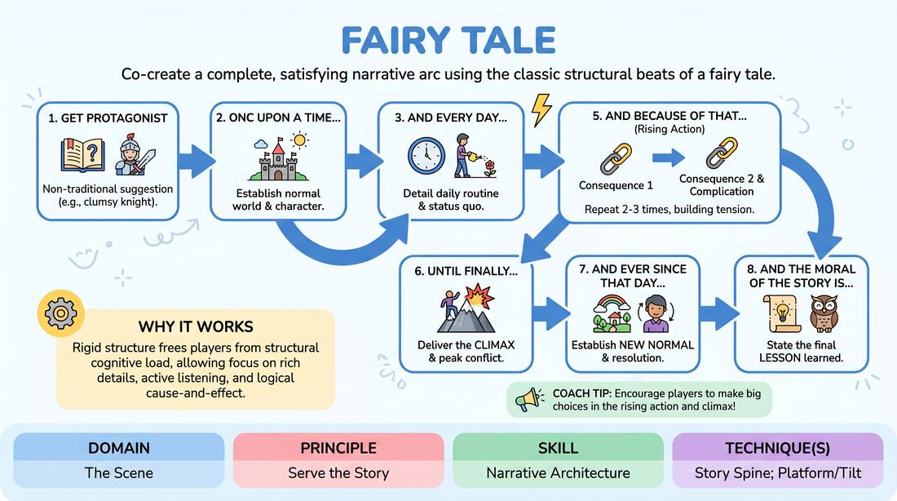

# Fairy Tale Spine

{ .game-hero }

> Co-create a complete, satisfying narrative arc using the classic structural beats of a fairy tale.

## Overview
Fairy Tale Spine is a collaborative storytelling game where players construct a cohesive narrative from scratch. Using a structured sequence of prompts, players build a world, introduce a conflict, and resolve it with a clear moral. The experience emphasizes active listening, cause-and-effect logic, and shared narrative control.

## What It Trains
- **Domain:** D3 — The Scene
- **Principle(s):** Serve the Story; Serve the Piece
- **Skill(s):** Narrative Architecture; World-Building; Thematic Synthesis
- **Technique(s):** Story Spine; Platform/Tilt
- **Focus:** narrative

**Objective:** Develops narrative architecture, thematic synthesis, and collaborative world-building by utilizing the Story Spine technique to ensure a satisfying story arc.

## At a Glance
| Aspect | Detail |
|---|---|
| Players | 2+ (ideal 3-5) |
| Time | ~5 min |
| Complexity | 3/5 |
| Skill level | advanced_beginner |
| Energy | medium |
| Physicality | medium |
| Modality | in_person |
| Space | moderate |
| Props | none |
| Audience | not required |

## Setup
Players stand in a line or a semi-circle facing the audience or each other. No props or physical materials are required.

## How to Play
1. Gather a suggestion from the group for a non-traditional protagonist (e.g., a clumsy knight or a vegetarian giant) to inspire the story.
2. The first player begins the narrative by establishing the protagonist's normal world, starting with the phrase: 'Once upon a time...'
3. The second player adds detail to this daily routine, starting with the phrase: 'And every day...'
4. The third player introduces the inciting incident that disrupts this status quo, starting with the phrase: 'Until one day...'
5. The next players take turns building the rising action and consequences of that disruption, with each player starting their contribution with: 'And because of that...'
6. After two or three rounds of consequences, a player steps forward to deliver the climax of the story, starting with the phrase: 'Until finally...'
7. The next player establishes the new normal and the resolution of the conflict, starting with the phrase: 'And ever since that day...'
8. The final player concludes the story by stating the lesson learned, starting with the phrase: 'And the moral of the story is...'

## Facilitation Notes
- Coaching Cue: Keep your contributions brief—one or two sentences per turn is plenty to advance the plot without hijacking the narrative.
- Pitfall: Players often use 'And then...' instead of 'And because of that...' which leads to a series of disconnected events. Fix: Gently side-coach players to focus on direct cause-and-effect.
- Coaching Cue: Listen closely to the player immediately before you to ensure your contribution directly builds on their specific offer.
- Pitfall: Rushing to the climax too quickly. Fix: Ensure there are at least three distinct 'And because of that' beats to build tension and stakes before triggering the 'Until finally' beat.

## Variations
- Physicalized Scenes: Instead of pure narration, players act out the scenes in real-time as they are being narrated, stepping into characters and dialogue.
- The Twisted Classic: Take a well-known fairy tale and change one fundamental rule or character trait at the beginning, then use the spine to discover how the story changes.
- Genre Mashup: Apply the exact same narrative spine structure to a completely different genre, such as a space opera, a corporate thriller, or a film noir.

## Debrief
- How did having a strict structural template affect your creative freedom? Did it feel limiting or liberating?
- What is the difference between a story driven by 'And then...' versus one driven by 'And because of that...'?
- How did you ensure that the final moral felt earned by the events of the story?

## Safety & Inclusion
Fairy tales often rely on outdated archetypes. Encourage players to subvert traditional gender roles, physical stereotypes, and moral binaries to create a more inclusive and modern narrative.

## Why It Works
By using a rigid structural template, players are freed from the cognitive load of deciding 'what happens next' structurally. This allows them to focus entirely on rich character details, active listening, and logical cause-and-effect, resulting in a highly cohesive and satisfying story.
