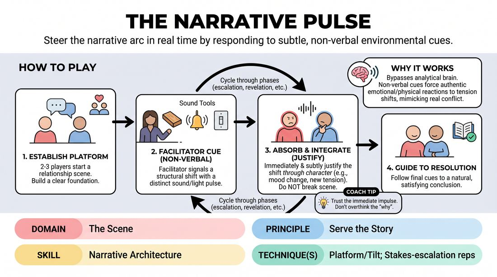

# The Narrative Pulse

{ .game-hero }

> Steer the narrative arc in real time by responding to subtle, non-verbal environmental cues.

## Overview
In this exercise, two or three players perform an open scene while a facilitator monitors the story's structural health from the sidelines. Using a series of distinct, non-verbal auditory or visual signals, the facilitator prompts shifts in narrative tension, pacing, and stakes. Players must seamlessly absorb these environmental 'pulses' and translate them into organic character choices without breaking the reality of the scene.

## What It Trains
- **Domain:** D3 — The Scene
- **Principle(s):** Serve the Story; Serve the Piece; Make Your Partner a Genius
- **Skill(s):** Narrative Architecture; Raising the Stakes; Pacing & Rhythm; Active Listening; Offer Reception
- **Technique(s):** Platform/Tilt; Stakes-escalation reps; Timing exercises
- **Focus:** narrative

**Objective:** To develop a shared, intuitive grasp of narrative architecture—specifically recognizing when a platform is stable, when to introduce a tilt, and how to escalate stakes or guide a story toward resolution.

## At a Glance
| Aspect | Detail |
|---|---|
| Players | 3+ (ideal 6-12) |
| Time | ~15 min |
| Complexity | 3/5 |
| Skill level | competent |
| Energy | medium |
| Physicality | low |
| Modality | in_person |
| Space | moderate |
| Props | sound makers (clicker, chime, wood block), dimmable lights (optional) |
| Audience | not required |

## Setup
An open performance space with moderate lighting. The facilitator stands or sits at the edge of the playing area, equipped with simple sound makers (such as a wood block, a clicker, or a chime) or access to dimmable lights. The rest of the group sits as an active audience. Before starting, the facilitator briefly defines 3 to 4 distinct non-verbal cues and their corresponding narrative meanings.

## How to Play
1. Select two or three players to step into the performance space and initiate a standard, relationship-focused scene to establish a clear platform.
2. Position the facilitator at the edge of the stage, holding the sound-making tools or standing near the light controls, ready to act as the narrative monitor.
3. Instruct the active players to perform their scene naturally, focusing on their characters, environment, and immediate relationship.
4. As the scene progresses, the facilitator listens for narrative milestones or stagnation points, then issues a specific non-verbal cue to signal a structural shift.
5. Upon hearing or seeing a cue (such as a sharp wood-block click signaling a 'tilt' or a soft chime signaling 'resolution'), the players must immediately but subtly adjust their behavior to match the prompt.
6. Ensure players do not break character, look at the facilitator, or verbally acknowledge the cue; instead, they must justify the shift through their character's internal state or environmental changes.
7. Continue the scene through multiple narrative phases—such as escalation, revelation, and resolution—guided entirely by the facilitator's rhythmic cues.
8. End the scene once the resolution cue has been fully integrated and the story reaches a natural, satisfying conclusion.

## Facilitation Notes
- Coaching Cue: 'Don't look at me, look at your partner. Let the sound change how you feel about them.'
- Pitfall: Players treat the cues like literal commands (e.g., hearing a click and saying 'What was that sound?'). Fix: Remind players that the cues represent internal shifts in tension or environmental atmosphere, not literal in-world noises.
- Coaching Cue: 'If the stakes rise, let your physical proximity or vocal volume reflect that tension immediately.'
- Pitfall: The facilitator over-cues, giving players no time to explore a beat. Fix: Allow at least 30 to 45 seconds between cues so players can fully establish and play out each narrative shift.
- Ensure the cues are distinct; using too many similar sounds (e.g., three different types of claps) will confuse players and stall the narrative flow.

## Variations
- Blind Pulse: The players perform the scene with their eyes closed (or in a static physical position) to heighten their auditory sensitivity to the sound cues.
- Player-Driven Pulse: An off-stage player takes over the facilitator's role, using the sound makers to direct their classmates' narrative arc.
- The Silent Pulse: The facilitator uses purely physical gestures (like raising a hand or taking a step forward) instead of sound makers, forcing players to maintain wide peripheral vision.

## Debrief
- How did it feel to have your narrative pacing guided by an external, non-verbal force?
- Which cues felt the most intuitive to translate into character action, and which ones felt jarring?
- How did responding to the cues help you discover a 'tilt' or escalation that you might not have found on your own?
- In what ways did this exercise change how you listen to the overall rhythm and structure of a scene?

## Safety & Inclusion
Ensure that auditory cues are clear but not startlingly loud for players with sensory sensitivities. If using lighting shifts, avoid rapid flashing or sudden total blackouts to maintain physical safety and comfort in the space.

## Why It Works
By bypassing the analytical, verbal brain, non-verbal cues force players to react emotionally and physically to shifts in tension. This mimics the natural rise and fall of real-world conflict, teaching improvisers to feel the structural needs of a story (like the transition from platform to tilt) as a visceral shift in energy rather than a calculated writing choice.
