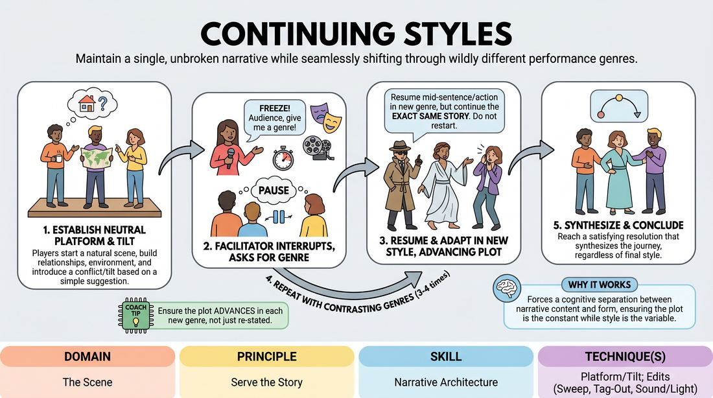

# Style Shift

{ .game-hero }

> Maintain a single, unbroken narrative while seamlessly shifting through wildly different performance genres.

## Overview
In this game, a team of players improvises a single, continuous scene that is periodically interrupted by a facilitator who calls out a new genre or style. Rather than starting over, the players must instantly adapt their physical and verbal choices to the new style while keeping the plot, characters, and narrative momentum completely intact. It challenges players to separate the 'what' of a story from the 'how' of its presentation.

## What It Trains
- **Domain:** D3 — The Scene
- **Principle(s):** Serve the Story; Group Mind; The Audience Is the Final Scene Partner
- **Skill(s):** Narrative Architecture; Pacing & Rhythm; Thematic Synthesis; Stage Presence & Clarity
- **Technique(s):** Platform/Tilt; Edits (Sweep, Tag-Out, Sound/Light); Weave the threads
- **Focus:** narrative

**Objective:** To develop narrative architecture and story preservation by practicing how to establish a solid platform and tilt, and then maintain that narrative spine even when the stylistic presentation is radically altered.

## Setup
An active playing area (stage) for 3 to 5 players, with the remaining workshop participants acting as the audience. A facilitator stands off-stage or at the side, ready to call out styles. No props or special materials are required.

## How to Play
1. Select 3 to 5 players to take the stage, and ask the audience for a simple, mundane suggestion to inspire the opening platform.
2. The players begin the scene in a 'neutral' style—acting naturally, establishing clear relationships, a solid environment, and a clear platform.
3. Once the platform is established and a narrative 'tilt' or conflict is introduced, the facilitator calls out 'Freeze!' or rings a bell to pause the action.
4. The facilitator asks the audience for a specific genre, film style, literary format, or television trope (such as Film Noir, Shakespearean Tragedy, or Reality TV).
5. On the facilitator's cue, the players unfreeze and immediately continue the exact same story, picking up mid-sentence or mid-action, but fully embodying the new style's physical, vocal, and thematic conventions.
6. The players must ensure that the plot continues to move forward; they should not repeat information or restart the scene, but rather advance the narrative using the tools of the new genre.
7. The facilitator repeats this process 3 to 4 times throughout the scene, challenging the players with increasingly contrasting styles.
8. The scene concludes when the players reach a satisfying narrative resolution that synthesizes the story's journey, regardless of the final style active at the end.

## Facilitation Notes
- Coaching Cue: 'Keep the story moving!' Remind players that a change in style is not a reset button; the plot must advance, not loop.
- Pitfall: Players often abandon their established characters or relationships when a new style is called. Fix: Encourage them to translate their existing character dynamics into the new genre's vocabulary.
- Coaching Cue: 'Commit to the physical vocabulary!' Encourage players to immediately change their posture, pacing, and spatial relationships to match the new genre's aesthetic.
- Pitfall: The scene becomes a series of disconnected gags. Fix: Side-coach with 'What is the core conflict here?' to ground them back in the narrative architecture.

## Variations
- Audience-Driven Shifts: Instead of the facilitator pausing the scene, the audience can call out styles from a pre-written list whenever they feel the energy plateauing.
- Emotional States: Instead of genres, shift the scene through extreme emotional states (such as paranoia, toxic positivity, or existential dread) while keeping the plot moving.
- Author/Director Styles: For advanced players, use specific directors or authors (such as Wes Anderson, Quentin Tarantino, or Jane Austen) to demand deeper thematic synthesis and stylistic precision.

## Debrief
- How did changing the style affect your ability to track the narrative arc? Did it help or hinder the story's progression?
- What strategies did you use to keep your character's core relationships consistent even when your physical and vocal choices changed?
- How does focusing on a strong platform at the beginning make it easier to survive sudden narrative disruptions?

## Safety & Inclusion
Ensure that the suggested genres or styles are inclusive and do not rely on offensive cultural stereotypes. If a style is called out that a player is unfamiliar with, they should be encouraged to play their honest interpretation of what that style sounds like, or the facilitator can quickly offer a one-sentence definition to keep the play equitable.

## Why It Works
This game works because it forces a cognitive separation between narrative content (the platform, tilt, and resolution) and narrative form (the genre or style). By keeping the story constant while shifting the style, players learn that a strong narrative spine can support any aesthetic. It trains group mind and pacing, as players must collectively agree on how the current story beat translates into the new genre's tropes instantly.
