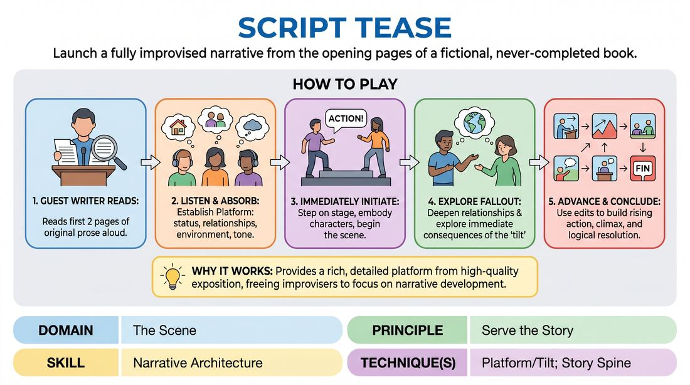

# The Unwritten Novel

{ .game-hero }

> Launch a fully improvised narrative from the opening pages of a fictional, never-completed book.

## Overview
In this long-form narrative format, a guest writer reads the first two pages of an original, non-existent novel. The improvisers listen intently to establish the characters, setting, and tone, then immediately step onto the stage to improvise the rest of the story. It is a high-wire act of narrative architecture, transforming a written literary platform into a living, breathing theatrical piece.

## What It Trains
- **Domain:** D3 — The Scene
- **Principle(s):** Serve the Story; Serve the Piece
- **Skill(s):** Narrative Architecture; World-Building; Format Literacy
- **Technique(s):** Story Spine; Platform/Tilt; Longform vs. shortform mechanics
- **Focus:** narrative

**Objective:** To develop narrative architecture and format literacy by identifying a written platform and tilt, then collaboratively building a satisfying story arc that honors the established tone and world.

## Setup
Set up a comfortable chair and a reading light on one side of the stage for the guest writer. The performance space should be clear for the improvisers. Prepare a guest writer beforehand to bring two pages of a custom, non-existing novel (rich in character, setting, and a clear inciting incident or 'tilt'). The improvisers stand offstage or in the wings, ready to listen.

## How to Play
1. Introduce the guest writer and invite them to sit at the designated reading station with their two pages of original, unreleased prose.
2. The guest writer reads the two pages aloud to the audience and the cast, establishing the story's platform (the status quo, relationships, and environment) and introducing a 'tilt' (the disruption or inciting incident) by the end of the reading.
3. As soon as the reading concludes, the guest writer steps back or remains seated as an observer, and the improvisers immediately initiate the first scene, embodying the characters introduced in the text.
4. The cast uses the first few scenes to explore the immediate fallout of the 'tilt' read in the pages, establishing the physical world and deepening the relationships.
5. As the narrative progresses, players use edits (such as sweep edits or French scenes) to advance the timeline, introduce secondary characters mentioned in the text, or explore parallel storylines.
6. The ensemble collaborates to build the narrative architecture, driving the story through rising action, a climactic confrontation or realization, and a logical resolution that honors the writer's original tone.

## Facilitation Notes
- Coaching Cue: 'Honor the prose!' Remind players to match the vocabulary, genre, and emotional weight of the reading rather than turning it into a parody.
- Pitfall: Ignoring the details. Players sometimes rush into generic improv tropes. Fix: Actively listen during the reading for specific names, sensory details, and historical context, and reintroduce them early in the play.
- Coaching Cue: 'Find the Tilt.' Ensure the first scene directly addresses the disruption introduced at the end of the reading rather than resetting to a boring status quo.
- Pitfall: Over-crowding the stage. Fix: Encourage players to start with two-person scenes to ground the relationships before bringing in the full ensemble.

## Variations
- The Midpoint Interruption: The guest writer stops reading after one page, the cast improvises for 10 minutes, then the writer reads the second page, forcing the cast to instantly adapt to new written canon.
- The Multi-Genre Library: Have three different writers bring one page each of different genres (e.g., sci-fi, romance, noir). The cast must weave these three distinct openings into a single, cohesive multi-genre universe.

## Debrief
- How did the written word influence your physical choices and pacing compared to a standard audience suggestion?
- What clues in the text helped us identify the 'tilt' of the story, and how did we escalate it?
- How did we balance honoring the writer's specific voice with our own collaborative comedic or dramatic choices?

## Safety & Inclusion
Ensure the guest writer is briefed on the group's content boundaries beforehand so the written pages do not contain triggering material. If the text contains sensitive themes, the facilitator should provide a brief content warning to the audience and cast before the reading begins.

## Why It Works
This format works because it provides a rich, highly detailed 'platform' that is rarely achievable through quick audience suggestions. By starting with high-quality, pre-written exposition, the improvisers are freed from the burden of inventing a world from scratch, allowing them to focus entirely on narrative architecture, pacing, and serving the established story.
