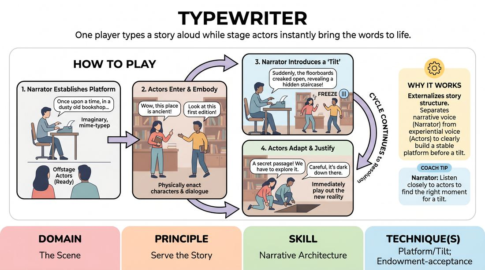

# Typewriter

{ .game-hero }

> One player types a story aloud while stage actors instantly bring the words to life.

## Overview
A narrative-driven scene structure where a designated narrator sits at an imaginary typewriter, speaking their prose aloud to establish the platform, characters, and sudden narrative shifts. The remaining players step into the performance space to physically and verbally play out the scenes described, seamlessly passing focus back and forth with the writer.

## What It Trains
- **Domain:** D3 — The Scene
- **Principle(s):** Serve the Story; Yes, And; Follow the Follower
- **Skill(s):** Narrative Architecture; Offer Reception; Active Gifting; Support Work; Pacing & Rhythm
- **Technique(s):** Platform/Tilt; Endowment-acceptance; Endowment-gifting drills; Edits (Sweep, Tag-Out, Sound/Light)
- **Focus:** narrative

**Objective:** To master narrative architecture by balancing narration and active scene work, specifically practicing how to establish a stable platform and introduce a compelling tilt that drives the story forward.

## Setup
Place a single chair downstage left or right for the Narrator. The rest of the stage remains clear for the active players. No physical props are needed; the typewriter is entirely mimed.

## How to Play
1. Assign one player to be the Narrator, who sits in the designated chair with an imaginary typewriter, while the other players stand offstage ready to perform.
2. The Narrator begins the game by miming typing and speaking the opening lines of a story, establishing the platform (who, where, what, and the initial status quo).
3. As soon as the Narrator introduces a character or action, the offstage players step into the playing space to physically embody those characters and speak their dialogue.
4. The active players perform the scene, building on the Narrator's setup using 'yes-and' to expand the details through physical action and dialogue.
5. The Narrator pauses typing while the players are acting, actively listening to their choices to discover where the story is heading.
6. To advance the narrative, the Narrator resumes typing and speaking, which signals the active players to freeze or exit as the Narrator introduces a 'tilt' (a disruptive event, a jump in time, a new location, or an unexpected character).
7. The players immediately adapt to the Narrator's new narrative direction, justifying the changes and playing out the consequences of the tilt.
8. The cycle of narration and active play continues, building a cohesive story arc with a beginning, middle, and satisfying resolution.

## Facilitation Notes
- Coaching cue: 'Show, don't just tell. Narrator, give them a platform, then let them play it out. Players, don't just wait for instructions—make active choices!'
- Pitfall: The Narrator over-narrates, leaving no room for the actors to play, or the actors ignore the narration. Fix: Remind the Narrator to speak in short paragraphs and then pause to let the scene breathe. Remind actors that the Narrator's word is absolute law.
- Coaching cue: 'Find the tilt! Narrator, disrupt the routine you just established to force a choice.'
- Pitfall: The story becomes a series of disconnected sketches. Fix: Encourage the Narrator to reintroduce established characters and call back to earlier plot points to weave a cohesive narrative thread.

## Variations
- The Editor's Cut: If a scene goes off track or loses momentum, the Narrator can mime ripping the paper out of the typewriter, saying 'No, that's all wrong,' and rewrite the last few moments with a completely different choice.
- Genre Shift: The Narrator must write in a specific literary genre (e.g., Noir, Sci-Fi, Gothic Romance), forcing both the prose and the actors' physical choices to match that style.
- Multiple Authors: Pass the typewriter to a new narrator between chapters, requiring the new writer to pick up the narrative thread seamlessly.

## Debrief
- How did it feel to balance control between the Narrator and the actors? Who was actually leading the story at any given moment?
- What made a 'tilt' successful in moving the story forward versus just confusing the actors?
- How did the actors use physical object work and dialogue to expand on the Narrator's simple descriptions?

## Safety & Inclusion
Ensure the physical space is clear of obstacles so actors can enter and exit safely. Since the Narrator has absolute narrative control, establish a pre-game boundary check or use a standard 'stop' signal if the narrative touches on sensitive or uncomfortable themes.

## Why It Works
This game externalizes the internal structure of storytelling. By separating the narrative voice (the Narrator) from the experiential voice (the actors), players learn to identify the exact moment a platform is stable enough to receive a tilt. It trains active gifting, as the Narrator's descriptions are gifts the actors must justify, while the actors' choices are gifts the Narrator must integrate into the next paragraph.
