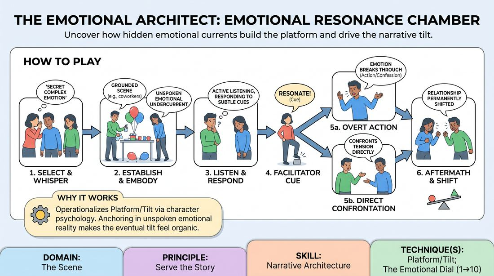

# Subtext Resonance Chamber

{ .game-hero }

> Uncover how hidden emotional currents build the platform and drive the narrative tilt.

## Overview
In this exercise, two players build a grounded scene where one carries a secret, complex emotional undercurrent. Rather than playing the emotion broadly, the player lets it subtly influence their physical choices, subtext, and reactions. As the partner responds to these unspoken cues, the facilitator triggers a shift that forces this hidden truth to erupt, transforming the scene's narrative trajectory.

## What It Trains
- **Domain:** D3 — The Scene
- **Principle(s):** Serve the Story; Show, Don't Tell; Vulnerability; Make Your Partner a Genius
- **Skill(s):** Narrative Architecture; Stakes / The 'Want'; Emotional Fluidity; Active Listening; Justification
- **Technique(s):** Platform/Tilt; The Emotional Dial (1→10); C.R.O.W. (Character, Relationship, Objective, Where)
- **Focus:** narrative

**Objective:** To develop narrative architecture by establishing a stable platform of subtext and executing a compelling narrative tilt. Players learn to use internal emotional states as a narrative engine, shifting from subtle behavioral cues to high-stakes dramatic action.

## Setup
An in-person playing space with two chairs or a clear stage area. The rest of the group acts as active observers. The facilitator prepares a list of complex, dual-layered emotional prompts (e.g., 'deeply relieved but hiding a secret shame' or 'quietly envious of a close friend's success') to whisper to one of the players before the scene begins.

## How to Play
1. Select two players to step into the performance space, designating one as Player A and the other as Player B.
2. The facilitator whispers a complex, nuanced emotional state or internal conflict to Player A, ensuring Player B cannot hear it.
3. Player B initiates a grounded, everyday scene, establishing a clear physical environment and relationship (e.g., two coworkers cleaning up after an office party).
4. Player A plays the scene by fully embodying the secret emotion, letting it influence their posture, eye contact, and vocal subtext without ever explicitly naming or over-acting the feeling.
5. Player B actively listens and observes, responding naturally to Player A's subtle behavioral shifts and attempting to read the unspoken tension in the room.
6. Once a stable platform is established, the facilitator lightly taps their foot or gives a verbal cue ('Resonate') to signal that the hidden emotion must now drive a narrative tilt.
7. Upon hearing the cue, Player A must allow the emotion to break through their subtlety into an overt action or confession, or Player B must directly confront the behavioral shift they have observed.
8. Both players play out the immediate, high-stakes aftermath of this revelation for a few more beats, exploring how the relationship has permanently shifted before the facilitator calls 'scene'.

## Facilitation Notes
- Coaching Cue: Remind Player A to 'live in the subtext' rather than 'show' the emotion. If they are playing envy, they shouldn't sneer; they should try to be genuinely happy for their partner while feeling the internal sting.
- Pitfall & Fix: A common pitfall is Player B immediately guessing the emotion like a parlor game. Fix this by coaching Player B to react to the behavior rather than trying to name the abstract emotion (e.g., 'You're acting distant' instead of 'Are you feeling guilty?').
- Coaching Cue: When triggering the tilt, ensure the shift feels justified. The tap shouldn't feel like a random disruption, but rather the natural boiling point of the established platform.
- Pitfall & Fix: Player A might make a sudden, ungrounded confession that breaks reality. Fix this by instructing them to let the emotion drive a physical action or a justified character choice rather than a melodramatic speech.

## Variations
- Double Secret: Both players receive different, conflicting secret emotional states from the facilitator, creating a double-layered platform of subtext before the tilt.
- Silent Resonance: The entire scene is played in silence with physical object work, relying purely on body language and spatial relationships to build the platform and execute the tilt.
- Audience Tap: Instead of the facilitator, an audience member or classmate taps their glass or snaps their fingers when they feel the emotional tension has reached its peak, handing narrative control to the observers' empathy.

## Debrief
- For Player A: How did holding a complex, unexpressed emotion change your physical choices and the way you processed your partner's lines?
- For Player B: What specific physical or vocal cues tipped you off that something was happening beneath the surface, and how did that affect your character's objective?
- For the group: How did the transition from subtle subtext (the platform) to overt expression (the tilt) alter the narrative stakes of the scene?

## Safety & Inclusion
Because complex emotional prompts can touch on sensitive personal themes, establish a clear 'opt-out' boundary before play. Players can request a different prompt immediately with no explanation needed, and the facilitator should avoid prompts involving deep personal trauma or systemic harm.

## Why It Works
This game works because it operationalizes the Platform/Tilt technique through character psychology rather than external plot events. By anchoring the platform in a deeply felt, unspoken emotional reality, the eventual tilt feels organic, earned, and highly dramatic, teaching players that the most compelling stories are driven by internal shifts rather than arbitrary external occurrences.
