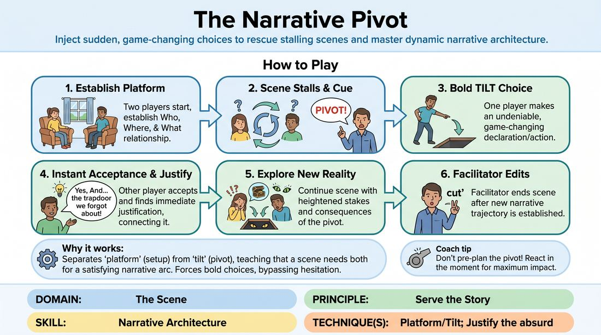

# The Narrative Pivot

{ .game-hero }

> Inject sudden, game-changing choices to rescue stalling scenes and master dynamic narrative architecture.

## Overview
In this active training game, players initiate a standard scene but must immediately execute a massive, game-changing shift when the facilitator calls out a specific cue. This disruption forces players to break out of circular dialogue, make bold choices, and practice rapid justification to build a brand-new narrative reality on the fly. It is an exhilarating exercise in letting go of control and embracing high-stakes spontaneity.

## What It Trains
- **Domain:** D3 — The Scene
- **Principle(s):** Serve the Story; Yes, And; The First Thought Is a Gift
- **Skill(s):** Narrative Architecture; Justification; Stakes / The 'Want'; Offer Reception; Unfiltered Spontaneity
- **Technique(s):** Platform/Tilt; Justify the absurd; Endowment-acceptance; First Thought drills
- **Focus:** narrative

**Objective:** To develop the ability to recognize narrative stagnation and inject decisive, high-stakes choices (tilts) that redefine the platform and propel the story forward.

## Setup
Players stand in a circle or semi-circle. Two players step into the center performance space. No props or special staging are required.

## How to Play
1. Two players step forward to begin a standard, relationship-focused scene based on a simple suggestion.
2. The players establish a clear platform: who they are, where they are, and what their basic relationship is.
3. The facilitator observes the scene closely, looking for signs of stagnation, circular dialogue, or lack of momentum.
4. When the scene begins to stall, loop, or lose its drive, the facilitator calls out 'PIVOT!'
5. Immediately upon hearing the cue, one of the active players must make a bold, undeniable, and game-changing declaration or physical choice (a 'tilt') that alters the scene's reality.
6. The other player must instantly accept this new reality ('Yes, And') and find a logical or emotional justification that connects this new truth to what happened before.
7. The players continue the scene under this new reality, exploring the heightened stakes and consequences of the pivot.
8. The facilitator edits the scene once the new narrative trajectory has been established and played out for a short duration.

## Facilitation Notes
- Coaching cue: 'Don't think, just leap! The first thought is a gift.' Encourage players to use the very first idea that pops into their head when the pivot is called.
- Common Pitfall: Players making a pivot that completely ignores the established platform, making justification impossible. Fix: Remind them that a pivot should reframe the existing reality, not erase it entirely (e.g., 'I'm not your brother, I'm a spy' still honors the history they shared, whereas 'Suddenly we are on Mars and I don't know you' wipes the slate clean).
- Coaching cue: 'Justify the shift immediately. Why does this make perfect sense?' The receiving player should treat the pivot as an absolute truth that explains all prior behavior.
- Facilitator Pitfall: Waiting too long to call 'Pivot!' Fix: Call it the moment the scene loses forward momentum or starts looping in polite conversation. Do not wait for the scene to completely die.

## Variations
- Player-Initiated Pivot: Remove the facilitator cue entirely. Players must self-diagnose stagnation and initiate their own pivots when they feel the scene slowing down.
- Targeted Pivots: The facilitator calls out specific types of pivots, such as 'Pivot - Relationship!', 'Pivot - Environment!', or 'Pivot - Secret!' to force specific narrative directions.
- Chain Pivots: A three-player scene where each player must execute a pivot in sequence, escalating the stakes and complexity each time.

## Debrief
- How did it feel to let go of your original plan for the scene and embrace the pivot?
- What made a pivot easy to justify versus difficult to justify?
- How did the energy of the scene change immediately after the pivot was introduced?
- How can we apply the concept of a 'pivot' to our regular scenes without a facilitator calling it out?

## Safety & Inclusion
Since this game requires rapid, unfiltered spontaneity, remind players to keep their pivots safe, respectful, and inclusive. Avoid using cheap shock value, trauma, or sensitive personal topics as easy pivots. Encourage physical safety if players choose to make physical pivots.

## Why It Works
This game physically separates the 'platform' (the setup) from the 'tilt' (the pivot), teaching players that a scene needs both to have a satisfying narrative arc. By forcing the tilt, it bypasses the polite hesitation that often stalls scenes, training players to trust their instincts and realize that any choice can be justified if they commit to it.
