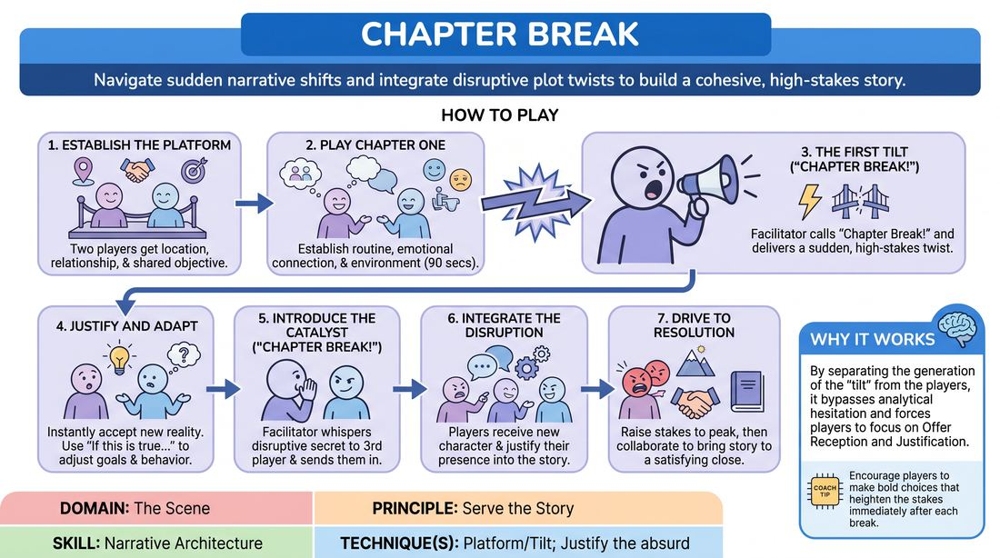

# Chapter Break

{ .game-hero }

> Navigate sudden narrative shifts and integrate disruptive plot twists to build a cohesive, high-stakes story.

## Overview
A dynamic narrative game where a facilitator-driven structural intervention forces players to adapt to sudden plot twists. Players must instantly justify external complications and integrate a disruptive third character, transforming unexpected disruptions into a seamless, satisfying story arc.

## What It Trains
- **Domain:** D3 — The Scene
- **Principle(s):** Serve the Story; Yes, And; Make Your Partner a Genius
- **Skill(s):** Narrative Architecture; Justification; Raising the Stakes; Offer Reception; Active Listening
- **Technique(s):** Platform/Tilt; Justify the absurd; Stakes-escalation reps; Endowment-acceptance
- **Focus:** narrative

**Objective:** To master the Platform/Tilt technique by rapidly adapting to external narrative disruptions, justifying high-stakes complications, and maintaining narrative cohesion under pressure.

## At a Glance
| Aspect | Detail |
|---|---|
| Players | 3+ (ideal 6-12) |
| Time | ~10 min |
| Complexity | 3/5 |
| Skill level | competent |
| Energy | medium |
| Physicality | low |
| Modality | in_person |
| Space | minimal |
| Props | none |
| Audience | not required |

## Setup
An open performance space. Two players start on stage, while a third player (the Catalyst) waits off-stage or at the side, ready to be briefed. The rest of the group acts as active observers. No props or special materials are required.

## How to Play
1. Establish the Platform: Two players step on stage and receive a suggestion of a location, a clear relationship, and an immediate shared objective to establish a stable starting platform.
2. Play Chapter One: The duo begins the scene, focusing on establishing their routine, emotional connection, and the physical environment for approximately ninety seconds.
3. The First Tilt: The facilitator calls out 'Chapter Break!' and delivers a sudden, high-stakes narrative twist that directly complicates the characters' immediate goals.
4. Justify and Adapt: The players must instantly accept this new reality as absolute truth, using the 'if this is true, what else is true' principle to adjust their behavior and emotional stakes.
5. Introduce the Catalyst: During a subsequent 'Chapter Break', the facilitator whispers a disruptive secret agenda to a third player and sends them into the scene as a new character.
6. Integrate the Disruption: The onstage players must receive this new character's disruptive presence, justifying how their arrival fits into the unfolding narrative without discarding their established history.
7. Drive to Resolution: The scene continues through one final chapter break to raise the stakes to their peak, before the players collaborate to bring the story to a logical and satisfying climax.

## Facilitation Notes
- Pacing the Breaks: Time the 'Chapter Break' calls to land right when the players have settled into a comfortable rhythm; do not let them linger in a plateau for too long.
- Crafting the Twists: Ensure your interventions are 'tilts' that complicate the existing platform rather than completely erasing it. Build on what the players have already established.
- Pitfall - Denying the Twist: If players ignore or downplay the facilitator's intervention, side-coach them to immediately express the emotional impact of the new information.
- Briefing the Catalyst: Give the incoming player a highly active, urgent motivation (e.g., 'You must confiscate their equipment immediately') rather than a passive state of being.

## Variations
- Genre Shift: Apply a specific genre (e.g., Film Noir, Sci-Fi, Victorian Melodrama) to the scene, requiring the facilitator's twists and the players' justifications to match the genre's tropes.
- Audience-Driven Breaks: Instead of the facilitator providing the twists, the audience calls out the 'Chapter Break' complications based on physical suggestions.
- Multiple Catalysts: Introduce two separate off-stage players at different intervals, each with conflicting secret agendas, forcing the onstage duo to mediate the chaos.

## Debrief
- How did the sudden 'Chapter Breaks' change your character's internal stakes and emotional urgency?
- What strategies did you use to make the facilitator's external twists feel logical and inevitable in retrospect?
- How did the arrival of the Catalyst alter the power dynamics and focus of the scene?
- What is the difference between merely reacting to a twist and actively using it to advance the story?

## Safety & Inclusion
Ensure that the facilitator's narrative twists and the Catalyst's secret agendas respect established group boundaries and avoid sensitive personal themes. Players can use a non-verbal signal to pause if a twist inadvertently crosses a personal boundary.

## Why It Works
By separating the generation of the 'tilt' from the players, this game bypasses the analytical hesitation of improvisers trying to write and act simultaneously. It forces players to focus entirely on 'Offer Reception' and 'Justification,' demonstrating that any narrative disruption can be made coherent if the characters treat it with genuine emotional stakes.
