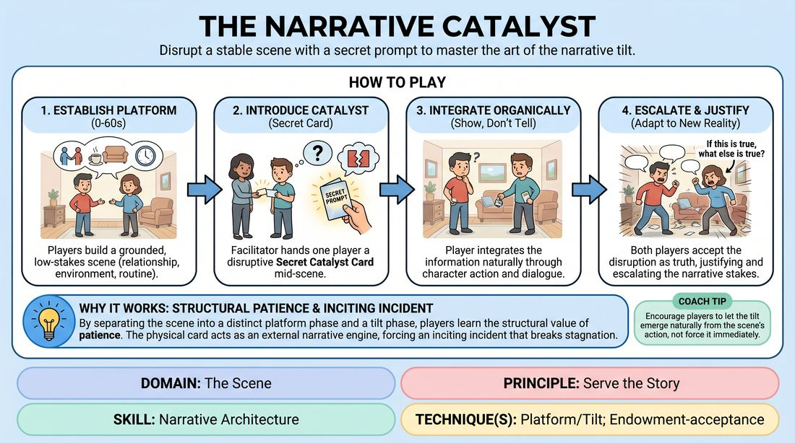

# The Narrative Catalyst

{ .game-hero }

> Disrupt a stable scene with a secret prompt to master the art of the narrative tilt.

## Overview
Two players establish a grounded, low-stakes slice-of-life scene to build a solid platform. Mid-scene, the facilitator hands one player a secret Catalyst Card containing a disruptive piece of information. That player must organically integrate this tilt, forcing both players to rapidly justify the new reality and escalate the narrative stakes.

## What It Trains
- **Domain:** D3 — The Scene
- **Principle(s):** Yes, And; Base Reality First; Serve the Story
- **Skill(s):** Offer Reception; Game Identification; Narrative Architecture; Justification; Raising the Stakes
- **Technique(s):** Endowment-acceptance; If this is true, what else is true?; Platform/Tilt; Justify the absurd; Stakes-escalation reps
- **Focus:** narrative

**Objective:** To develop the ability to establish a stable platform (base reality) and execute a clean narrative tilt (inciting incident), using the 'if true, what else is true' principle to drive story progression.

## At a Glance
| Aspect | Detail |
|---|---|
| Players | 3+ (ideal 6-12) |
| Time | ~10 min |
| Complexity | 3/5 |
| Skill level | competent |
| Energy | medium |
| Physicality | low |
| Modality | in_person |
| Space | minimal |
| Props | Catalyst Cards |
| Audience | not required |

## Setup
An in-person playing space with an audience area. The facilitator prepares a deck of index cards (Catalyst Cards), each containing a high-impact, disruptive narrative prompt (e.g., 'You just realized your partner is a wanted fugitive,' 'You found a map hidden inside the book you are holding'). Two players step up to perform, while the rest observe.

## How to Play
1. Two players step onto the stage and receive a simple, low-stakes suggestion to begin their scene.
2. The players spend the first sixty seconds establishing a grounded platform, defining their relationship, the environment, and a comfortable, low-stakes routine.
3. Once a stable base reality is established, the facilitator quietly approaches the stage and hands one of the players a secret Catalyst Card.
4. The receiving player reads the card silently, pockets it, and immediately looks for an organic moment to introduce this new reality into the scene.
5. The player must show, not tell, the catalyst, integrating the information through character behavior, dialogue, or physical discovery without breaking character or referencing the card.
6. The second player must immediately accept this new offer as absolute truth, adapting their character's emotional state and objectives to match the disruption.
7. Both players apply the principle of 'if this is true, what else is true?' to explore the immediate, cascading consequences of the catalyst.
8. The scene continues for another two to three minutes, focusing on how this disruption permanently alters the characters' relationship and escalates the stakes to a natural climax.

## Facilitation Notes
- Coaching Cue: 'Build the platform first!' Remind players not to rush into conflict before the initial relationship and environment are clearly established.
- Coaching Cue: 'Justify, don't just announce.' Ensure the player receiving the card weaves the information into the existing scene logically, rather than dropping it like an unrelated bomb.
- Pitfall: The non-card-receiving player ignores or downplays the disruption. Fix: Side-coach the second player to let the news impact them deeply, changing their physical posture or emotional temperature.
- Pitfall: The card-holder breaks the fourth wall or treats the card as a joke. Fix: Remind players that the catalyst is a real, high-stakes event in their characters' lives, requiring absolute commitment.

## Variations
- The Double Blind: Both players receive different, secret Catalyst Cards at the same time and must find a way to integrate both conflicting truths into the same scene.
- The Silent Catalyst: The card contains a physical action or non-verbal secret (e.g., 'You are hiding a stolen object in your pocket') that must be discovered entirely through object work.
- Audience Catalysts: Instead of pre-written cards, the audience writes down secrets or disruptions on slips of paper before the show, which are then used as the catalysts.

## Debrief
- How did establishing a strong, quiet platform make the introduction of the catalyst more impactful?
- What specific choices did you make to justify the sudden shift in reality without breaking the scene's logic?
- How did you apply 'if this is true, what else is true' to escalate the stakes after the tilt was introduced?

## Safety & Inclusion
Ensure Catalyst Cards do not contain prompts involving trauma, non-consensual physical contact, or highly sensitive personal topics. Encourage players to interpret prompts metaphorically or adjust them on the fly if a prompt makes them uncomfortable.

## Why It Works
By separating the scene into a distinct platform phase and a tilt phase, players learn the structural value of patience. The physical card acts as an external narrative engine, forcing an inciting incident that breaks stagnation. Applying 'if true, what else is true' ensures that the resulting escalation feels earned and logically connected to the established base reality, rather than random.
