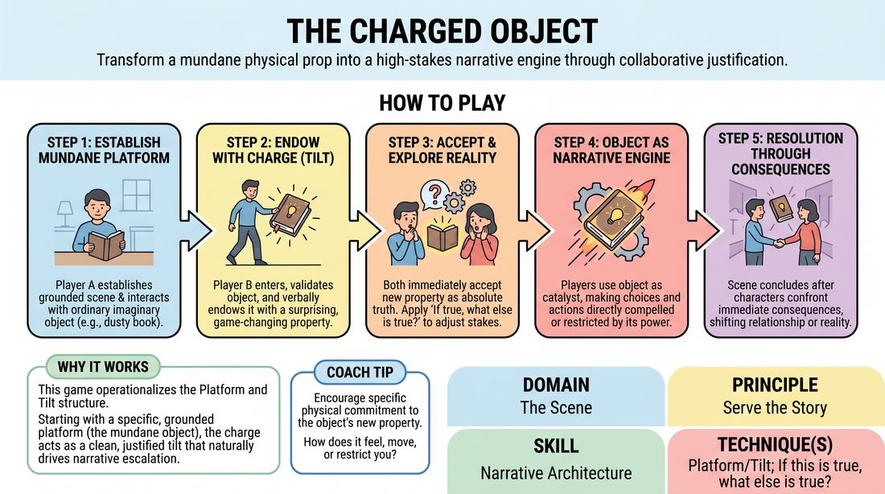

# The Charged Object

{ .game-hero }

> Transform a mundane physical prop into a high-stakes narrative engine through collaborative justification.

## Overview
Two players build a scene around a simple, everyday imaginary item that is suddenly endowed with an extraordinary, game-changing property. By treating this charged object as an active catalyst, players explore its logical consequences to naturally escalate stakes and drive the story forward.

## What It Trains
- **Domain:** D3 — The Scene
- **Principle(s):** Serve the Story; Base Reality First; Yes, And; Make Your Partner a Genius
- **Skill(s):** Narrative Architecture; Game Identification; Stakes / The 'Want'; Justification; Physicality & Space Work; Offer Reception; Active Gifting
- **Technique(s):** Platform/Tilt; If this is true, what else is true?; Object work; Endowment-acceptance; Endowment-gifting drills; Justify the absurd
- **Focus:** narrative

**Objective:** To master the Platform and Tilt technique by establishing a stable base reality (the platform) and using a sudden, meaningful disruption (the tilt) to build compelling narrative architecture.

## At a Glance
| Aspect | Detail |
|---|---|
| Players | 2+ (ideal 2 players per scene, 6-12 total) |
| Time | ~10 min |
| Complexity | 3/5 |
| Skill level | competent |
| Energy | medium |
| Physicality | medium |
| Modality | in_person |
| Space | minimal |
| Props | none |
| Audience | not required |

## Setup
Two players stand on stage. The facilitator provides a simple, grounded relationship and a location containing everyday items (e.g., roommates cleaning a garage, coworkers in a breakroom). No physical props are used; all object work is pantomimed.

## How to Play
1. The facilitator establishes a grounded relationship and a mundane setting for two players.
2. Player A begins the scene by establishing a clear, physical environment and interacting with a specific, ordinary imaginary object (e.g., a dusty book, a pocket watch, a coffee mug) using detailed pantomime.
3. Player B enters or responds, validating the physical reality of the object, and then delivers a charge—a verbal statement that endows the object with a surprising, significant, or supernatural property.
4. Both players immediately accept this new reality as absolute truth, treating the object's new property as the tilt that disrupts their ordinary world.
5. Players apply the 'if true, what else is true' principle to explore how this charged object alters their characters' immediate desires, personal stakes, and relationship dynamics.
6. The players use the object as an active narrative engine, making choices and taking actions that are directly compelled or restricted by the object's unique properties.
7. The scene concludes once the characters have fully confronted the immediate consequences of the object's power, resulting in a clear shift in their relationship or circumstances.

## Facilitation Notes
- Coaching Cue: 'Make the physical work undeniable!' Remind Player A to establish the weight, size, and texture of the mundane object before it is charged, ensuring the scene remains physically grounded.
- Coaching Cue: 'Play the consequence, not just the magic.' Ensure players don't just marvel at the object's power, but let it actively change what their characters want and fear in that exact moment.
- Pitfall: The charge is too wacky or disconnected, turning the scene into a cartoon. Fix: Encourage Player B to tie the object's property to the characters' existing relationship or emotional history.
- Pitfall: Players forget about the object halfway through the scene. Fix: Side-coach them to physically interact with or reference the object to make a decision or resolve a conflict.

## Variations
- Silent Charge: Player B charges the object entirely through physical reaction and pantomime rather than a verbal declaration, forcing Player A to deduce and label the property.
- The Cursed Hand-off: The object's charge is a burden or curse that passes from one character to another upon physical contact, shifting the power dynamic mid-scene.
- Multi-Stage Charge: The object's power escalates in three distinct stages, with each player taking turns to reveal a deeper, more dangerous layer of its history or function.

## Debrief
- How did establishing a clear, mundane physical reality first make the charge feel more impactful?
- In what ways did the object's new property instantly clarify or shift your character's motivation?
- How did you use the 'if true, what else is true' rule to discover narrative beats instead of planning them?
- What made the object feel like an active character or engine in the scene rather than just a passive prop?

## Safety & Inclusion
Since this game involves pantomiming objects that may have magical or high-stakes properties, establish a boundary beforehand that the charge cannot introduce elements of self-harm, non-consensual physical control, or graphic violence. Ensure players maintain physical boundaries when passing or interacting with the imaginary object.

## Why It Works
This game works because it perfectly operationalizes the Platform and Tilt narrative structure. By starting with a highly specific, grounded physical platform (the mundane object), the subsequent charge acts as a clean, justified tilt. Because the tilt is bound to a physical item, players have a concrete anchor to return to, preventing the narrative from drifting into abstract talking heads and forcing them to show, rather than tell, the story's progression.
