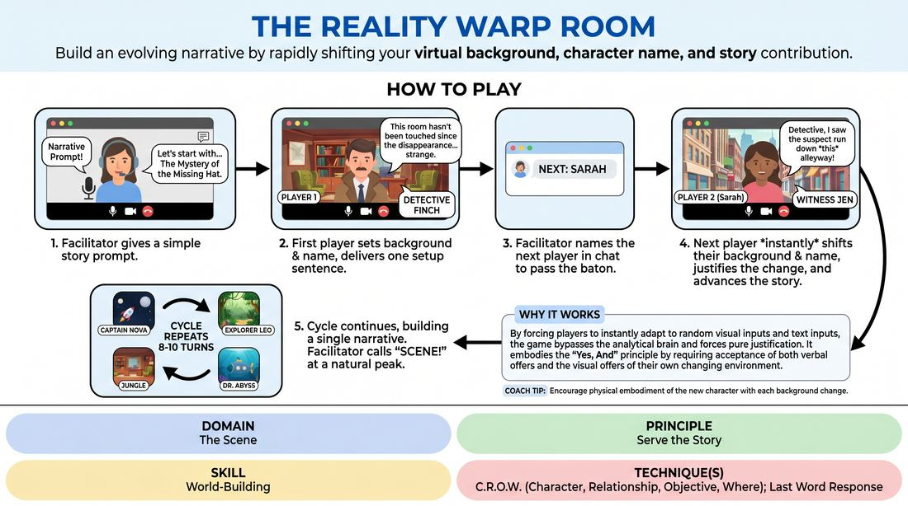

# The Backdrop Shift

{ .game-hero }

> Build an evolving narrative by rapidly shifting your virtual background, character name, and story contribution.

## Overview
A fast-paced virtual storytelling engine where players use video conferencing features to instantly transform their environment and identity. Each player steps into the spotlight by changing their virtual background and display name, then delivering a single sentence that justifies this sudden shift while advancing the shared narrative. It is a high-energy exercise in rapid offer reception, visual world-building, and narrative agility.

## What It Trains
- **Domain:** D3 — The Scene
- **Principle(s):** Yes, And; Serve the Story; Group Mind
- **Skill(s):** Active Listening; Offer Reception; Narrative Architecture; World-Building; Justification; Pacing & Rhythm
- **Technique(s):** Last Word Response; Yes, And… sentence games; Story Spine; C.R.O.W. (Character, Relationship, Objective, Where); Justify the absurd
- **Focus:** narrative

**Objective:** To develop advanced-beginner skills in virtual world-building using the C.R.O.W. framework (Character, Relationship, Objective, Where). Players learn to instantly establish and justify environmental shifts and character identities while serving a singular, cohesive story.

## At a Glance
| Aspect | Detail |
|---|---|
| Players | 6–10 (ideal 6-10) |
| Time | ~15 min |
| Complexity | 3/5 |
| Skill level | advanced_beginner |
| Energy | high |
| Physicality | low |
| Modality | virtual |
| Space | minimal |
| Props | Zoom client with virtual backgrounds enabled, Library of virtual background images |
| Audience | not required |

## Setup
Conducted on a video conferencing platform with virtual backgrounds and participant renaming enabled. Players should have a pre-loaded library of diverse virtual background images ranging from mundane offices to fantastical landscapes. All players start in Gallery View with cameras on and microphones muted until called upon.

## How to Play
1. The facilitator leads a quick two-minute technical rehearsal, prompting all players to simultaneously change their virtual background and rename themselves to ensure technical fluidity.
2. The facilitator provides a simple, open-ended narrative prompt to set the story in motion.
3. The first player, selected by the facilitator, changes their virtual background to establish the initial location and renames themselves to establish their character.
4. This first player unmutes, physically embodies their character within their camera frame, and delivers a single, high-stakes sentence that sets up the scene's conflict or objective.
5. The facilitator immediately types the name of the next player in the chat box to act as the narrative baton, preventing audio overlap and lag.
6. The designated player must immediately change their virtual background to a new location and rename themselves to a new character that logically connects to the previous statement.
7. The new player unmutes and delivers exactly one sentence that accepts the previous player's line, justifies their own new background and character, and advances the story.
8. This cycle repeats, with the facilitator continuously naming the next speaker in chat, ensuring every player contributes to the unfolding, singular narrative arc.
9. After eight to ten turns, or when the story reaches a natural, satisfying peak, the facilitator calls 'Scene!' to conclude the narrative.

## Facilitation Notes
- Side-coaching cue: 'Play the frame! Use your physical space, posture, and proximity to the camera to match your new character and background.'
- Pitfall: Players get bogged down trying to find the perfect background, stalling the momentum. Fix: Instruct players to select the very first image their eyes land on and trust their ability to justify it afterward.
- Side-coaching cue: 'Focus on C.R.O.W. How does your new location change your relationship or objective in this story?'
- Pitfall: The story becomes a series of disconnected sketches rather than a single narrative. Fix: Remind players that despite the changing backgrounds, they are in the same story; each shift must represent a progression of the plot.

## Variations
- The Split-Screen Duet: The facilitator names two players at once. They must both change their backgrounds to matching or contrasting locations and conduct a brief, three-line dialogue before passing the baton.
- Emotional Weather: Along with renaming their character, players must append an emotion in parentheses and play their turn entirely through that emotional lens.
- The Prop Challenge: Players must quickly grab a physical object within arm's reach and integrate it into their frame as a crucial story element, justifying its presence in their new location.

## Debrief
- How did the sudden visual changes of your peers' backgrounds alter your planned contribution to the story?
- What strategies did you use to instantly justify a background that seemed completely unrelated to the current plot?
- How did having your character name and location visually displayed change how you approached your character's voice and objective?

## Safety & Inclusion
Ensure all players are comfortable with virtual backgrounds; if a player's hardware does not support virtual backgrounds or causes severe lag, allow them to use physical household items held up to the camera, or change their display name to describe their virtual background in brackets.

## Why It Works
By forcing players to instantly adapt to random visual inputs and text inputs, the game bypasses the analytical brain and forces pure justification. It embodies the 'Yes, And' principle by requiring players to accept both the verbal offer of the previous line and the visual offer of their own randomly selected background, synthesizing them into a coherent narrative step. This builds strong C.R.O.W. skills by making environment and identity highly visible, dynamic variables.
