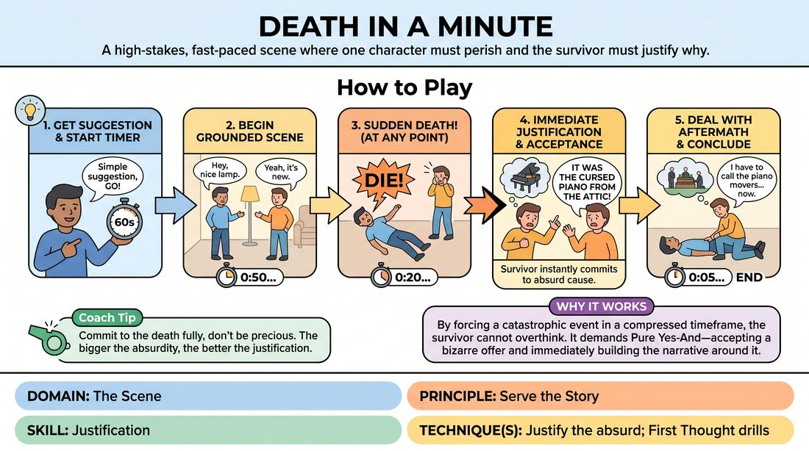

# One-Minute Demise

{ .game-hero }

> A high-stakes, fast-paced scene where one character must perish and the survivor must justify why.

## Overview
Two to three players launch into a scene with a strict sixty-second time limit. Within this minute, one character must die, forcing the remaining player or players to instantly justify the cause of death and weave it into a coherent narrative. It is a high-energy exercise in rapid offer acceptance, narrative pacing, and committing to absurd realities.

## What It Trains
- **Domain:** D3 — The Scene
- **Principle(s):** Serve the Story; Fail Joyfully; Yes, And
- **Skill(s):** Justification; Narrative Architecture; Unfiltered Spontaneity; Offer Reception; Pacing & Rhythm
- **Technique(s):** Justify the absurd; First Thought drills; Endowment-acceptance; Timing exercises
- **Focus:** mixed

**Objective:** To develop rapid justification skills and narrative pacing under pressure, specifically training players to embrace sudden, extreme plot shifts and make them make sense within the story's logic.

## Setup
A clear performance space with a visible timer or a facilitator ready to call out time. Two to three players stand on stage. No props are needed, though players should use object work to establish the environment.

## How to Play
1. Get a simple suggestion from the group to start the scene.
2. Start a 60-second countdown timer visible to the players or managed by the facilitator.
3. The players begin a normal, grounded scene, establishing their relationship and environment immediately.
4. At any point during the 60 seconds, one player must die suddenly and without warning.
5. The surviving player or players must immediately accept this death as an absolute reality and justify why and how it happened.
6. The scene must continue with the survivors dealing with the emotional and physical aftermath of the death, building to a satisfying narrative conclusion just as the 60-second timer expires.

## Facilitation Notes
- Encourage players to die early in the scene, ideally within the first 15 to 20 seconds, to give their partner time to play with the consequences.
- Remind the surviving player to justify the absurd by finding a creative, in-world explanation for even the most sudden or bizarre deaths.
- If players wait until the last 5 seconds to die, pause the game and instruct the next group to execute the death immediately to practice handling the aftermath.
- Ensure the surviving player reacts with genuine stakes and emotion rather than treating the death as a throwaway joke.

## Variations
- The Chain Reaction: In a three-player version, one player dies at 20 seconds, the second player justifies it, then the second player dies at 40 seconds, leaving the third player to justify both deaths before the minute ends.
- The Silent Witness: The dying player cannot speak or explain their death, leaving the survivor to do all of the verbal justification.
- Genre Shift: Run the scene under a specific genre constraint, such as Shakespearean tragedy or Film Noir, to guide the style of the death and justification.

## Debrief
- How did it feel to have a massive, disruptive event dropped into the scene early on?
- What strategies did you use to make an absurd or sudden death feel logical within the world of the scene?
- How does a strict time limit help quiet your inner editor and force spontaneous choices?

## Safety & Inclusion
Ensure players practice safe physical comedy when falling or collapsing. Remind players to collapse safely to the floor by bending their knees first to avoid injury. Since the theme is death, check in with the group beforehand to ensure everyone is comfortable with dark comedy, and allow players to opt for a sudden faint or retirement instead of literal death if preferred.

## Why It Works
By forcing a catastrophic narrative event early in a highly compressed timeframe, players cannot overthink or plan. The survivor is forced to use Yes-And in its purest form: accepting a bizarre physical offer and immediately finding a creative, narrative-serving reason for its existence. This builds muscle memory for justifying mistakes or unexpected offers in standard scenes.
