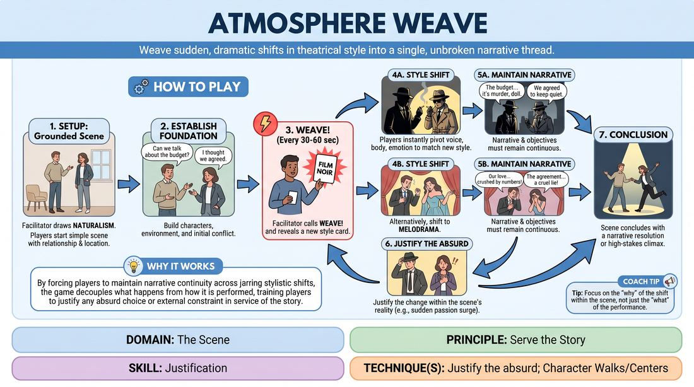

# Atmosphere Weave

{ .game-hero }

> Weave sudden, dramatic shifts in theatrical style into a single, unbroken narrative thread.

## Overview
A dynamic scene-work game where players must instantly adapt to sudden stylistic shifts called out by a facilitator. While the performance style changes radically, the underlying story, character relationships, and objectives must remain continuous and logically justified.

## What It Trains
- **Domain:** D3 — The Scene
- **Principle(s):** Commit 100%; Yes, And; Serve the Story
- **Skill(s):** Emotional Fluidity; Physicality & Space Work; Active Listening; Offer Reception; Narrative Architecture; Justification
- **Technique(s):** Character Walks/Centers; Endowment-acceptance; If this is true, what else is true?; Justify the absurd
- **Focus:** narrative

**Objective:** To develop advanced justification skills by treating abrupt stylistic changes as organic narrative developments, reinforcing the principle of serving the story through extreme adaptability.

## Setup
Two to three players on stage, with the remaining group acting as active observers. The facilitator stands off-stage with a pre-prepared deck of Style Cards representing distinct theatrical genres (e.g., Film Noir, Shakespearean Tragedy, Sitcom, Melodrama, Gothic Horror, Absurdist).

## How to Play
1. Position two or three players in the performance space to begin a standard scene.
2. The facilitator draws an initial card (typically Naturalism) and provides a simple, grounded relationship or location suggestion to start.
3. Players begin the scene, establishing clear characters, a physical environment, and an initial conflict within this baseline style.
4. Once the scene's foundation is established, the facilitator calls out WEAVE! and reveals a new style card to the players.
5. Players must instantly pivot their physical, vocal, and emotional choices to match the new style (e.g., shifting from Naturalism to Film Noir).
6. Crucially, players must continue the exact same narrative arc and character objectives, rather than resetting the scene.
7. Players must immediately justify the stylistic shift within the reality of the scene (e.g., treating a shift to Melodrama as a sudden surge of internal passion or a shift in the room's tension).
8. The facilitator continues to call WEAVE! every 30 to 60 seconds, introducing new styles that overwrite the previous performance filter while building the same story.
9. The scene concludes when the narrative reaches a satisfying resolution or a high-stakes climax under one of the styles.

## Facilitation Notes
- Pacing the Weave: Avoid calling WEAVE! during a critical narrative discovery; wait until a beat has landed, then use the style shift to escalate the consequences.
- Pitfall - Resetting the Plot: Players often treat a new style as a brand-new scene. Remind them that the story is a continuous thread; only the lens through which we view it has changed.
- Side-Coaching Cue: Keep the same want! If a character wanted an apology in Naturalism, they must still want that apology in Shakespearean Tragedy, just expressed with poetic grandeur.
- Justifying the Transition: Encourage players to verbally or physically acknowledge the shift in atmosphere (e.g., Why does this kitchen suddenly feel like a cold, dark tomb?) to bridge the styles.

## Variations
- Audience Choice: The observing players call out the styles or write them on slips of paper before the game begins.
- Environmental Zones: Divide the stage into physical zones, each representing a different style. Players shift styles automatically as they move across the space.
- Emotional Weave: Instead of theatrical styles, use extreme emotional states (e.g., grief, hysteria, apathy) as the cards.

## Debrief
- How did changing the style help you discover new depths in your character's core desire?
- What strategies did you use to justify a sudden, absurd shift in tone without breaking the story's logic?
- How did active listening change when you had to track both the narrative progression and a shifting aesthetic?

## Safety & Inclusion
Ensure that physical styles (like Silent Film or Melodrama) respect physical boundaries and personal space. Since styles can heighten emotional intensity, players should feel empowered to use a non-verbal pause or tap-out if a style feels emotionally unsafe or overwhelming.

## Why It Works
By forcing players to maintain narrative continuity across jarring stylistic shifts, the game decouples what happens from how it is performed. This teaches players that any absurd choice or external constraint can be fully justified if it serves the underlying human truth of the story.
