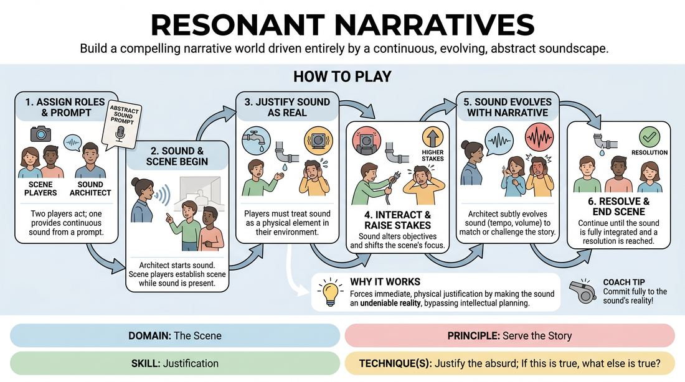

# Acoustic Architecture

{ .game-hero }

> Build a compelling narrative world driven entirely by a continuous, evolving, abstract soundscape.

## Overview
A trio of players collaborates to construct a scene where the physical environment, character motivations, and plot progression are dictated by a live, non-verbal soundscape. While one player acts as the audio engine, generating a persistent abstract sound, two scene players must treat this sound as an undeniable, physical reality of their world. The result is a highly atmospheric, justified narrative where the sound itself acts as the primary catalyst for story development.

## What It Trains
- **Domain:** D3 — The Scene
- **Principle(s):** Serve the Story; Base Reality First; Yes, And
- **Skill(s):** Justification; Narrative Architecture; World-Building; Active Listening; Offer Reception; Physicality & Space Work
- **Technique(s):** Justify the absurd; If this is true, what else is true?; C.R.O.W. (Character, Relationship, Objective, Where); Object work; Endowment-acceptance
- **Focus:** narrative

**Objective:** To develop advanced justification skills by treating abstract, non-verbal auditory constraints as foundational narrative truths, forcing players to build cohesive worlds and serve the story through active listening and physical space work.

## At a Glance
| Aspect | Detail |
|---|---|
| Players | 3+ (ideal 3) |
| Time | ~10 min |
| Complexity | 3/5 |
| Skill level | competent |
| Energy | medium |
| Physicality | low |
| Modality | virtual |
| Space | minimal |
| Props | none |
| Audience | not required |

## Setup
Designed for a virtual platform. Three active players are selected: two Scene Players and one Sound Architect. The Sound Architect should ensure their microphone is clear and positioned to capture vocalizations or gentle body percussion. No physical props or special software are required.

## How to Play
1. Assign roles: two players act as the Scene Players, and one player acts as the Sound Architect.
2. The facilitator or group provides an abstract sound prompt to the Sound Architect, such as a rhythmic metallic tapping, a low mechanical hum, or a frantic scratching.
3. The Sound Architect immediately begins generating this sound continuously using their voice, breath, or simple body percussion, establishing a steady baseline.
4. The Scene Players turn on their cameras and begin their scene, establishing their characters, relationship, and a basic physical setting while the sound continues in the background.
5. As the scene develops, the Scene Players must actively acknowledge and justify the sound as a real, physical element of their environment (e.g., a leaking pipe, a ticking device, or an internal psychological state made manifest).
6. The Scene Players must physically and verbally interact with the implications of this sound, allowing it to raise the stakes, alter their objectives, or shift their emotional states.
7. The Sound Architect closely monitors the scene and subtly evolves the sound's tempo, volume, or texture to match or challenge the narrative's emotional beats, without changing the fundamental nature of the sound.
8. The Scene Players must never break character or directly acknowledge the Sound Architect as a performer; the sound must remain entirely diegetic within the reality of the story.
9. The scene continues until a natural narrative resolution is reached, or the facilitator calls 'scene' once the sound has been fully integrated and resolved.

## Facilitation Notes
- Coaching Cue: Remind the Sound Architect to keep the sound abstract and continuous rather than illustrative. They are creating an environment, not doing literal cartoon sound effects.
- Pitfall: Scene Players ignoring the sound for too long. Fix: Side-coach with 'Let the sound affect your body' or 'What does that noise do to your character's stress levels?'
- Coaching Cue: Encourage the Sound Architect to play with dynamics. If the scene players are whispering, make the sound quieter or louder to create contrast and tension.
- Pitfall: The Sound Architect changing the sound entirely (e.g., switching from a hum to a whistle). Fix: Remind them to evolve the existing sound's speed, volume, or texture rather than introducing a new sound source.
- Coaching Cue: Ask the Scene Players 'If that sound is true, what else is true about this room?' to push their world-building and narrative architecture.

## Variations
- Sensory Shift: The Scene Players perform with their eyes closed (or cameras off for them, but on for the audience), relying entirely on vocal delivery, physical sound, and spatial audio to build the narrative.
- Internal Echo: The sound represents the internal psychological state of one specific character, which only they can hear, while the other character must figure out why their partner is reacting to 'nothing'.
- Dual Architects: Two Sound Architects collaborate to create a layered, polyrhythmic soundscape, requiring the Scene Players to justify two distinct auditory elements simultaneously.

## Debrief
- How did the continuous sound change the way you approached physical space work and object work?
- For the Scene Players, how did justifying the sound help you discover your character's stakes and objectives?
- For the Sound Architect, how did you balance leading the narrative versus following the emotional cues of the actors?
- In what ways did the sound prevent the scene from becoming a 'talking heads' scene?

## Safety & Inclusion
Since this game relies heavily on continuous auditory stimuli, ensure players can adjust their individual volume levels. Offer alternative non-verbal options for the Sound Architect (such as rhythmic visual movement or tapping on a visible surface) if any participant has sensory sensitivities or hearing difficulties.

## Why It Works
By introducing a persistent, non-verbal constraint, the game bypasses intellectual planning and forces players into immediate, physical justification. The sound acts as an objective reality that cannot be negotiated away, demanding that players apply 'Yes, And' to their environment. This builds narrative momentum because every change in the soundscape requires a corresponding shift in the story's stakes, naturally driving the narrative arc forward without relying solely on dialogue.
