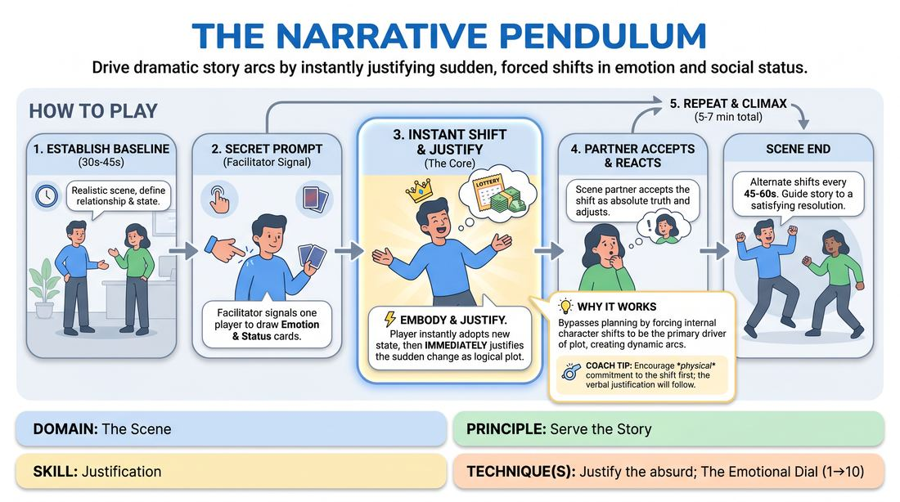

# The Narrative Pendulum

{ .game-hero }

> Drive dramatic story arcs by instantly justifying sudden, forced shifts in emotion and social status.

## Overview
Two players improvise a scene while periodically receiving secret prompts to instantly shift their emotional state and social status. The core challenge is to immediately embody these sudden changes and rapidly justify them within the narrative. This process forces characters to evolve dynamically, turning abrupt internal shifts into logical, high-stakes plot developments.

## What It Trains
- **Domain:** D3 — The Scene
- **Principle(s):** Commit 100%; Make Your Partner a Genius; Serve the Story
- **Skill(s):** Emotional Fluidity; Status Modulation; Narrative Architecture; Justification; Raising the Stakes
- **Technique(s):** The Emotional Dial (1→10); Status Seesaw; Justify the absurd; Stakes-escalation reps
- **Focus:** narrative

**Objective:** To develop advanced justification skills (specifically justifying the absurd or unexpected) and status modulation, demonstrating how sudden internal character shifts can logically drive external narrative architecture and heighten scene stakes.

## At a Glance
| Aspect | Detail |
|---|---|
| Players | 2+ (ideal 6-12) |
| Time | ~15 min |
| Complexity | 3/5 |
| Skill level | competent |
| Energy | medium |
| Physicality | medium |
| Modality | in_person |
| Space | minimal |
| Props | Emotional Shift Cards, Status Shift Cards |
| Audience | not required |

## Setup
An open performance space. Prepare two physical decks of cards: 'Emotional Shift Cards' (e.g., 'From Calm to Outraged', 'From Joy to Suspicion') and 'Status Shift Cards' (e.g., 'Seize High Status', 'Surrender to Low Status', 'Equalize Status'). Two players stand in the playing area; the remaining players observe as active audience members. The facilitator stands nearby to manage the cards and cue shifts.

## How to Play
1. Select two players to begin an open scene based on a simple, realistic relationship premise (e.g., business partners closing a deal, or neighbors cleaning a shared hallway).
2. Allow the players to establish a stable baseline platform for the first 30 to 45 seconds, defining their initial relationship, environment, and emotional states.
3. The facilitator quietly signals one player (via a gentle shoulder tap or clear visual cue) to step to the side and draw one card from each deck: one Emotional Shift and one Status Shift.
4. The signaled player must instantly step back into the scene and physically embody the new emotion and status level within their very next line or physical action.
5. Immediately following the physical shift, the active player must verbally or physically justify why this sudden change occurred, framing it as a logical consequence of the scene's reality (e.g., revealing a hidden secret, misinterpreting a gesture, or remembering a critical detail).
6. The scene partner must immediately accept this new reality, treating the shifted player's behavior and justification as absolute truth, and adjusting their own status and emotional response accordingly.
7. The facilitator continues to alternate signals between the two players every 45 to 60 seconds, introducing new shifts to keep the narrative pendulum swinging.
8. Conclude the scene after 5 to 7 minutes, or once the series of justified shifts has naturally guided the narrative to a satisfying climax and resolution.

## Facilitation Notes
- Side-coaching cue: 'Show, don't tell!' Remind players to physically embody the shift through posture, vocal tone, and eye contact before explaining it verbally.
- Pitfall: Players stalling or overthinking the justification. Fix: Side-coach 'Commit first, explain second.' Encourage them to make the physical/emotional change 100% real first, and let the explanation flow naturally from that physical commitment.
- Pitfall: The non-shifted partner ignoring the change. Fix: Remind the partner to 'make your partner a genius' by actively reacting to and validating the shift, rather than steamrolling with their own agenda.
- Pacing tip: If a scene plateaus or gets stuck in a repetitive loop, immediately trigger a shift card to inject a fresh narrative jolt.

## Variations
- Blind Shifts: Instead of drawing cards, the facilitator calls out the emotional and status shifts verbally to the entire room, forcing the player to adapt instantly without a pause to read.
- External Catalyst Cards: Add a third deck of 'Event Cards' (e.g., 'A phone rings', 'You find a mysterious object') to provide an external prompt that helps players justify their internal shifts.
- Status Tug-of-War: Both players draw status cards simultaneously at the start, and must continuously adjust their status levels in opposite directions whenever a bell rings.

## Debrief
- How did forcing an abrupt emotional or status shift actually help move the story forward rather than disrupting it?
- What strategies did you use to make an absurd or sudden shift feel completely logical and justified to the audience?
- How did it feel as the partner to adapt to these sudden changes, and how did you help make those shifts look brilliant?

## Safety & Inclusion
Ensure players are comfortable with light physical touch if shoulder-tapping is used as the cue; otherwise, use a clear, non-contact visual signal like pointing or holding up a colored card. Remind players that high-intensity emotional shifts (like rage or despair) should be expressed safely without physical aggression or violating personal boundaries.

## Why It Works
This game leverages the narrative engine by treating internal character shifts as the primary driver of plot. By forcing players to instantly adopt extreme emotional and status changes, it bypasses intellectual planning and forces them to use the 'if this is true, what else is true' principle. Justifying these sudden shifts introduces unexpected information and stakes, which naturally builds a compelling, unpredictable narrative arc.
