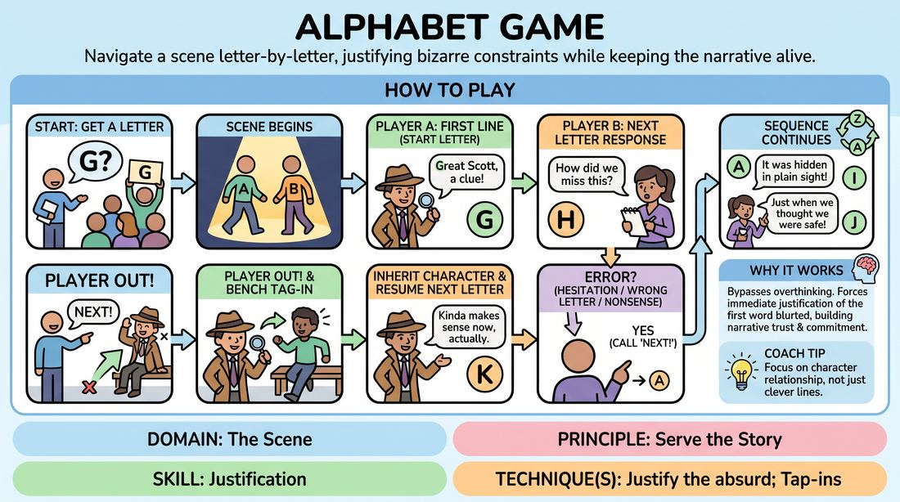

# Alphabet Elimination

{ .game-hero }

> Navigate a scene letter-by-letter, justifying bizarre constraints while keeping the narrative alive.

## Overview
Two players perform a scene where each successive line of dialogue must begin with the next letter of the alphabet. If a player hesitates, misses their letter, or breaks the narrative flow, they are joyfully eliminated and immediately replaced by a bench player who inherits their character. The goal is to complete a coherent story from A to Z despite the rigid linguistic constraints.

## What It Trains
- **Domain:** D3 — The Scene
- **Principle(s):** Serve the Story; Fail Joyfully; Yes, And
- **Skill(s):** Justification; Active Listening; Support Work; Unfiltered Spontaneity
- **Technique(s):** Justify the absurd; Tap-ins; Last Word Response
- **Focus:** mixed

**Objective:** To develop rapid justification skills under pressure, training players to make absurd or forced starting words make perfect sense within the context of an ongoing narrative.

## At a Glance
| Aspect | Detail |
|---|---|
| Players | 3+ (ideal 6-12) |
| Time | ~10 min |
| Complexity | 3/5 |
| Skill level | advanced_beginner |
| Energy | high |
| Physicality | low |
| Modality | in_person |
| Space | minimal |
| Props | none |
| Audience | not required |

## Setup
An active playing area for two performers, with the remaining players forming a bench or line at the back or side of the stage, ready to tag in instantly.

## How to Play
1. Ask the group or a spectator for a starting letter of the alphabet to initiate the scene.
2. Two players step forward into the performance space to begin the scene.
3. Player A speaks the first line of dialogue, which must begin with the chosen starting letter.
4. Player B responds with a line that begins with the very next letter in alphabetical order (for example, if Player A started with 'G', Player B must start with 'H').
5. The dialogue continues in strict alphabetical sequence, wrapping around from 'Z' to 'A' if necessary, until the entire alphabet has been completed.
6. If a player hesitates for more than two seconds, uses the wrong letter, or delivers a line that makes no narrative sense, the facilitator or bench calls out 'Next!' or 'Freeze!'.
7. The eliminated player steps out of the scene immediately, celebrating their mistake, and a player from the bench rushes in to take their place.
8. The incoming player must instantly adopt the established character, physical posture, and relationship of the player they are replacing.
9. The scene resumes immediately with the next letter in the sequence, maintaining the narrative momentum without restarting the story.

## Facilitation Notes
- Encourage players to prioritize the story over the constraint; if a line is grammatically bizarre due to the letter, use emotional justification to make it fit.
- Keep the elimination tempo fast and light. The elimination should be a moment of high-energy celebration, not shame.
- Watch out for players who stall by using filler words like 'Ah,' 'Oh,' or 'Well' to bypass their assigned letter. Call these out as eliminations to keep the game honest.
- Side-coach players to inherit the physicalized state of the person they are replacing to maintain visual continuity for the audience.

## Variations
- Reverse Alphabet: Run the scene backwards from Z to A, which increases the cognitive load and forces even more creative justification.
- Emotional Alphabet: Each new letter also dictates a shift in emotional intensity or a new emotional state starting with that letter.
- Blind Alphabet: Players do not know which letter they are on and must track it entirely in their heads without any visual aids or facilitator prompts.

## Debrief
- How did the constraint of the next letter force you to make choices you wouldn't normally make?
- What strategies did you use to justify a highly unusual starting word so that it still served the story?
- How did it feel to step into an existing character mid-scene, and what did you have to pay attention to?

## Safety & Inclusion
Ensure the physical transition when replacing a player is safe and swift. Players should tag in without physical collision. If a player has mobility constraints, the incoming player can match their seated or stationary posture rather than requiring rapid physical movement.

## Why It Works
By forcing players to start sentences with predetermined letters, the game bypasses the analytical brain's filtering system. Players must blurt out a word and then instantly justify why their character would say it. This builds the muscle of 'justifying the absurd,' turning a mechanical constraint into an engine for organic, surprising narrative discovery.
