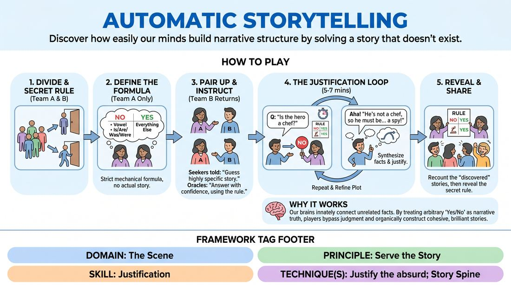

# The Illusion of Plot

{ .game-hero }

> Discover how easily our minds build narrative structure by solving a story that doesn't exist.

## Overview
In this exercise, players pair up to 'guess' a secret story using only yes-or-no questions. In reality, there is no pre-existing story; the partner answers using a hidden mechanical rule, forcing the guesser to constantly justify unexpected answers and organically construct a brilliant, cohesive narrative out of thin air.

## What It Trains
- **Domain:** D3 — The Scene
- **Principle(s):** Serve the Story; Yes, And; The First Thought Is a Gift
- **Skill(s):** Narrative Architecture; Justification; Offer Reception; Unfiltered Spontaneity
- **Technique(s):** Justify the absurd; Story Spine; Yes, And… sentence games
- **Focus:** narrative

**Objective:** To develop advanced justification skills and narrative architecture by training players to treat every response—no matter how contradictory—as a gift, seamlessly integrating absurd or unexpected plot points into a logical story.

## At a Glance
| Aspect | Detail |
|---|---|
| Players | 4+ (ideal 8-20) |
| Time | ~15 min |
| Complexity | 3/5 |
| Skill level | advanced_beginner |
| Energy | medium |
| Physicality | low |
| Modality | in_person |
| Space | moderate |
| Props | none |
| Audience | not required |

## Setup
Divide the group into two equal halves: the 'Oracles' (who know the secret rule) and the 'Seekers' (who believe they are guessing a real story). Send the Seekers out of the room or to a far corner where they cannot hear the instructions.

## How to Play
1. Divide the group into two equal teams: Team A (the Oracles) and Team B (the Seekers), and send Team B out of the room.
2. Explain the secret rule to Team A: They do not have a story. Instead, they will answer Team B's yes-or-no questions using a strict mechanical formula.
3. Define the formula for Team A: Answer 'No' if the question starts with a vowel or a form of 'to be' (Is, Are, Was, Were), and 'Yes' to everything else. Additionally, never give more than two 'No' answers in a row—force a 'Yes' on the third question to keep the story moving.
4. Bring Team B back into the room and pair each Seeker with an Oracle.
5. Instruct Team B that their partner has envisioned a highly specific, dramatic story, and Team B's goal is to uncover the entire plot by asking yes-or-no questions.
6. Instruct Team A to answer immediately using the secret rule, maintaining a completely straight, confident face as if they are recalling a real story.
7. As Team B receives 'Yes' and 'No' answers, they must synthesize these facts, adjusting their theories to justify any contradictions (e.g., if 'Is the main character a dog?' gets a 'No', but 'Does the hero have four legs and bark?' gets a 'Yes', they must justify this, perhaps deciding the hero is a werewolf).
8. Allow the pairs to play for 5 to 7 minutes, or until the Seekers confidently declare they have 'solved' the story and recount the full plot to their Oracle partner.
9. Bring the entire group back together to reveal the secret rule and share the wildly creative stories that were 'discovered.'

## Facilitation Notes
- Coaching cue: 'Accept the answer as absolute truth. If the Oracle says Yes to something that contradicts your last theory, don't fight it—justify it!'
- Pitfall: Oracles breaking character or laughing when a contradiction occurs. Fix: Remind Oracles to maintain a deadpan, supportive 'wise guide' persona.
- Coaching cue: 'Seekers, don't just ask random questions. Build on the answers you've already received to construct a sequence of events.'
- Pitfall: The rule is too complex for the Oracles to calculate quickly, leading to long pauses. Fix: Keep the rule simple. A great alternative rule is: 'Alternate Yes, Yes, No, Yes, No' or 'No to any question starting with a vowel, Yes to consonants, but never three No's in a row.'

## Variations
- The Group Oracle: Instead of pairs, one Seeker stands before a panel of 3-4 Oracles who take turns answering using the secret rule, while the rest of the group watches the narrative unfold.
- The Emotional Oracle: The Oracle must answer 'Yes' or 'No' with a specific, intense emotion (e.g., weeping, ecstatic, terrified), forcing the Seeker to justify not only the plot point but the emotional reaction to it.
- The Open-Ended Trap: The Seeker is allowed to ask open-ended questions, and the Oracle must answer with a single pre-determined word or short phrase (e.g., 'Only in autumn' or 'Because of the gold') regardless of the question, forcing massive justification.

## Debrief
- Seekers, how did it feel when an answer completely contradicted your theory? How did you adapt?
- What does this game tell us about our brain's natural ability to find order and narrative in random information?
- How can we apply this 'justification of the unexpected' to our regular scenic improv?

## Safety & Inclusion
Ensure that the secret rule does not lead to forced physical contact or boundary-crossing. Remind the Oracles that if a Seeker asks a question that touches on sensitive or triggering topics, they can break the mechanical rule to say 'No' or redirect, prioritizing player safety over the game's mechanics.

## Why It Works
This game works because of the human brain's innate tendency to perceive meaningful connections between unrelated things. By forcing the Seeker to treat arbitrary 'Yes' and 'No' responses as absolute narrative truths, the game bypasses the analytical mind's fear of being unoriginal. The Seeker is forced to use 'Yes, And' and 'Justification' to bridge the gap between contradictory facts, proving that any sequence of events can be made logical and satisfying through committed justification.
