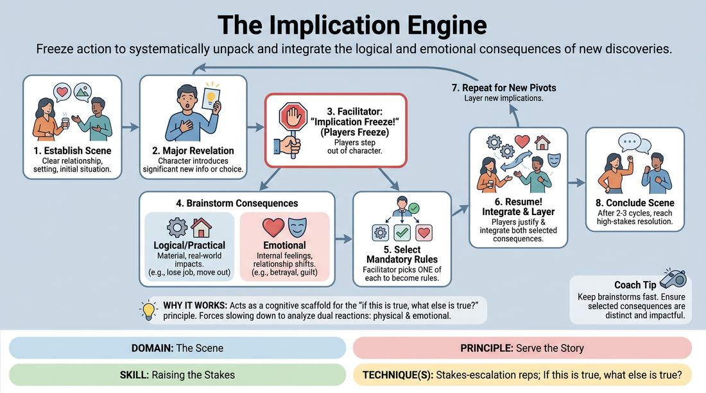

# The Implication Engine

{ .game-hero }

> Freeze action to systematically unpack and integrate the logical and emotional consequences of new discoveries.

## Overview
This structured scene-work exercise uses strategic pauses to dissect the ripple effects of major narrative choices. Players pause mid-scene to brainstorm the immediate practical and emotional fallout of a new revelation. By weaving these consequences back into the action, players learn to build rich, high-stakes stories with deep character commitment.

## What It Trains
- **Domain:** D3 — The Scene
- **Principle(s):** Serve the Story; Yes, And; Make Your Partner a Genius
- **Skill(s):** Narrative Architecture; Justification; Raising the Stakes; Active Listening; Active Gifting
- **Technique(s):** Stakes-escalation reps; If this is true, what else is true?; Reincorporation-as-justification; Endowment-gifting drills
- **Focus:** narrative

**Objective:** To train improvisers in stakes-escalation reps by systematically applying the 'if this is true, what else is true' principle to both the physical world and the characters' emotional relationships.

## Setup
Two to three active players stand in the performance space, with the remaining players and a facilitator observing. No props or special staging are required; the game can easily run in physical or virtual spaces.

## How to Play
1. Begin a standard scene with two players establishing a clear relationship, setting, and initial situation.
2. Play normally until a character introduces a significant new piece of information, a major choice, or a surprising revelation.
3. The facilitator immediately calls out 'Implication Freeze!' and both players freeze in place, stepping out of character.
4. The frozen players and the facilitator quickly brainstorm two types of consequences for this new information: 'Logical/Practical' (material, real-world impacts) and 'Emotional/Relational' (how it alters feelings and dynamics).
5. The facilitator selects one logical consequence and one emotional consequence from the brainstorm to become mandatory narrative rules.
6. The facilitator calls 'Resume!' and the players immediately unfreeze, continuing the scene while actively justifying and integrating both selected consequences.
7. Repeat this freeze-and-brainstorm cycle whenever another major narrative pivot occurs, layering new implications onto the story.
8. Conclude the scene after two or three cycles once the narrative reaches a natural, high-stakes resolution.

## Facilitation Notes
- Coaching Tip: Ensure the 'Implication Freeze' is called only on high-impact offers (e.g., 'I lost the map' or 'I'm in love with your rival') rather than minor details like 'I brought tea.'
- Pitfall: Players might treat the brainstorm as a joke or pitch absurd, unplayable consequences. Fix: Guide them back to grounded, high-stakes realities that honor the established tone of the scene.
- Coaching Tip: Encourage players to show, not just tell, the emotional consequences. If a character is devastated, their physical posture and vocal tone should immediately reflect that shift upon resuming.
- Pitfall: The scene stalls because players get overwhelmed by the new rules. Fix: Side-coach them to focus on one consequence at a time, letting the other emerge naturally through reaction.

## Variations
- Silent Integration: Run the same structure, but the emotional consequence must be integrated entirely non-verbally through body language and eye contact.
- Audience-Driven Engine: Have the observing players (the audience) shout out the logical and emotional consequences during the freeze, keeping the active players on their toes.

## Debrief
- How did separating consequences into 'practical' and 'emotional' change how you raised the stakes?
- What did it feel like to have your character's internal feelings dictated by the brainstorm, and how did you justify it?
- How did this structured pausing prevent the scene from stalling or looping on the same conflict?

## Safety & Inclusion
Because this game rapidly escalates emotional stakes, players should establish boundaries beforehand regarding sensitive topics (e.g., family trauma, severe loss). Facilitators must ensure brainstormed consequences do not cross these pre-established boundaries, and players always have the right to veto a consequence that makes them uncomfortable.

## Why It Works
By pausing the scene to analyze implications, the game acts as a cognitive scaffold for the 'if this is true, what else is true' principle. It forces players to slow down and realize that every action has a dual reaction: one in the physical world (plot) and one in the internal world (relationship). This dual-track escalation builds a robust narrative architecture where stakes rise organically and characters remain deeply affected by their choices.
