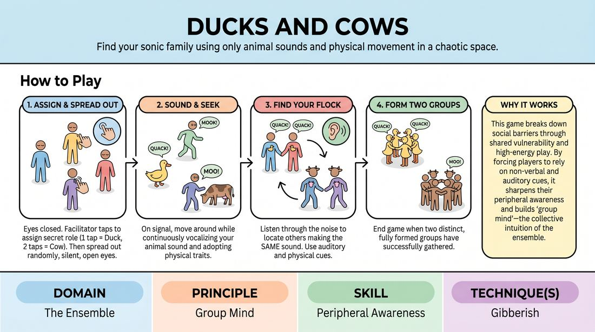

# Sound Flocks

{ .game-hero }

> Find your sonic family using only animal sounds and physical movement in a chaotic space.

## Overview
Sound Flocks is a high-energy, chaotic warm-up where players are secretly assigned to one of two animal groups. By vocalizing their designated animal sound and moving through the space, players must locate their teammates and assemble into unified groups without using any human language. It is a joyful, noisy exercise in listening, physical commitment, and group cohesion.

## What It Trains
- **Domain:** D4 — The Ensemble
- **Principle(s):** Group Mind; Commit 100%; Fail Joyfully
- **Skill(s):** Peripheral Awareness; Physicality & Space Work; Vocal Craft
- **Technique(s):** Gibberish
- **Focus:** connection

**Objective:** To develop peripheral auditory awareness, vocal commitment, and group mind by navigating a chaotic sonic environment to find connection.

## At a Glance
| Aspect | Detail |
|---|---|
| Players | 6+ (ideal 10-30) |
| Time | ~5 min |
| Complexity | 1/5 |
| Skill level | novice |
| Energy | high |
| Physicality | medium |
| Modality | in_person |
| Space | moderate |
| Props | none |
| Audience | not required |

## Setup
An open room cleared of obstacles. Players stand scattered throughout the space. No props are required.

## How to Play
1. Instruct all players to stand in a circle and close their eyes.
2. Explain that you will walk around the outside of the circle and assign each player an animal identity by tapping them on the shoulder: a single tap on the right shoulder means they are a Duck, and a single tap on the left shoulder means they are a Cow.
3. Once everyone has been assigned a role, instruct players to open their eyes but remain silent and spread out randomly across the room.
4. On your signal, players must begin moving around the space while continuously making their assigned animal sound (quacking or mooing) and adopting the physical posture of that animal.
5. Players must listen through the noise to locate others making the same sound, using only their auditory senses and physical orientation to find their group.
6. As players find members of their own species, they must link hands or stand close together, continuing to vocalize to attract remaining lost members.
7. The game ends when two distinct, fully formed groups (the ducks and the cows) have successfully gathered in separate areas of the room.

## Facilitation Notes
- Side-coaching cue: 'Listen past your own voice! Project your sound but keep your ears open to the room.'
- Side-coaching cue: 'Commit fully to the physicality of your animal—how does a duck walk compared to a cow?'
- Pitfall: Players using hand gestures or pointing to find each other. Fix: Remind them that communication is strictly limited to vocalizations and abstract physical movement.
- Pitfall: Players staying in one spot. Fix: Encourage constant movement until the groups are fully formed.

## Variations
- Blindfolded/Eyes Closed: For an advanced challenge, players keep their eyes closed throughout the entire search, relying entirely on sound and gentle physical contact to assemble.
- Multi-Species: Introduce three or four different animals (e.g., sheep, frogs, lions) using different tap patterns to increase the sonic complexity.
- Silent Symphony: Play the game entirely in silence, where players must find each other using only physical movement and non-verbal gestures characteristic of their animal.

## Debrief
- How did you filter out the competing noise to find your group members?
- What did it feel like to commit 100% to a silly physical and vocal character in front of others?
- How did the group dynamic shift once you found your first partner versus when the whole flock was assembled?

## Safety & Inclusion
Since players are moving around a shared space while vocalizing, ensure the floor is completely clear of tripping hazards. For players with hearing impairments, encourage the use of distinct, highly visible physical gestures alongside or instead of vocalizations. Always obtain consent before using physical taps for role assignment, or use a non-contact method like whispering the animal name.

## Why It Works
This game breaks down social barriers through shared vulnerability and high-energy play. By forcing players to rely on non-verbal and auditory cues, it sharpens their peripheral awareness and builds 'group mind'—the collective intuition of the ensemble. Committing to silly sounds and movements helps players overcome self-consciousness, fostering a supportive environment where they can fail joyfully.
