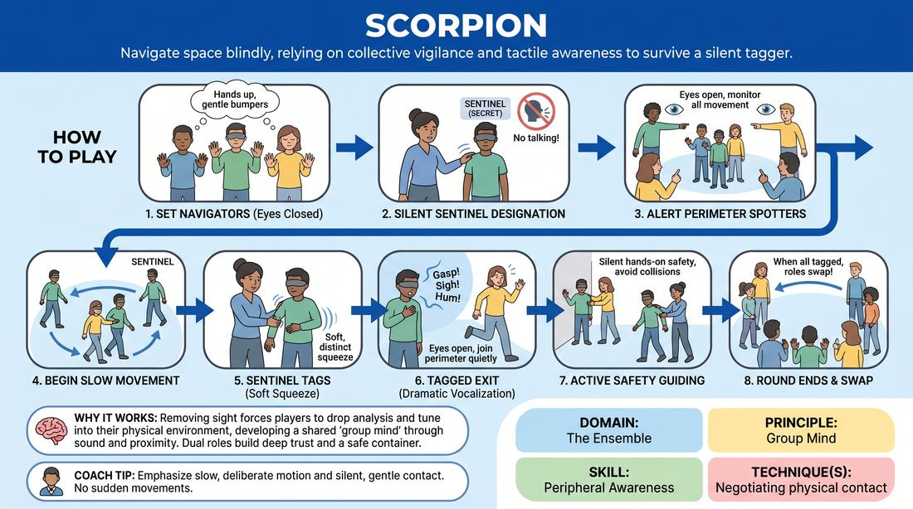

# Blind Sentinel

{ .game-hero }

> Navigate space blindly, relying on collective vigilance and tactile awareness to survive a silent tagger.

## Overview
In this sensory-deprivation ensemble game, a subset of players navigate a cleared space with their eyes closed while a secretly designated 'Sentinel' seeks to tag them out. The remaining players form a protective physical boundary around the room, acting as active spotters to ensure absolute safety and build deep group trust.

## What It Trains
- **Domain:** D4 — The Ensemble
- **Principle(s):** Group Mind; Vulnerability; Consent & Boundaries
- **Skill(s):** Peripheral Awareness; Support Work; Physicality & Space Work; Boundary Navigation
- **Technique(s):** Negotiating physical contact
- **Focus:** connection

**Objective:** To develop heightened peripheral awareness, physical trust, and non-visual spatial mapping while practicing active, non-verbal support work.

## At a Glance
| Aspect | Detail |
|---|---|
| Players | 5+ (ideal 10-20) |
| Time | ~10 min |
| Complexity | 2/5 |
| Skill level | advanced_beginner |
| Energy | medium |
| Physicality | medium |
| Modality | in_person |
| Space | large_open |
| Props | none |
| Audience | not required |

## Setup
Clear a large, open room of all physical obstacles. Divide the group: half of the players stand in the center of the space (the navigators), while the other half form a protective perimeter around the edges of the room (the spotters).

## How to Play
1. Instruct the center navigators to close their eyes, stand still, and bring their hands up to chest height with palms facing outward to act as gentle bumpers.
2. The facilitator silently walks through the center group and taps one player on the shoulder to secretly designate them as the 'Sentinel'.
3. Instruct the perimeter spotters to remain highly alert, keeping their eyes open to monitor the movement of the blind navigators.
4. On the facilitator's cue, the blind navigators (including the Sentinel) begin moving slowly and mindfully through the space.
5. When the Sentinel gently bumps into another navigator, they deliver a soft, distinct squeeze to the person's forearm.
6. The tagged navigator lets out a dramatic, stylized vocalization (such as a gasp, sigh, or hum), opens their eyes, and quietly exits the center to join the perimeter spotters.
7. Spotters must actively and silently guide any blind navigator away from walls, obstacles, or hard collisions by placing gentle hands on their shoulders and steering them back toward the center.
8. The round continues until all navigators have been tagged out, after which the roles of navigators and spotters are swapped.

## Facilitation Notes
- Coaching Cue: 'Spotters, you are the physical safety net. Be proactive, silent, and gentle when redirecting your peers.'
- Coaching Cue: 'Navigators, move at a slow, deliberate pace. This is an exercise in sensory tuning, not a high-speed chase.'
- Pitfall: Navigators moving too quickly, leading to accidental hard collisions. Fix: Pause the game immediately and enforce a strict 'slow-motion' rule.
- Pitfall: Spotters becoming passive observers or talking. Fix: Remind spotters that their active, silent physical support is the foundation of the group's trust.

## Variations
- Infection: Anyone tagged by the Sentinel also becomes a Sentinel, spreading the silent tag until only one survivor remains.
- Neutralization: If two Sentinels bump into each other, they both lose their Sentinel status and revert to regular navigators, signaling the change with a double-tap.
- Soundscapes: Instead of exiting the space, tagged players freeze in place and emit a continuous low hum, creating physical and auditory obstacles for the remaining players to navigate.

## Debrief
- How did your reliance on your other senses shift once your vision was removed?
- As a spotter, what did it feel like to be entirely responsible for the physical safety of your ensemble partners?
- How does the physical trust built in this exercise translate to supporting your scene partners on stage during an improvisation?

## Safety & Inclusion
Establish clear boundaries for physical touch before starting: a gentle forearm squeeze for the tag, and a gentle two-handed shoulder guide for spotting. If any participant is uncomfortable closing their eyes or being touched, they can participate fully as a spotter, or navigate with their eyes open but looking directly down at their feet.

## Why It Works
By removing sight, players are forced to drop their analytical minds and tune into their physical environment, developing a shared 'group mind' through sound and proximity. The dual structure of navigators and spotters creates a safe container that allows players to embrace vulnerability while practicing active, non-verbal support.
