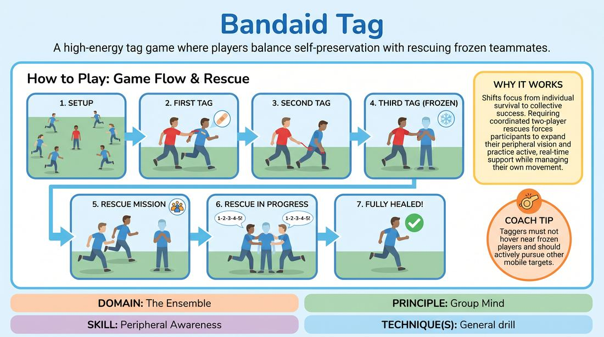

# Bandage Tag

{ .game-hero }

> A high-energy tag game where players balance self-preservation with rescuing frozen teammates.

## Overview
Bandage Tag is an active, physical warm-up that transforms a classic playground game into a lesson in collective responsibility. Players navigate a shared space, managing physical limitations from tags while keeping a watchful eye out for teammates who need rescue. It builds immediate physical connection, high energy, and a shared group consciousness.

## What It Trains
- **Domain:** D4 — The Ensemble
- **Principle(s):** Commit 100%; Group Mind
- **Skill(s):** Physicality & Space Work; Peripheral Awareness; Support Work
- **Focus:** connection

**Objective:** To develop peripheral awareness, physical commitment, and active support work by forcing players to look beyond their immediate survival to assist others in need.

## Setup
An open, safe room free of obstacles. Define clear boundaries for the playing area. No props are required.

## How to Play
1. Designate one player as the tagger and have all other players scatter across the playing space.
2. When the tagger tags a player, that player must immediately place one hand over the exact spot where they were tagged, acting as a bandage.
3. The tagged player must continue running and dodging while keeping that hand firmly in place.
4. If tagged a second time, the player must place their other hand over the new tag site, continuing to move with both hands occupied.
5. If tagged a third time, having no free hands left to apply a bandage, the player becomes frozen in place.
6. To unfreeze a frozen player, two active players must simultaneously run to them, place a hand on them, and count aloud to five together to perform a rescue operation.
7. Once the count is complete, the frozen player is fully healed, releases their bandages, and rejoins the game with both hands free.
8. The tagger cannot hover near frozen players and must actively pursue other mobile targets.

## Facilitation Notes
- Encourage players to make dramatic, physically committed choices when holding their bandages, which naturally limits their mobility and adds comedic tension.
- Watch for tunnel vision where players only focus on avoiding the tagger; side-coach them to look around and spot frozen teammates who need help.
- If the tagger is struggling to freeze anyone, add a second tagger to increase the pressure and demand higher peripheral awareness.
- Ensure players are tagging gently with a two-finger touch to maintain safety in a high-energy environment.

## Variations
- Multi-Tagger Chaos: Introduce two or three taggers simultaneously to increase the speed of the game and demand faster rescues.
- Silent Rescue: The two rescuers must unfreeze the player by making eye contact and synchronized physical gestures instead of counting aloud, deepening non-verbal connection.
- Vocal Infection: When tagged, players must make a continuous sound representing their injury until they are cured, adding a soundscape element to the physical play.

## Debrief
- How did your focus shift when you went from simply surviving to actively looking for teammates to rescue?
- What did it feel like to be frozen and waiting for help? How did you signal your need without breaking the rules?
- How does the concept of saving your partner in this game translate to supporting your scene partners on stage?

## Safety & Inclusion
Establish a strict light touch rule for tagging, restricting tags to shoulders, back, or arms only to respect physical boundaries. Players with mobility limitations can participate by walking, with the entire group matching their pace to keep the game inclusive.

## Why It Works
This game works because it shifts the player's objective from individual survival to collective success. By requiring two players to coordinate a rescue, it forces participants to expand their peripheral vision and practice active support work under pressure, embodying the Group Mind principle.
