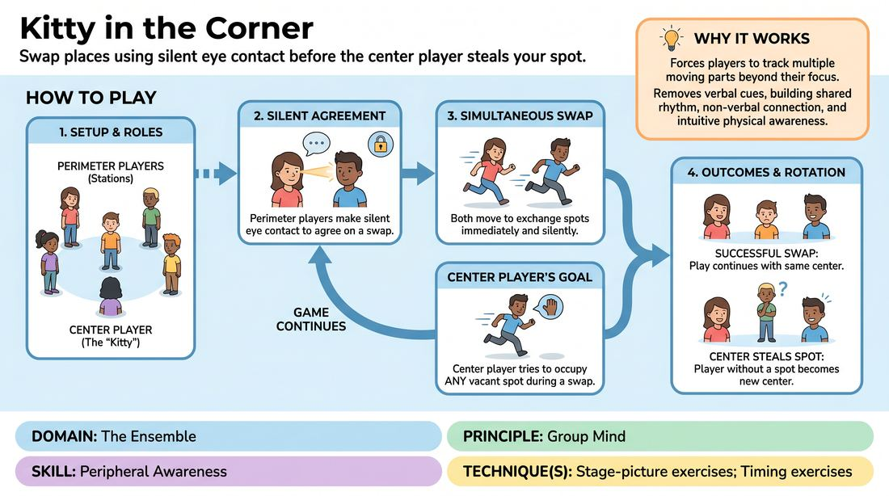

# Corner Swap

{ .game-hero }

> Swap places using silent eye contact before the center player steals your spot.

## Overview
A high-energy, non-verbal warm-up where players occupy designated perimeter spots while one player stands in the center. Perimeter players must make silent eye contact to coordinate swapping places, while the center player attempts to claim any vacated spot. It builds intense focus, non-verbal connection, and group mind.

## What It Trains
- **Domain:** D4 — The Ensemble
- **Principle(s):** Group Mind; Follow the Follower; Make Your Partner a Genius
- **Skill(s):** Peripheral Awareness; Pacing & Rhythm; Active Listening; Physicality & Space Work
- **Technique(s):** Stage-picture exercises; Timing exercises
- **Focus:** connection

**Objective:** To develop peripheral awareness, non-verbal communication, and group mind by reading subtle physical cues and coordinating movement without speaking.

## Setup
Clear a moderate-sized playing space. Define four to six perimeter stations (using actual room corners, chairs, or tape marks). One player starts in the center, while the remaining five to six players occupy the perimeter spots.

## How to Play
1. Position the perimeter players at their designated stations around the room, leaving one player standing in the center.
2. Instruct the players on the perimeter to attempt to swap places with one another without speaking or making noise.
3. To initiate a swap, two perimeter players must make direct eye contact and reach a silent, mutual agreement to move.
4. Once the agreement is made, both players must simultaneously move to exchange spots.
5. The center player's goal is to physically occupy any perimeter spot that becomes vacant during a swap.
6. If the center player successfully claims an open spot, the player left without a perimeter station becomes the new center player.
7. The game continues seamlessly with the new center player trying to intercept the next swap.

## Facilitation Notes
- Coaching cue: 'Keep your eyes moving. Don't just look at your immediate neighbors; look diagonally across the space.'
- Pitfall: Players hesitating or backing out of a swap mid-run. Fix: Coach them to commit fully once eye contact is locked. 'Commit to the movement; trust your partner.'
- Coaching cue: 'Center player, watch the eyes of the perimeter players to anticipate where the next opening will be.'
- Pitfall: Players calling out names or using hand gestures. Fix: Remind them that all communication must be entirely silent and visual.

## Variations
- Slow-Motion Swap: Perform the entire game in slow motion, emphasizing deliberate physical control and dramatic tension.
- Multiple Centers: Add a second center player to a larger group to increase the chaos and demand higher peripheral awareness.
- Emotional Swaps: Players must adopt a specific shared emotion during the swap, changing their physical posture and movement style.

## Debrief
- How did you know when your partner was truly ready to swap without speaking?
- What did you have to pay attention to in order to successfully steal a spot or defend yours?
- How does this game demonstrate 'Group Mind' and 'Follow the Follower'?

## Safety & Inclusion
Ensure the playing area is completely clear of tripping hazards. Players should be mindful of physical collisions; encourage controlled speed rather than reckless sprinting. Offer a walking-only version for accessibility.

## Why It Works
It forces players to look beyond their immediate focus and use their peripheral vision to track multiple moving parts. By removing verbal communication, players must rely on shared rhythm, eye contact, and physical intuition, which rapidly builds ensemble trust and a sense of group mind.
