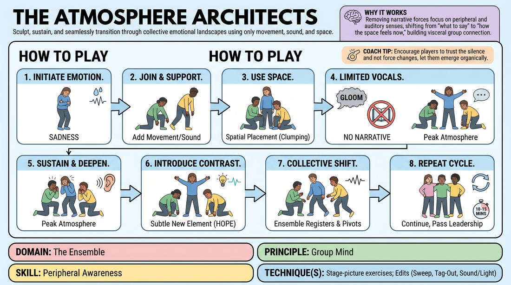

# Atmospheric Architects

{ .game-hero }

> Sculpt, sustain, and seamlessly transition through collective emotional landscapes using only movement, sound, and space.

## Overview
A non-narrative ensemble exercise where players collaboratively construct and shift through distinct emotional atmospheres. By stripping away plot and character, the group relies entirely on physical posture, spatial relationships, and vocalized soundscapes to build a unified mood, then organically pivots to new emotional states as a single cohesive unit.

## What It Trains
- **Domain:** D4 — The Ensemble
- **Principle(s):** Group Mind; Follow the Follower; Serve the Piece
- **Skill(s):** Peripheral Awareness; Support Work; Pacing & Rhythm; Thematic Synthesis; Emotional Fluidity; Physicality & Space Work
- **Technique(s):** Stage-picture exercises; Edits (Sweep, Tag-Out, Sound/Light); Character Walks/Centers; Mirror exercise
- **Focus:** connection

**Objective:** To develop deep group mind, peripheral awareness, and physical stage-picture composition by prioritizing collective emotional resonance over individual narrative or character-driven choices.

## Setup
A clear, open performance space. Four to eight players stand in a loose semi-circle or around the perimeter of the space, ready to enter. No props or chairs are needed.

## How to Play
1. One player steps into the empty space and establishes a clear, singular physical posture, repetitive movement, or non-verbal sound that evokes a specific emotional quality.
2. One by one, other players enter the space, adding their own minimal physical or vocal contributions that support and deepen the established mood without introducing a narrative or character.
3. Players use their physical placement in the space—such as clumping together, spreading far apart, varying physical levels, or facing away—to visually and physically manifest the collective feeling.
4. Keep verbal communication strictly limited to single, resonant words or abstract sounds, avoiding any dialogue, scenes, or plot points.
5. Sustain and deepen the atmosphere, listening and watching closely until the mood reaches its peak and the group collectively senses it is time to shift.
6. Any player who feels the impulse introduces a subtle, contrasting physical or vocal element to hint at a new emotional direction.
7. The rest of the ensemble immediately registers this subtle cue, gradually letting go of the previous atmosphere to adopt, support, and amplify the new emotional state.
8. Continue this organic cycle of building, sustaining, and transitioning through multiple distinct atmospheres for ten to fifteen minutes, letting leadership pass fluidly from player to player.

## Facilitation Notes
- Side-coaching cue: Focus on the space between you, not just your own body. How does your posture talk to theirs?
- Pitfall: Players defaulting to narrative or starting a scene. Fix: Remind them to strip away identity and focus purely on abstract sound, shape, and weight.
- Side-coaching cue: Don't rush the transition. Let the old mood dissolve slowly as the new one takes root.
- Pitfall: One player dominating the transitions. Fix: Coach the group to follow the follower—anyone can initiate a shift, but it only works if the group chooses to support it.

## Variations
- Silent Landscapes: Remove all vocalizations and words entirely, forcing the ensemble to rely solely on physical posture, movement, and spatial composition.
- The Echo Chamber: Once an atmosphere is established, players must mirror or echo a physical posture or sound of another player before adding their own subtle variation.
- Atmospheric Arc: The facilitator provides a starting and ending emotional state, and the group must navigate the transition through several intermediate moods without speaking.

## Debrief
- How did it feel to transition between moods without anyone explicitly calling for a change?
- What physical or vocal cues were the easiest to read and follow?
- How did the physical layout of the stage picture affect the emotional weight of each atmosphere?
- When did you feel the Group Mind click most strongly during the exercise?

## Safety & Inclusion
Ensure players are mindful of physical boundaries and personal space, especially when moving with closed eyes or in close proximity. Encourage participants to adapt any physical postures to their own comfort and mobility levels.

## Why It Works
By removing the cognitive load of narrative, plot, and character, players are forced to activate their peripheral vision and auditory senses. This shifts their focus from what to say next to how the space feels right now, building a visceral, shared group mind that translates directly to stronger stage presence and support in scenic work.
