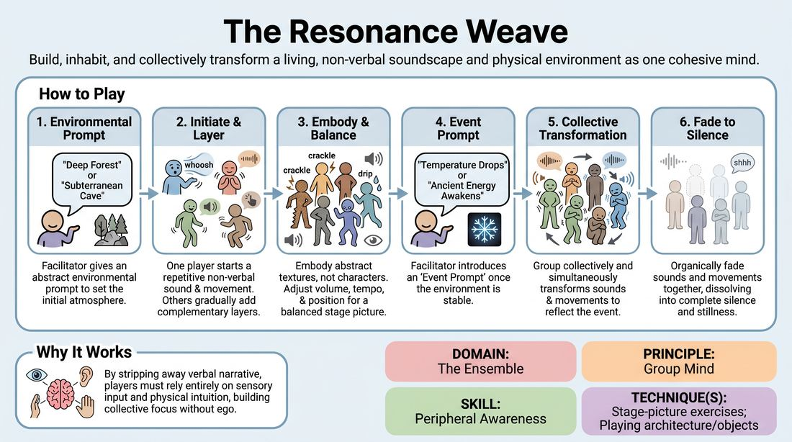

# The Resonance Weave

{ .game-hero }

> Build, inhabit, and collectively transform a living, non-verbal soundscape and physical environment as one cohesive mind.

## Overview
A collaborative, non-verbal ensemble exercise where players construct a multi-sensory environment using repetitive physical movements and vocal sounds. Instead of playing characters, participants embody the abstract textures and natural elements of a setting. The group must work in absolute synchronicity, using heightened peripheral awareness to establish the space and collectively transform it when an external event occurs.

## What It Trains
- **Domain:** D4 — The Ensemble
- **Principle(s):** Group Mind; Follow the Follower; Serve the Piece
- **Skill(s):** Peripheral Awareness; Support Work; Suggestion Deconstruction (A-to-C); Pacing & Rhythm
- **Technique(s):** Stage-picture exercises; Playing architecture/objects; A-to-C drills; Timing exercises
- **Focus:** connection

**Objective:** To develop deep group mind, non-verbal synchronicity, and advanced peripheral awareness by training players to listen, observe, and adapt to the collective stage picture and soundscape without individual ego.

## Setup
An open, quiet room with enough space for 4 to 15 players to move freely. No props or materials are required. Players begin scattered across the space in a neutral standing position, with their eyes closed or cast downward to focus their internal attention.

## How to Play
1. The facilitator provides an abstract environmental prompt (e.g., 'Deep Forest', 'Subterranean Cave', or 'Industrial Factory') to set the initial atmosphere.
2. One player voluntarily opens their eyes and initiates a single, simple, repetitive physical movement or non-verbal sound that represents a texture of the environment (e.g., a slow swaying motion or a rhythmic hum).
3. The remaining players gradually open their eyes and enter the space one by one, adding their own repetitive movements or sounds that support, layer, or subtly contrast the existing elements.
4. Players must avoid portraying characters or miming specific actions; instead, they must become abstract, physical, and auditory components of the environment itself.
5. The ensemble continuously monitors the entire room, adjusting their individual volume, tempo, and physical positioning to maintain a balanced, evolving stage picture and soundscape.
6. Once the environment is fully established and stable, the facilitator introduces an 'Event Prompt' (e.g., 'The temperature drops rapidly' or 'An ancient energy awakens').
7. Without speaking or pausing, the entire group must collectively and simultaneously transition their movements and sounds to reflect how the environment reacts to this new event.
8. After sustaining the newly transformed environment, the group organically fades their sounds and movements together, gradually dissolving into complete silence and stillness.

## Facilitation Notes
- Side-coaching cue: 'Listen to the whole room, not just your immediate neighbor. Let your movement be a response to the entire stage picture.'
- Pitfall: Players trying to tell individual stories or play characters (e.g., pretending to be a scared explorer). Fix: Remind them to remain abstract textures—be the wind, the creaking wood, or the rising heat, not the person experiencing it.
- Side-coaching cue: 'Blend and support. If the soundscape is getting too loud or chaotic, find a quiet frequency or a slower rhythm to ground it.'
- Pitfall: The transition during the Event Prompt becomes disjointed or led by a single dominant player. Fix: Coach the group to 'follow the follower,' making micro-adjustments together rather than waiting for one person to dictate the change.

## Variations
- Sensory Deprivation Shift: Have half of the players keep their eyes closed throughout the entire exercise, forcing them to rely entirely on auditory cues and physical proximity to sense and execute the environmental transformation.
- Internal Emotional Arc: Instead of an external event prompt, the facilitator gives the group a silent emotional progression (e.g., 'from tranquility to mounting anxiety to relief') that they must collectively navigate.
- Narrative Spark: Use a highly specific, brief narrative fragment as the event prompt (e.g., 'A single drop of water falls into the dust') and have the environment react to its immediate physical implications.
- Autonomous Weave: Run the exercise without any facilitator prompts; the ensemble must organically initiate, evolve, shift, and dissolve the environment entirely through intuitive group consensus.

## Debrief
- How did it feel to communicate and negotiate changes without using words or looking at a single leader?
- What cues did you rely on to sense when the group was ready to transition during the event prompt?
- How did you balance your individual contribution with the overall soundscape and physical stage picture?
- In what ways did we practice 'following the follower' during the environmental shift?

## Safety & Inclusion
Ensure the space is clear of tripping hazards, as players will be moving with soft focus or closed eyes. Encourage participants to adapt movements to their physical comfort levels, and establish that vocal contributions can range from quiet breathing to humming to accommodate different vocal comfort zones.

## Why It Works
This game works because it strips away the cognitive load of verbal narrative, forcing players to rely entirely on sensory input and physical intuition. By removing individual characters, it eliminates ego and redirects focus toward the collective stage picture and soundscape. The transition phase acts as a physicalized A-to-C association drill, requiring the group to instantly align on the unspoken logic of how an environment reacts to change, thereby building a profound sense of group mind.
