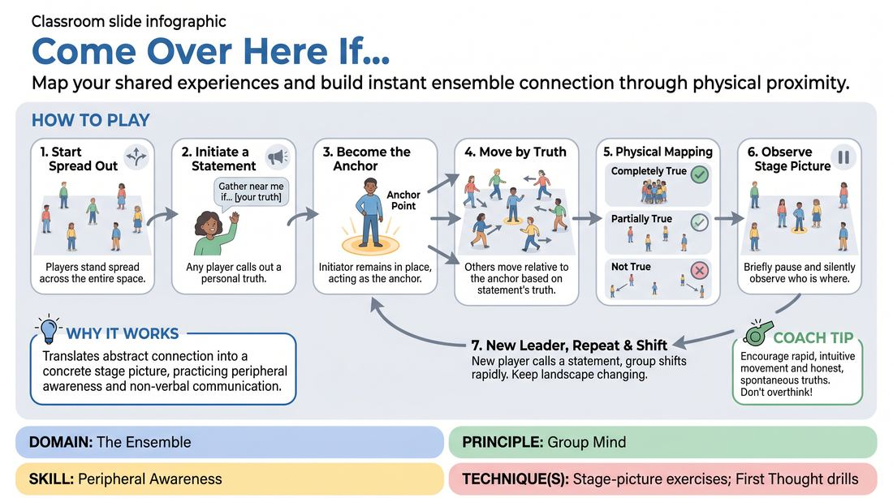

# Common Ground

{ .game-hero }

> Map your shared experiences and build instant ensemble connection through physical proximity.

## Overview
A dynamic, whole-room warm-up where players physically cluster based on shared traits, preferences, or experiences. By moving closer to or further from a speaker, the group constantly reshapes the stage picture, visually mapping their collective commonalities.

## What It Trains
- **Domain:** D4 — The Ensemble
- **Principle(s):** Group Mind; Vulnerability
- **Skill(s):** Peripheral Awareness; Unfiltered Spontaneity
- **Technique(s):** Stage-picture exercises; First Thought drills
- **Focus:** connection

**Objective:** Develops peripheral awareness and group mind by forcing players to constantly read the physical space, observe who is standing where, and make spontaneous, honest choices about their own placement.

## Setup
A wide, open room with cleared furniture so players can move freely. No props needed. Players start scattered randomly throughout the space.

## How to Play
1. Begin with all players standing and spread out across the entire room.
2. Any player can initiate a round by raising their hand and calling out a personal truth starting with the phrase, 'Gather near me if...' (for example, '...if you have a dog' or '...if you are afraid of heights').
3. The initiating player remains in their spot, acting as the anchor point for that statement.
4. All other players must immediately move relative to the anchor based on how strongly the statement applies to them.
5. Stand directly next to the anchor if the statement is completely true for you, stand at a moderate distance if it is partially true, or move to the far edges of the room if it does not apply at all.
6. Once the group settles into this new physical map, take a brief moment to silently observe the stage picture and see who is standing where.
7. A new player then raises their hand from their current position, calls out a new 'Gather near me if...' statement, and the entire group shifts to form a new physical spectrum around this new anchor.
8. Continue the process rapidly, allowing different voices to lead and ensuring the physical landscape of the room keeps shifting.

## Facilitation Notes
- Coaching cue: 'Don't just look at the anchor—look at the whole room. Notice the empty spaces and the dense clusters.'
- Pitfall: Players taking too long to decide where to stand. Fix: Encourage rapid, unfiltered movement; go with your first instinct rather than overthinking the nuance of the statement.
- Coaching cue: 'Vary the depth of your statements. Mix lighthearted preferences with deeper, more vulnerable truths to see how the group dynamic shifts.'
- Pitfall: The same few people initiating every round. Fix: Encourage quieter players to step up as the anchor, or prompt the group to wait a beat to let someone new speak.

## Variations
- Silent Spectrum: Play the entire game in complete silence after the initial statement is made, relying purely on eye contact and physical intuition to find your place.
- Opposite Poles: The anchor makes a statement and points to another spot in the room for the exact opposite, forcing the group to line up along a strict linear spectrum between the two points.
- Abstract Prompts: Use abstract or emotional prompts instead of literal facts (for example, 'Gather near me if you feel like a storm cloud today').

## Debrief
- How did it feel to see a physical representation of what we have in common?
- What did you notice about the stage picture when we clustered versus when we spread out?
- How does paying attention to where everyone else is standing help us build a stronger group mind on stage?

## Safety & Inclusion
Ensure pathways are clear for players with mobility considerations. Remind players that they are in control of their own vulnerability; they do not have to move close to the anchor if a prompt feels too personal or uncomfortable to share publicly.

## Why It Works
It translates abstract connection into a concrete, visual stage picture. By physically navigating the space in response to others, players practice peripheral awareness and non-verbal communication, laying the groundwork for intuitive ensemble work.
