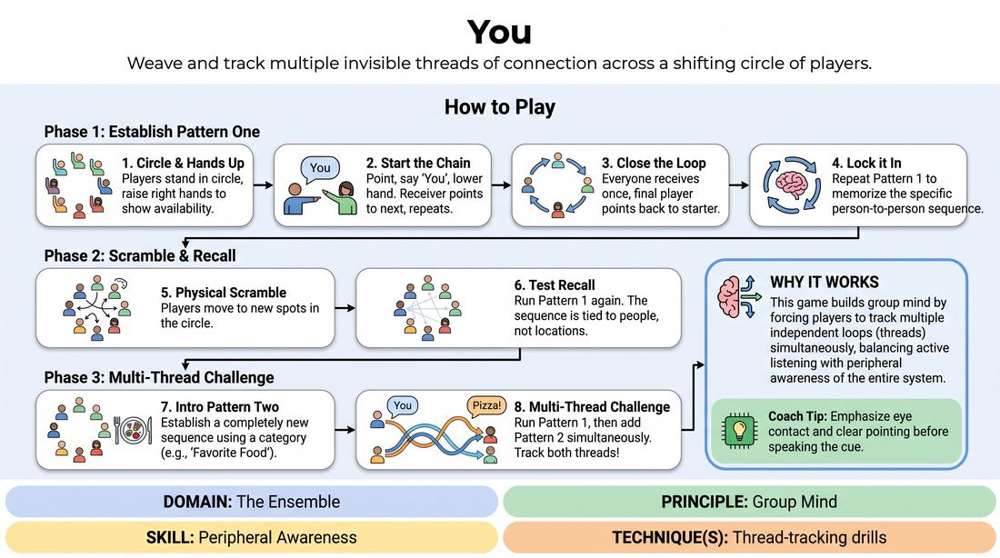

# The Multi-Thread Connection

{ .game-hero }

> Weave and track multiple invisible threads of connection across a shifting circle of players.

## Overview
A high-focus ensemble warm-up where players establish and maintain multiple distinct passing patterns simultaneously. As the physical positions of the players shift, the mental threads of the patterns remain intact, demanding deep peripheral awareness and active listening.

## What It Trains
- **Domain:** D4 — The Ensemble
- **Principle(s):** Group Mind; Make Your Partner a Genius
- **Skill(s):** Peripheral Awareness; Active Listening
- **Technique(s):** Thread-tracking drills
- **Focus:** connection

**Objective:** To develop group mind, peripheral awareness, and multi-thread tracking by requiring players to manage multiple cognitive tasks and interpersonal connections at once.

## At a Glance
| Aspect | Detail |
|---|---|
| Players | 5+ (ideal 8-15) |
| Time | ~10 min |
| Complexity | 2/5 |
| Skill level | novice |
| Energy | medium |
| Physicality | low |
| Modality | in_person |
| Space | moderate |
| Props | none |
| Audience | not required |

## Setup
Players stand in a comfortable circle facing inward. No props or materials are required. Ensure there is enough space for players to move and swap positions safely.

## How to Play
1. Have all players stand in a circle and raise their right hands to indicate they are available to receive the pattern.
2. The starting player points to someone across the circle, says 'You', and lowers their hand. The receiving player then points to a different player with their hand up, says 'You', and lowers their hand.
3. Continue this chain until every player has received the pass exactly once, with the final player pointing back to the starter to close the loop. This sequence is Pattern One.
4. Run Pattern One several times to lock in the sequence. Emphasize that the pattern is tied to the specific people, not their physical locations in the room.
5. Have players physically scramble and stand in completely new spots in the circle, then run Pattern One again to test their recall of who they receive from and pass to.
6. Introduce Pattern Two: Raise hands again and establish a completely new sequence of passes using a category (e.g., naming favorite foods) instead of the word 'You'. Ensure the sequence of people is entirely different from Pattern One.
7. Once Pattern Two is memorized, launch Pattern One. Shortly after, launch Pattern Two simultaneously, requiring players to track both threads at the same time.

## Facilitation Notes
- Coaching cue: 'Keep your eyes soft.' Encourage players to use peripheral vision to see the whole circle rather than hyper-focusing only on the person they pass to.
- Pitfall: Players panic when multiple patterns overlap. Fix: Remind them to breathe and focus only on their immediate 'sender' and 'receiver' for each specific thread.
- Coaching cue: 'Support your partner.' If someone forgets who they pass to, their receiver can gently wave or make eye contact to help them out.
- If a pattern drops, don't stop the game. Simply have the starter relaunch that specific thread while the other threads keep moving.

## Variations
- Blind Pattern: Once Pattern One is highly secure, have all players close their eyes and run the pattern using only vocal cues and spatial memory.
- The Physical Swap: Every time a player passes a word in Pattern One, they must physically walk and swap places with the person they just passed to, keeping the patterns moving while the circle is in constant motion.
- Triple Thread: Introduce a third pattern with a new category (e.g., colors or animal sounds) and a third unique sequence of players, running all three at once.

## Debrief
- How did your focus shift when we scrambled the circle? What did you have to rely on instead of physical location?
- What did it feel like when multiple patterns were running at once? How did you manage the cognitive overload?
- How does this exercise demonstrate 'making your partner look good' when a thread gets dropped or tangled?

## Safety & Inclusion
Ensure the physical space is clear of tripping hazards, especially for the scrambling phase or variations involving movement. For players with visual or mobility differences, adapt the pointing/moving mechanics to verbal cues or simple gestures that suit everyone's comfort level.

## Why It Works
This game builds group mind by forcing players to look past their individual actions and see the system as a whole. By tracking multiple independent loops (threads), players must balance active listening (waiting for their cue) with peripheral awareness (monitoring the state of the entire circle), creating a shared cognitive state.
