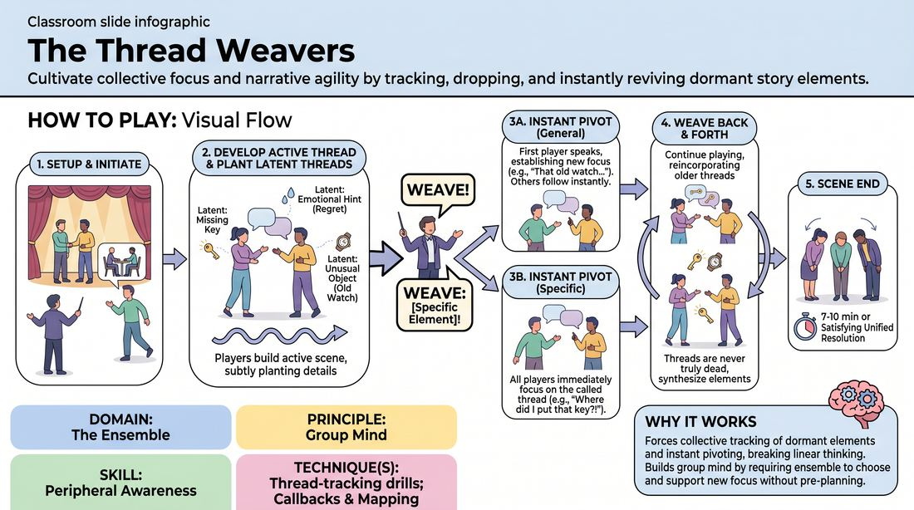

# Thread Weavers

{ .game-hero }

> Cultivate collective focus and narrative agility by tracking, dropping, and instantly reviving dormant story elements.

## Overview
Thread Weavers is an ensemble narrative game where players build a scene while planting subtle, secondary story seeds. At a facilitator's command, the group must instantly pivot, abandoning the active plot to seamlessly develop one of these latent threads. This process trains players to hold a shared mental map of a scene's history and potential futures.

## What It Trains
- **Domain:** D4 — The Ensemble
- **Principle(s):** Group Mind; Follow the Follower; Serve the Piece; Serve the Story; Yes, And
- **Skill(s):** Peripheral Awareness; Support Work; Suggestion Deconstruction (A-to-C); Pacing & Rhythm; Thematic Synthesis; Narrative Architecture
- **Technique(s):** Thread-tracking drills; Callbacks & Mapping; A-to-C drills
- **Focus:** narrative

**Objective:** To develop advanced peripheral awareness and group mind by training players to track multiple narrative threads simultaneously, allowing for rapid, unified transitions that serve the larger story.

## Setup
Three to eight players stand in a semi-circle on stage. One facilitator stands off-stage to act as the Conductor. No props are required, though a whiteboard can optionally be used by the Conductor to track threads during early training.

## How to Play
1. 1. Establish the starting setup with players on stage and the Conductor off-stage.
2. 2. A player steps forward to initiate a scene, establishing a clear platform with a character, relationship, location, and immediate activity to form the active narrative thread.
3. 3. Other players enter the scene to support and build directly on this active thread, ensuring every line of dialogue or physical action heightens the immediate focus.
4. 4. While developing the active thread, players must deliberately but subtly plant 'latent threads'—minor details, emotional hints, or unusual objects that are acknowledged but not immediately explored.
5. 5. The Conductor closely tracks all active and latent threads. At any moment, the Conductor calls out 'WEAVE!'
6. 6. Upon hearing 'WEAVE!', the active players must instantly drop the current storyline and immediately pivot to one of the previously established latent threads.
7. 7. The transition must be seamless and immediate; the first player to speak or move after the call establishes which latent thread is now active, and the rest of the ensemble must instantly align with this choice.
8. 8. Alternatively, the Conductor can call 'WEAVE: [Specific Element]!' (e.g., 'WEAVE: The missing key!'), forcing the ensemble to instantly transition to that specific dormant thread.
9. 9. Continue playing, allowing threads to be woven back and forth. No thread is ever truly dead, and players can naturally reincorporate older elements to synthesize the narrative.
10. 10. End the scene after 7 to 10 minutes, or when the ensemble achieves a satisfying, unified resolution that ties multiple threads together.

## Facilitation Notes
- Coaching Cue: 'Plant the seed, don't water it yet!' Remind players to introduce latent threads casually without immediately derailing the current focus.
- Pitfall & Fix: Players freeze or debate which thread to pick up when 'WEAVE!' is called. Fix: Coach them to commit to the very first offer made post-call. The first physical movement or line of dialogue dictates the direction; everyone else must immediately 'yes-and' it.
- Coaching Cue: 'Track the history!' Encourage players to maintain a wide-angle mental map of everything that has been mentioned, treating the scene's past as a live resource.
- Pitfall & Fix: The facilitator calls 'WEAVE!' too frequently, preventing any single thread from developing depth. Fix: Allow each thread to breathe for at least 45-60 seconds to establish a solid platform before forcing a transition.

## Variations
- Player-Led Weaving: Remove the off-stage Conductor. Any player currently on stage or waiting on the sidelines can call 'WEAVE!' to shift the narrative focus.
- Silent Transitions: Instead of a verbal cue, the facilitator uses a subtle physical gesture (like raising a hand). Players must use their peripheral vision to spot the cue and transition non-verbally first.
- Thematic Weaving: The facilitator calls out an emotional state or theme instead of a plot point (e.g., 'WEAVE: Regret!'). Players must instantly pivot the scene to explore that emotional undercurrent using existing elements.
- Synthesis Weave: When 'WEAVE!' is called, the next player must make an offer that explicitly merges two previously separate latent threads into a single, unified plot point.

## Debrief
- How did it feel to hold multiple narrative possibilities in your head while staying fully present in the active moment?
- What made some transitions feel seamless and satisfying, while others felt jarring?
- How did tracking the 'history' of the scene change your relationship to your scene partners' minor offers?

## Safety & Inclusion
Ensure that physical transitions are safe and that players respect physical boundaries when rapidly shifting focus. If a player has cognitive or memory processing differences, allow the facilitator to use a whiteboard to visibly list the active and latent threads as a shared reference point.

## Why It Works
By forcing players to track dormant narrative elements and pivot instantly, the game breaks the habit of linear, single-track thinking. It builds group mind by requiring the ensemble to collectively choose and support a new focus without verbal negotiation, transforming peripheral details into vital structural pillars of the story.
