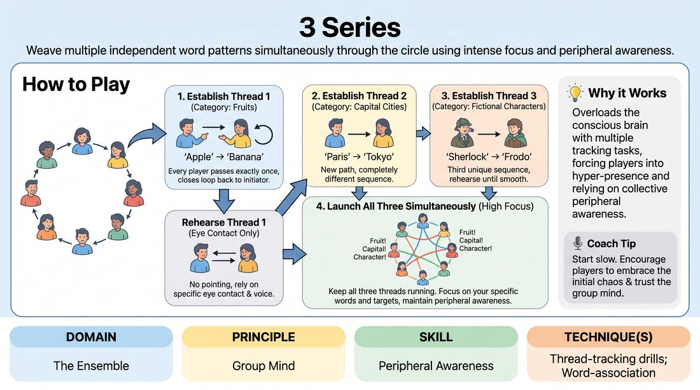

# Parallel Threads

{ .game-hero }

> Weave multiple independent word patterns simultaneously through the circle using intense focus and peripheral awareness.

## Overview
A high-focus ensemble drill where players establish and run multiple distinct word-association patterns simultaneously across a circle. As the cognitive load increases, players must rely on peripheral awareness and deep listening to keep all threads moving without collision. It is an exhilarating exercise in group mind and split-second focus.

## What It Trains
- **Domain:** D4 — The Ensemble
- **Principle(s):** Group Mind; Make Your Partner a Genius; The First Thought Is a Gift
- **Skill(s):** Peripheral Awareness; Active Listening; Unfiltered Spontaneity
- **Technique(s):** Thread-tracking drills; Word-association
- **Focus:** skill_drill

**Objective:** To develop peripheral awareness and thread-tracking capabilities, training players to maintain multiple streams of information simultaneously while remaining present and supportive of their teammates.

## Setup
Players stand in a comfortable circle with enough space to see everyone clearly. No props or materials are required.

## How to Play
1. Gather the group into a standing circle and explain that they will be weaving multiple independent threads of information across the space.
2. Establish Thread 1: Choose a simple category (e.g., fruits). The first player says a fruit (e.g., 'Apple') and points to someone across the circle. That person says a new fruit (e.g., 'Banana') and points to a different person who has not gone yet.
3. Continue this chain until every player has received and passed the thread exactly once, with the final player passing it back to the first player to close the loop. Everyone lowers their pointing hand once they have participated.
4. Rehearse Thread 1 a few times without pointing, using only eye contact and voice to pass the specific words in the exact same sequence.
5. Establish Thread 2: Introduce a completely different category (e.g., capital cities) and create a brand-new passing sequence. Ensure the path of Thread 2 is entirely different from Thread 1. Rehearse Thread 2 until it is memorized.
6. Introduce Thread 3: Establish a third category (e.g., fictional characters) with a third unique sequence, and rehearse it until the group can run it smoothly on its own.
7. Launch the multi-thread phase: Start Thread 1. Once it is successfully moving, the facilitator prompts the initiator of Thread 2 to launch their thread. Shortly after, launch Thread 3.
8. Instruct players to keep all three threads running simultaneously, focusing on receiving their specific words, passing them to their designated targets, and maintaining the flow of the entire circle.

## Facilitation Notes
- Side-coaching cue: 'Don't just throw your word; make sure it is received.' If a player doesn't hear their cue, the sender must repeat it clearly while making eye contact.
- Pitfall: Players rushing and causing the threads to collapse. Fix: Encourage a steady, rhythmic pace rather than speed. Accuracy and connection trump velocity.
- Side-coaching cue: 'Soften your gaze.' Encourage players to use peripheral vision to track the energy of the room rather than staring intensely at only their sender.
- Pitfall: Forgetting who to pass to. Fix: If a thread stalls, pause briefly, have the group help identify the next person in that specific sequence, and resume.

## Variations
- Physical Shift: After a thread is passed, the sender must physically swap places with the receiver, adding spatial movement to the cognitive load.
- Emotional Threads: Instead of word categories, pass specific emotional states or physical gestures that must be mirrored and passed along.
- The Ghost Thread: Run one of the established threads entirely in silence, using only eye contact and physical gestures to pass the invisible word.

## Debrief
- How did your focus shift when we went from running one thread to running three simultaneously?
- What did you have to do with your eyes and ears to keep track of your cues without losing connection to the rest of the circle?
- How does this drill mirror the experience of tracking multiple narrative threads or character relationships in a long-form improv set?

## Safety & Inclusion
Ensure the circle is physically accessible for all participants. If physical pointing or swapping places is difficult, players can use clear vocal cues, name-calling, or simple head nods to pass the threads.

## Why It Works
This game works because it forces players out of their analytical minds and into a state of hyper-presence. By overloading the conscious brain with multiple tracking tasks, players must rely on their peripheral awareness and the collective 'group mind' to keep the system balanced, building deep ensemble trust.
