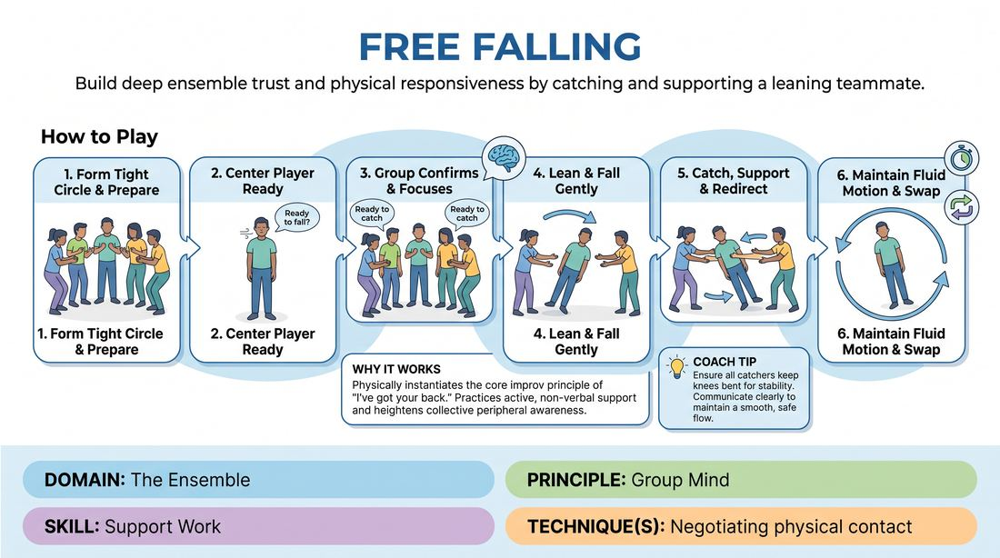

# Circle of Support

{ .game-hero }

> Build deep ensemble trust and physical responsiveness by catching and supporting a leaning teammate.

## Overview
This is a physical ensemble exercise where one player stands in the center of a tight circle, closes their eyes, and gently leans in any direction. The surrounding players work as a unified, attentive unit to catch, support, and gently redirect them back to center, creating a physical manifestation of mutual support.

## What It Trains
- **Domain:** D4 — The Ensemble
- **Principle(s):** Group Mind; Vulnerability; Assume Competence
- **Skill(s):** Support Work; Peripheral Awareness; Boundary Navigation
- **Technique(s):** Negotiating physical contact
- **Focus:** connection

**Objective:** To cultivate a deep sense of group mind, physical support work, and mutual vulnerability by sharing physical responsibility for a teammate's safety.

## Setup
Players stand in a tight, shoulder-to-shoulder circle on a flat, non-slip floor. One volunteer stands in the exact center of the circle. No props are required.

## How to Play
1. Form a tight, compact circle with players standing shoulder-to-shoulder, facing inward, with knees slightly bent and hands up at chest level, palms facing forward.
2. Have one volunteer stand in the center of the circle, keeping their feet planted close together, body straight but relaxed like a wooden plank, and eyes closed.
3. The center player establishes physical readiness by taking a deep breath and verbally confirming with the group: 'Ready to fall?'
4. The circle responds in unison: 'Ready to catch,' signaling their collective focus and physical readiness.
5. Keeping their feet firmly anchored in place, the center player slowly and gently leans in any direction without bending at the waist or hips.
6. The surrounding players use their hands and forearms to gently catch the falling player, absorb their weight, and smoothly push them back toward the center or gently roll them to another part of the circle.
7. Maintain a continuous, fluid motion where the center player is gently swayed around the circle, ensuring they never hit the ground or feel a sudden drop.
8. After one to two minutes, the circle gently brings the center player back to a stable, upright position, allowing them to open their eyes before swapping roles with another player.

## Facilitation Notes
- Coaching cue: 'Keep your body straight like a plank—don't break at the hips or bend your knees.'
- Coaching cue: 'Absorb the weight with your whole body by bending your knees, rather than just using your wrists.'
- Pitfall: Players in the circle standing too far apart, creating dangerous gaps. Fix: Have everyone take a half-step inward to ensure a dense, unbroken perimeter.
- Pitfall: The center player lifting their feet or stepping out of fear. Fix: Remind them to keep their heels glued to the floor, and start with very small, subtle leans first to build confidence.

## Variations
- Silent Sway: Play the entire round in absolute silence, relying purely on breath and physical cues to coordinate the catches and transitions.
- The Pendulum: Instead of a circle, players form two parallel lines facing each other, and the center player falls back and forth between the two lines.

## Debrief
- How did it feel to completely surrender control to the group, and what did you need from them to feel safe?
- For those catching, how did you maintain peripheral awareness to ensure no gaps opened up in the circle?
- How does this physical experience of 'having someone's back' translate to supporting a teammate's choices in an improv scene?

## Safety & Inclusion
This game involves close physical contact and trust. Always offer an explicit opt-out for anyone uncomfortable with being touched or falling. Ensure catchers stand in a strong, athletic stance (knees bent, low center of gravity) to prevent strain. The center player must keep their body rigid to make catching safe and predictable.

## Why It Works
It physically instantiates the core improv principle of 'I've got your back.' By physically catching a teammate, players practice active, non-verbal support work and develop a heightened peripheral awareness of the group's collective physical state.
