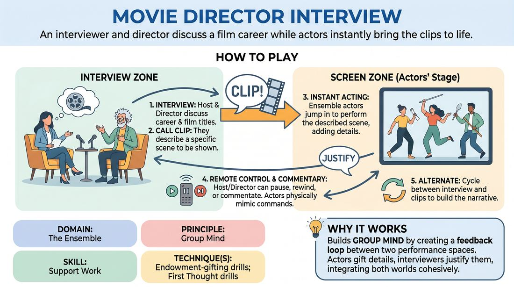

# The Director's Cut

{ .game-hero }

> An interviewer and director discuss a film career while actors instantly bring the clips to life.

## Overview
This game splits the stage into a talk-show interview on one side and a live-action movie screen on the other. An interviewer and an eccentric director discuss the director's filmography, calling for clips of specific scenes on the fly. The remaining players act out these clips instantly, responding to the director's commentary, remote control commands, and bizarre artistic choices.

## What It Trains
- **Domain:** D4 — The Ensemble
- **Principle(s):** Group Mind; Make Your Partner a Genius; The First Thought Is a Gift
- **Skill(s):** Support Work; Pacing & Rhythm; Active Gifting; Active Listening; Unfiltered Spontaneity
- **Technique(s):** Endowment-gifting drills; First Thought drills; Timing exercises
- **Focus:** comedy_game

**Objective:** To develop Group Mind and Support Work by requiring players to listen across two distinct performance zones, instantly justifying and building upon each other's narrative offers.

## At a Glance
| Aspect | Detail |
|---|---|
| Players | 4–6 (ideal 4-6) |
| Time | ~10 min |
| Complexity | 3/5 |
| Skill level | advanced_beginner |
| Energy | medium |
| Physicality | medium |
| Modality | in_person |
| Space | moderate |
| Props | none |
| Audience | not required |

## Setup
Divide the playing area into two halves. On the left side, place two chairs for the Interviewer and the Director. The right side is the screen area, left clear for two to four actors to stand ready. No props are needed.

## How to Play
1. Assign roles: one Interviewer, one Director, and two to four Ensemble Actors who will play all the movie clips.
2. Get a suggestion from the audience for a fictional, slightly unusual movie director's name and their signature genre.
3. The Interviewer begins the talk-show style segment, welcoming the Director and asking about their career, specific film titles, or artistic choices.
4. At any point during the conversation, either the Interviewer or the Director can call for a clip by describing a scene from one of the director's movies.
5. The moment a clip is called, the Interviewer and Director freeze, and the Ensemble Actors instantly step into the screen area to perform the scene based on the details just discussed.
6. The Interviewer or Director can pause, rewind, fast-forward, or commentate on the clip at any time, and the actors must physically and vocally mimic these remote-control effects immediately.
7. The actors should not just replicate what was described; they must yes-and the premise, adding new, surprising details that the Director must then justify when the interview resumes.
8. Alternate back and forth between the interview and the movie clips, building a cohesive, comedic narrative of the director's career.

## Facilitation Notes
- Side-coaching cue: Keep the clips short! Remind the interviewer and director to pause or cut the clips after twenty to thirty seconds to keep the pacing brisk and energetic.
- Pitfall: The actors wait for too much information before starting. Fix: Encourage the actors to jump into physical action immediately upon the clip being called, discovering the scene through movement and first thoughts.
- Side-coaching cue: Justify the mistakes! If an actor mishears a detail or makes a choice that contradicts the director's description, the director should enthusiastically justify it as a brilliant artistic choice.
- Pitfall: The interviewers and actors operate in silos. Fix: Ensure the interviewers actively reference specific things the actors did in the clip, and the actors reference the director's pretentious commentary in subsequent clips.

## Variations
- Foreign Language Dub: The actors perform the clip in a gibberish language, and the Director must translate or explain what they are saying.
- Genre Hop: The Interviewer reveals that the film was remade in three different genres, forcing the actors to replay the same clip in rapid succession under different stylistic constraints.
- Director's Commentary: The clip plays continuously while the Director talks over it in real-time, with the actors adjusting their performances to match the Director's live critique.

## Debrief
- How did it feel to listen and support your teammates across two different areas of the stage?
- What strategies did the actors use to instantly align on a scene's setting and relationship?
- How did justifying mistakes or contradictions make the director's character and the movie clips funnier?

## Safety & Inclusion
Ensure the physical space is clear of obstacles so actors can safely move, jump, or mimic physical rewinds and fast-forwards without tripping. Encourage actors to use physical self-preservation during high-energy physical comedy.

## Why It Works
This game builds Group Mind by establishing a feedback loop between two separate performance spaces. The interviewers feed the actors premises, the actors expand those premises with physical and verbal gifts, and the interviewers then integrate those new gifts back into the interview. This constant mutual support ensures that no single player carries the burden of inventing the entire narrative.
