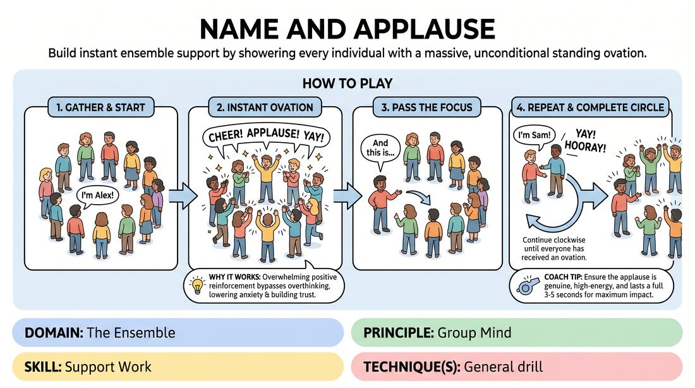

# The Welcome Ovation

{ .game-hero }

> Build instant ensemble support by showering every individual with a massive, unconditional standing ovation.

## Overview
A high-energy, low-stakes icebreaker where players stand in a circle and take turns introducing themselves. Every single introduction is met with an immediate, explosive burst of applause and cheering from the entire group, establishing a culture of radical support and celebration from the very first minute.

## What It Trains
- **Domain:** D4 — The Ensemble
- **Principle(s):** Group Mind; Vulnerability
- **Skill(s):** Support Work; Vocal Craft
- **Focus:** connection

**Objective:** To develop a sense of group mind, vulnerability, and active support work by practicing unconditional celebration of one's peers and overcoming the fear of being seen.

## At a Glance
| Aspect | Detail |
|---|---|
| Players | 3+ (ideal 8-25) |
| Time | ~5 min |
| Complexity | 1/5 |
| Skill level | novice |
| Energy | high |
| Physicality | low |
| Modality | in_person |
| Space | minimal |
| Props | none |
| Audience | not required |

## Setup
Players stand in a circle facing inward. No props or special materials are required. Ensure there is enough space for everyone to stand comfortably.

## How to Play
1. Gather the group into a standing circle facing inward.
2. Explain that the goal of this exercise is to practice radical, unconditional support for every member of the ensemble.
3. The facilitator starts by stating their own name clearly (e.g., 'I'm Alex!').
4. Immediately upon hearing the name, the entire circle erupts into enthusiastic applause, cheering, and celebration for three to five seconds.
5. Once the applause subsides, the active player gestures to the person to their left and says, 'And this is...'
6. The next person says their name, and the entire group instantly responds with another massive, high-energy ovation.
7. Continue this pattern clockwise around the circle until every participant has introduced themselves and received their ovation.
8. Complete the circle by having the final player introduce the first player one last time, ending on a collective group cheer.

## Facilitation Notes
- Coaching cue: 'Don't just clap—celebrate them like they just won a lifetime achievement award!'
- Pitfall: Half-hearted or polite golf claps. Fix: Model the extreme energy yourself on the very first turn, using vocal cheers and high physical energy to set the bar high.
- Coaching cue: 'Make eye contact with the person you are celebrating to make the support personal and direct.'
- Pitfall: Rushing through the names without letting the applause land. Fix: Remind players to pause, breathe, and let the wave of applause fully wash over them before passing the turn.

## Variations
- The Wave of Sound: Instead of clapping, the group supports the player by matching their vocal tone or creating a harmonious, rising vocal swell.
- Physical Gesture: The introducing player strikes a simple physical pose, and the group mirrors the pose while applauding.
- Speed Run: Once the initial round is complete, run the circle again as fast as possible, with rapid-fire names and instant, explosive single-clap ovations.

## Debrief
- How did it feel to receive that level of unconditional support just for saying your name?
- What does this exercise teach us about how we should support our scene partners on stage?
- How does the fear of failure change when you know the group is waiting to celebrate you no matter what?

## Safety & Inclusion
Ensure that participants who are sensitive to loud noises are accommodated (e.g., offering the option of silent 'jazz hands' applause or adjusted volume levels). Participation can be done seated if standing is a barrier.

## Why It Works
It bypasses the analytical mind by pairing a simple, vulnerable act (stating one's name) with overwhelming positive reinforcement. This instantly lowers social anxiety, builds trust, and establishes the core improv principle that the group always has your back.
