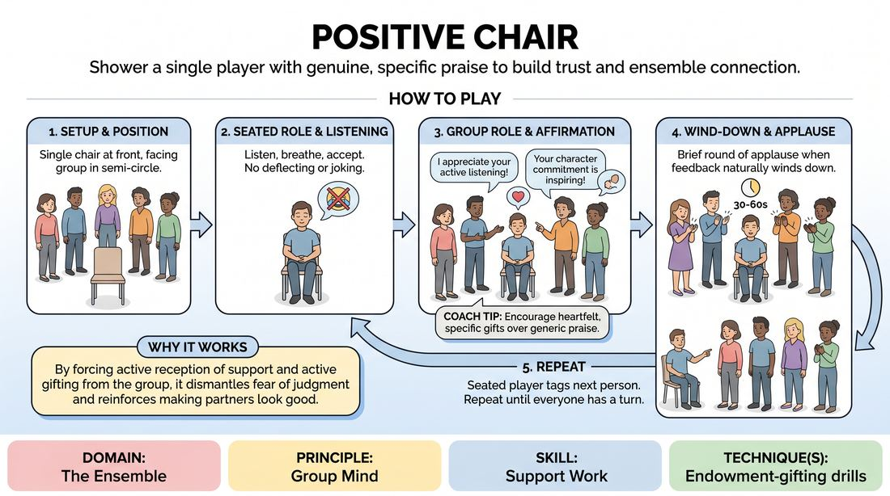

# The Appreciation Seat

{ .game-hero }

> Shower a single player with genuine, specific praise to build trust and ensemble connection.

## Overview
A warm, low-energy ensemble-building exercise where players take turns sitting in a central chair to receive positive feedback from their peers. The group shares specific things they appreciate about the seated player's improv style, presence, and contributions to the team. It creates a powerful atmosphere of vulnerability, safety, and mutual support.

## What It Trains
- **Domain:** D4 — The Ensemble
- **Principle(s):** Group Mind; Vulnerability; Make Your Partner a Genius
- **Skill(s):** Support Work; Active Gifting
- **Technique(s):** Endowment-gifting drills
- **Focus:** connection

**Objective:** To develop deep ensemble trust, practice active gifting through positive reinforcement, and help players internalize their unique strengths as seen by their peers.

## At a Glance
| Aspect | Detail |
|---|---|
| Players | 3+ (ideal 8-16) |
| Time | ~10 min |
| Complexity | 1/5 |
| Skill level | novice |
| Energy | low |
| Physicality | low |
| Modality | in_person |
| Space | minimal |
| Props | one chair |
| Audience | not required |

## Setup
Place a single chair at the front of the room facing the rest of the group, who are seated or standing in a semi-circle. No other props are needed.

## How to Play
1. Position a single chair at the front of the room, facing the rest of the group arranged in a comfortable semi-circle.
2. Invite one volunteer to sit in the chair, facing their ensemble peers.
3. Instruct the seated player to simply listen, breathe, and accept the feedback without deflecting, joking, or downplaying the compliments.
4. Prompt the rest of the group to share specific, genuine observations about what they appreciate about the seated player's improv skills, stage presence, or collaborative spirit.
5. Encourage the group to speak one at a time, offering heartfelt gifts of affirmation rather than generic praise.
6. After about 30 to 60 seconds of positive feedback, or when the flow naturally winds down, lead the group in a brief round of applause for the seated player.
7. The seated player then tags the next person to take the chair, and the process repeats until every member of the ensemble has had a turn in the seat.

## Facilitation Notes
- Coaching cue: 'Breathe in the compliments. Just say thank you and let it land.' This helps players resist the urge to deflect praise with self-deprecating humor.
- Coaching cue: 'Be specific. What exact moment or quality makes you feel safe when you share a scene with them?' This prevents generic, repetitive praise.
- If the group struggles to find words, the facilitator can seed the first compliment or ask a guiding question like, 'What is a superpower this person brings to our team?'
- Keep the pace moving so everyone gets equal time, especially in larger groups. Aim for a sweet spot of 45 seconds per person.

## Variations
- The Silent Appreciation: Instead of speaking, players write one specific positive quality on a sticky note and hand it to the seated player, who reads them privately.
- The Character Seat: Run the exercise in character, where players praise the seated character's traits or relationship dynamics within a fictional world.
- The Future-Focus Seat: Instead of past work, the group shares what exciting choices or roles they can't wait to see the seated player explore in future scenes.

## Debrief
- How did it feel to sit in the chair and receive praise without being allowed to deflect or minimize it?
- What did you notice about the collective strengths of our ensemble as we went around the room?
- How does knowing your peers' specific appreciation of your work change how you might approach your next scene?

## Safety & Inclusion
Receiving direct attention and praise can feel intensely vulnerable or overwhelming for some individuals. Ensure players know they can opt out of sitting in the chair, or can request a shorter duration. Remind the group to keep compliments focused on creative choices, collaborative spirit, and artistic strengths rather than physical appearance.

## Why It Works
By forcing the seated player to actively receive support and the group to actively gift it, this game dismantles the fear of judgment. It reinforces the core improv principle of making your partner look good by explicitly stating how they already do so, cementing a shared group mind and a safe creative playground.
