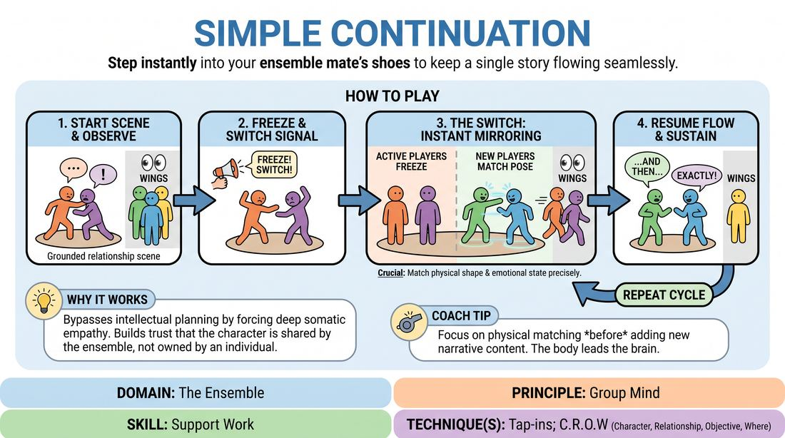

# Character Relay

{ .game-hero }

> Step instantly into your ensemble mate's shoes to keep a single story flowing seamlessly.

## Overview
A narrative scene is played by a small group while the rest of the ensemble watches closely from the wings. At any moment, a signal triggers a total cast swap, requiring off-stage players to instantly assume the exact physical poses, emotional states, and narrative stakes of the active characters. It is a high-focus exercise in physical mirroring, active listening, and narrative continuity.

## What It Trains
- **Domain:** D4 — The Ensemble
- **Principle(s):** Group Mind; Serve the Story; Make Your Partner a Genius
- **Skill(s):** Support Work; World-Building; Active Listening; Single-Partner Empathy & Mirroring
- **Technique(s):** Tap-ins; C.R.O.W. (Character, Relationship, Objective, Where); Mirror exercise
- **Focus:** skill_drill

**Objective:** To develop deep ensemble support, active listening, and physical empathy by seamlessly inheriting and advancing a partner's character choices and narrative trajectory.

## Setup
A clear stage area with the rest of the ensemble lined up on the sidelines where they can clearly see and hear everything. No props or chairs are needed, though standard stage furniture can be used if desired.

## How to Play
1. Two to three players step onto the stage to initiate a grounded, relationship-driven scene based on a simple suggestion.
2. The remaining players stand in the wings, actively observing every physical choice, vocal pattern, emotional shift, and narrative detail.
3. At a random point, the facilitator calls out 'Freeze!' or 'Switch!' to pause the action.
4. The active players instantly freeze in their current physical postures.
5. New players from the wings quickly step onto the stage, matching the exact physical positions and spatial relationships of the frozen players.
6. Once the physical match is complete, the original players step off-stage to the wings, and the facilitator calls 'Resume!'
7. The new players immediately continue the scene, adopting the same voices, emotional stakes, and narrative goals without resetting or rewriting the story.
8. This cycle repeats multiple times, allowing the entire ensemble to cycle through the roles and drive the narrative to a satisfying conclusion.

## Facilitation Notes
- Coaching cue: 'Match the physical tension! If their hand was raised, your hand must be raised at the exact same angle.'
- Pitfall: Players entering the scene try to 'fix' or radically change the direction of the story. Fix: Remind them that their job is to support the existing choices and make the previous actor look like a genius by validating their setup.
- Coaching cue: 'Listen to the subtext. Don't just copy the words; inherit the emotional hunger or fear of that character.'
- Pitfall: Lag time during the transition. Fix: Encourage rapid, decisive physical takeovers. The swap should take less than five seconds.

## Variations
- Organic Tap-Ins: Instead of the facilitator calling the switch, players in the wings must self-initiate the swap by tapping a player on the shoulder when they feel a strong narrative beat or physical posture to inherit.
- Emotional Escalation: Each new wave of actors must take the existing emotional state of the character and dial it up by exactly one notch.
- Blind Relay: The off-stage players turn their backs and can only listen to the audio, forcing them to match the scene purely through vocal tone, pacing, and narrative context when they swap in.

## Debrief
- How did it feel to inherit a physical posture versus trying to invent a character from scratch?
- What clues did you look for to ensure you were supporting your partner's established narrative?
- How does this exercise build Group Mind and reduce the pressure to be individually clever?

## Safety & Inclusion
Ensure physical transitions are safe; players should be mindful of personal space and physical limitations when matching complex or low-to-the-ground postures. Offer modifications for players with mobility constraints so they can match the energy and attitude rather than exact physical strain.

## Why It Works
By forcing players to literally step into the physical and emotional shapes of their peers, it bypasses intellectual planning and fosters deep somatic empathy. It reinforces the core improv principle that the character belongs to the ensemble, not the individual actor, demanding radical support and active listening.
