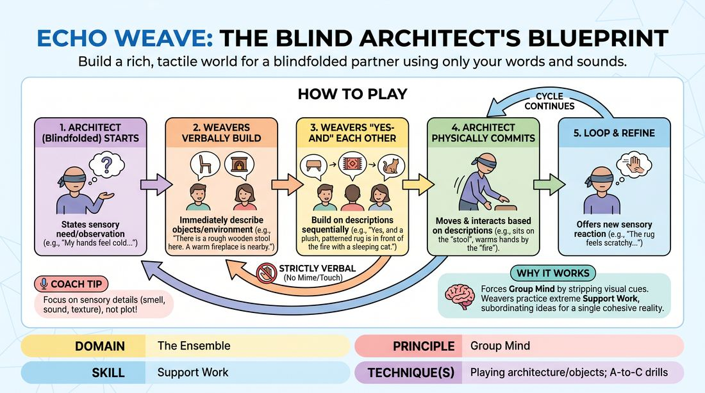

# Echoed Architecture

{ .game-hero }

> Build a rich, tactile world for a blindfolded partner using only your words and sounds.

## Overview
In this collaborative world-building exercise, one or two blindfolded players act as 'Architects' who navigate an unseen space by voicing physical needs or sensory observations. The remaining open-eyed players, acting as 'Weavers,' verbally construct the environment's physical layout, textures, and sounds in real-time. The Architects must physically adapt to and interact with these descriptions, creating a deeply committed, shared imaginary space.

## What It Trains
- **Domain:** D4 — The Ensemble
- **Principle(s):** Group Mind; Follow the Follower; Serve the Piece; Make Your Partner a Genius; Show, Don't Tell
- **Skill(s):** Support Work; Peripheral Awareness; Suggestion Deconstruction (A-to-C); Active Listening; Active Gifting; World-Building; Physicality & Space Work
- **Technique(s):** Playing architecture/objects; A-to-C drills; Endowment-gifting drills; Object work
- **Focus:** connection

**Objective:** To develop Group Mind and Support Work by collaboratively constructing a consistent, highly detailed physical environment. Players practice active listening, spatial awareness, and 'Show, Don't Tell' physicality by relying entirely on auditory cues to establish a shared reality.

## Setup
Clear a safe, flat playing area free of physical obstacles. Divide a group of 3 to 6 players into one or two 'Architects' and two to four 'Weavers.' Provide the Architects with comfortable blindfolds (or have them close their eyes tightly). The Weavers stand in a semi-circle around the playing space, keeping their eyes open. The facilitator provides a simple, evocative starting location (e.g., 'an abandoned greenhouse' or 'a submarine control room').

## How to Play
1. The blindfolded Architect enters the playing space and initiates the scene by voicing a single physical need, comfort issue, or sensory observation (e.g., 'My hands are freezing' or 'I need a place to rest my back').
2. The open-eyed Weavers listen closely and immediately begin to verbally construct the environment to address the Architect's statement, describing specific objects, their exact spatial relationship to the Architect, and their textures.
3. Weavers must build sequentially on each other's descriptions, using 'Yes-And' to add layers of detail (e.g., if Weaver A describes a wooden stool, Weaver B adds that it has a rough, splintered surface, and Weaver C adds the smell of damp pine).
4. Weavers are strictly forbidden from physically touching the Architect or miming the objects; all world-building must be delivered through precise verbal descriptions and vocal sound effects.
5. The Architect must physically commit to the described environment, moving their body, adjusting their posture, and miming interactions with the objects exactly where the Weavers placed them.
6. The loop continues with the Architect offering new sensory reactions or needs based on their physical exploration, and the Weavers expanding the environment's architecture in response.
7. The facilitator calls an edit once a highly detailed, multi-sensory environment has been fully established and the Architect is actively engaged in a clear physical narrative.

## Facilitation Notes
- Coaching Cue: 'Be specific with coordinates!' Remind Weavers to use precise spatial directions relative to the Architect's body (e.g., 'three inches past your left elbow' rather than 'over there').
- Pitfall: Weavers overloading the Architect with too many conflicting objects at once. Fix: Side-coach Weavers to let each object breathe, allowing the Architect time to physically explore and commit to one element before introducing the next.
- Coaching Cue: 'Make your partner look good!' Encourage the Architect to move slowly and deliberately, treating the imagined objects with high physical integrity (weight, resistance, temperature) to validate the Weavers' descriptions.
- Pitfall: The Architect ignoring the Weavers' details or moving through described solid objects. Fix: Pause the action briefly and ask the Architect to find the physical boundary of the object described before proceeding.

## Variations
- Dual Architects: Introduce two blindfolded Architects who must navigate the same space simultaneously. The Weavers must coordinate their descriptions to help the two Architects safely discover and interact with each other within the imagined environment.
- Atmospheric Undercurrent: The facilitator secretly assigns a specific emotional tone or genre (e.g., 'gothic horror' or 'childlike wonder') to the Weavers. The Weavers must weave this mood into their physical descriptions and soundscapes without naming the emotion directly.
- Sonic Architecture: Weavers are restricted from using spoken words. They must construct the entire environment, its boundaries, and its objects using only non-verbal vocalizations and environmental sound effects (e.g., creaking wood, dripping water, humming machinery).

## Debrief
- For the Architects: How did it feel to rely entirely on your ensemble's voices to understand your physical surroundings? What made an object feel truly 'solid' or real to you?
- For the Weavers: How did you balance listening to your fellow Weavers' descriptions while simultaneously watching the Architect's physical movements?
- How did this exercise shift your understanding of 'playing the space' and using physical architecture to support a scene's narrative?

## Safety & Inclusion
Ensure the playing area is completely clear of real-world tripping hazards before starting. Because the Architects are blindfolded, Weavers must act as active safety spotters, gently calling out a verbal 'freeze' if an Architect is about to step out of the safe play zone or collide with a wall.

## Why It Works
This game works because it strips away visual shortcuts, forcing players to achieve a high level of Group Mind. Weavers must practice extreme Support Work, subordinating their individual ideas to build a single, cohesive physical reality. By requiring the Architect to physically commit to these verbal offers, it reinforces the principle of 'Show, Don't Tell,' proving that space and object work are collaborative agreements that require mutual support to exist.
