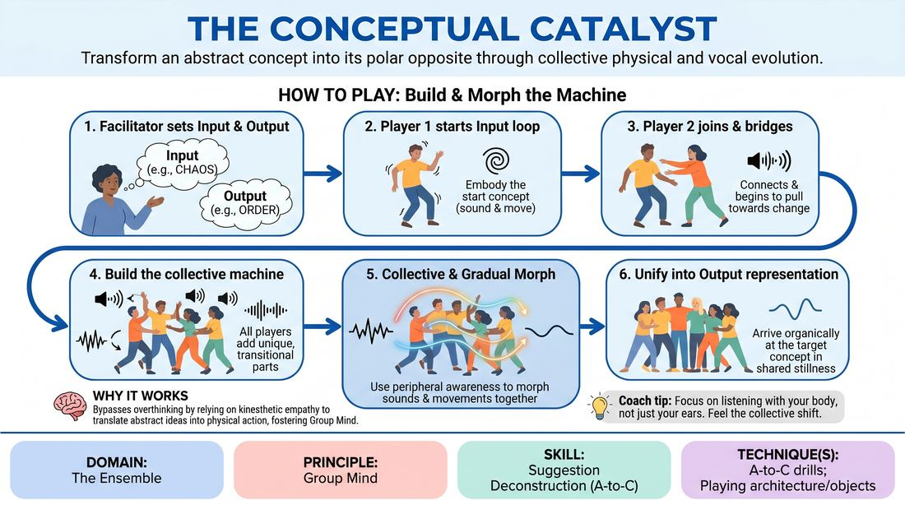

# Polarity Shift

{ .game-hero }

> Transform an abstract concept into its polar opposite through collective physical and vocal evolution.

## Overview
An ensemble physical and vocal exercise where players build a living machine that morphs from one abstract state to another. The group must work in absolute alignment, using non-verbal cues to transition a physicalized concept into its thematic opposite.

## What It Trains
- **Domain:** D4 — The Ensemble
- **Principle(s):** Group Mind; Follow the Follower; Serve the Piece
- **Skill(s):** Peripheral Awareness; Support Work; Suggestion Deconstruction (A-to-C); Pacing & Rhythm; Thematic Synthesis; Physicality & Space Work; Vocal Craft
- **Technique(s):** A-to-C drills; Playing architecture/objects
- **Focus:** mixed

**Objective:** To develop Group Mind and A-to-C suggestion deconstruction by translating abstract thematic prompts into physical and vocal offers, then collectively negotiating a gradual, unscripted transformation.

## Setup
An open playing space with enough room for 4 to 12 players to move freely and form a connected physical cluster. No props or materials are required. The facilitator prepares pairs of contrasting abstract concepts (e.g., 'Rigidity' to 'Fluidity', 'Isolation' to 'Community').

## How to Play
1. The facilitator announces a starting abstract concept (the Input) and a target abstract concept (the Output).
2. One player steps into the center of the space and initiates a simple, repetitive physical movement and vocal sound that embodies the starting concept.
3. A second player enters the space, connects physically or spatially to the first player, and introduces a new movement and sound that begins to subtly pull the energy toward the target concept.
4. Subsequent players enter one by one, each adding a unique physical and vocal loop that serves as a transitional bridge, slowly shifting the collective machine's overall tone.
5. Once all players are integrated, the ensemble must use peripheral awareness to collectively and gradually morph their individual sounds and movements, guiding the entire machine toward the target concept.
6. The transformation is complete when the entire group has organically arrived at a unified, harmonious representation of the target concept, ending in a shared moment of stillness or resolved sound.

## Facilitation Notes
- Coaching Cue: 'Listen with your whole body.' Encourage players to match the physical tension and vocal resonance of the group before attempting to shift it.
- Pitfall: Players jumping too quickly to the target concept, skipping the gradual transition. Fix: Side-coach them to make micro-adjustments, changing their movement or sound by only 10% at a time.
- Coaching Cue: 'Support the shift, don't force it.' Remind players to follow the collective momentum rather than trying to single-handedly drag the machine to the finish line.
- Pitfall: The machine becoming static or repetitive. Fix: Introduce a sudden shift in volume or speed to break the pattern and force players to re-evaluate their physical relationship.

## Variations
- System Malfunction: The facilitator calls out 'Glitch!' at any point, requiring the machine to stutter, repeat, or temporarily reverse its progress before finding its way back to the transformation path.
- Tempo Shift: The facilitator calls out 'Double Time' or 'Half Time' to alter the speed of the transformation, forcing players to adapt their physical and vocal control.
- Silent Engine: Run the entire exercise without any vocal sounds, relying purely on physical contact, weight sharing, and visual cues to communicate the conceptual shift.

## Debrief
- How did we collectively decide when it was time to transition from the starting concept to the target concept?
- What physical or vocal choices felt the most effective in bridging the gap between the two abstract ideas?
- How did you balance maintaining your individual loop with supporting the overall evolution of the group?

## Safety & Inclusion
Ensure players are mindful of physical boundaries and consent when connecting to the machine. Offer non-contact options where players can connect through spatial proximity, eye contact, or vocal harmony instead of physical touch.

## Why It Works
This game works because it bypasses analytical, verbal planning and forces players to rely on kinesthetic empathy and Group Mind. By translating abstract ideas (A) into physical and vocal actions (C), players practice rapid suggestion deconstruction while learning to 'follow the follower' to achieve a unified thematic arc.
