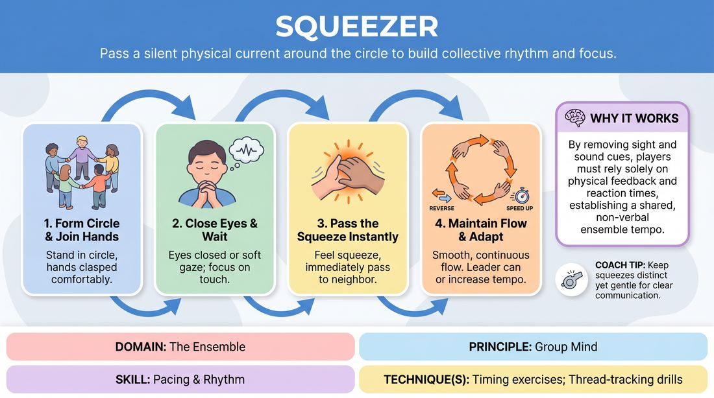

# The Pulse

{ .game-hero }

> Pass a silent physical current around the circle to build collective rhythm and focus.

## Overview
The Pulse is a silent, tactile ensemble warm-up where players stand in a circle holding hands and pass a physical squeeze from person to person. It creates a shared physical rhythm, demanding high focus, peripheral awareness, and non-verbal connection. The experience shifts the group's energy from individual thinking to a unified, collective flow.

## What It Trains
- **Domain:** D4 — The Ensemble
- **Principle(s):** Group Mind; Follow the Follower
- **Skill(s):** Pacing & Rhythm; Peripheral Awareness; Active Listening; Single-Partner Empathy & Mirroring
- **Technique(s):** Timing exercises; Thread-tracking drills; Mirror exercise
- **Focus:** connection

**Objective:** To develop group mind, active listening, and precise physical timing by tuning into the micro-movements of partners and practicing the principle of 'follow the follower'.

## At a Glance
| Aspect | Detail |
|---|---|
| Players | 4+ (ideal 8-20) |
| Time | ~5 min |
| Complexity | 1/5 |
| Skill level | novice |
| Energy | medium |
| Physicality | low |
| Modality | in_person |
| Space | minimal |
| Props | none |
| Audience | not required |

## Setup
Players stand in a closed circle, facing inward, holding hands. The space should be clear of obstacles so players can stand comfortably close.

## How to Play
1. Have all players stand in a circle and join hands, ensuring a comfortable and relaxed grip.
2. Instruct the group to close their eyes or maintain a soft, downward gaze to heighten their tactile awareness.
3. The facilitator initiates the game by gently squeezing the hand of the player to their left or right.
4. As soon as a player feels their hand squeezed, they must immediately pass that squeeze to their other hand, sending it to their neighbor.
5. Allow the squeeze to travel continuously around the circle in one direction, aiming for a smooth, uninterrupted flow.
6. Once the pulse returns to the initiator, they can send it back in the opposite direction or let it continue circulating.
7. Challenge the group to increase the speed of the pulse while maintaining a clean, distinct hand-squeeze for every single participant.

## Facilitation Notes
- Side-coaching cue: 'Don't anticipate the squeeze. Wait until you actually feel it before passing it on.'
- Side-coaching cue: 'Keep the squeeze gentle. A light, clear pulse travels much faster than a heavy grip.'
- Common Pitfall: Players squeezing too early because they see or feel the movement coming down the line. Fix: Remind them to be a pure conduit, reacting only to the physical sensation in their hand.
- Common Pitfall: The pulse dying out or getting stuck. Fix: Encourage players to keep their physical connection active and responsive, avoiding overthinking.

## Variations
- Bi-Directional Pulse: Send two pulses in opposite directions simultaneously and observe how players handle the moment when the two pulses cross paths.
- The Detective: One player stands in the center of the circle with their eyes open and tries to guess where the silent pulse is currently located as it travels around.
- Rhythmic Pulse: Instead of a single squeeze, pass a specific rhythm (e.g., two quick squeezes) that must be replicated and passed along accurately.

## Debrief
- What did you have to do to avoid anticipating the squeeze?
- How did the group's energy shift when we closed our eyes and focused entirely on touch?
- How does this tactile connection translate to verbal and physical timing when we are sharing a stage?

## Safety & Inclusion
Because this game requires physical contact, always ask for consent before starting. If a player is uncomfortable with direct hand-holding, they can participate by holding a short prop (like a wooden dowel or a piece of rope) between them, or by gently tapping shoulders or elbows instead.

## Why It Works
By stripping away verbal communication and visual cues, this exercise forces players to rely entirely on physical feedback and reaction times. It builds group mind by establishing a shared, physicalized tempo where everyone must follow the follower to keep the chain alive.
