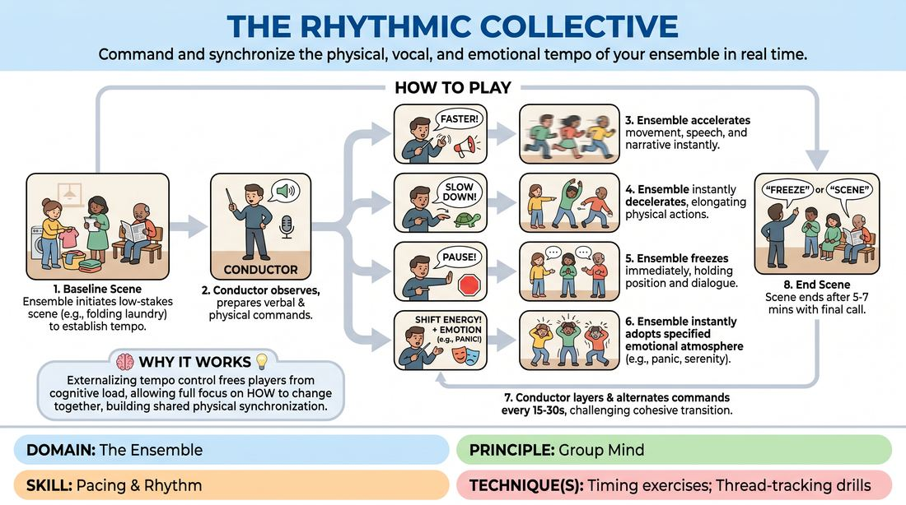

# The Tempo Conductor

{ .game-hero }

> Command and synchronize the physical, vocal, and emotional tempo of your ensemble in real time.

## Overview
An ensemble-driven exercise where a designated conductor dynamically steers a live scene using real-time tempo and energy commands. Players must instantly and collectively adjust their physical speed, vocal delivery, and emotional intensity to match the conductor's cues. The result is a highly synchronized, high-energy performance that demands deep peripheral awareness and absolute trust.

## What It Trains
- **Domain:** D4 — The Ensemble
- **Principle(s):** Group Mind; Follow the Follower; Commit 100%; Make Your Partner a Genius
- **Skill(s):** Pacing & Rhythm; Peripheral Awareness; Support Work; Physicality & Space Work; Vocal Craft; Active Listening
- **Technique(s):** Timing exercises; Thread-tracking drills; Character Walks/Centers; Vocal characterization
- **Focus:** skill_drill

**Objective:** To cultivate a unified group mind and sharpen collective pacing by training players to instantly align their physical, vocal, and emotional rhythms to external and internal shifts.

## At a Glance
| Aspect | Detail |
|---|---|
| Players | 4–8 (ideal 5-7) |
| Time | ~30 min |
| Complexity | 3/5 |
| Skill level | competent |
| Energy | high |
| Physicality | high |
| Modality | in_person |
| Space | moderate |
| Props | none |
| Audience | not required |

## Setup
Clear a moderate-sized performance space. One player is designated as the Conductor and stands downstage or off-stage where they have a clear view of the entire playing area. The remaining 3 to 7 players form the active Ensemble on stage. No props or materials are required.

## How to Play
1. The Ensemble initiates a grounded, everyday scene based on a simple, low-stakes premise (e.g., folding laundry, waiting at a bus stop) to establish a baseline rhythm.
2. The Conductor stands off-stage, observing the scene and preparing to issue real-time verbal and physical commands to manipulate the group's tempo.
3. When the Conductor calls 'FASTER!' (accompanied by rapid hand gestures), the Ensemble must immediately accelerate their physical movements, speech rate, and narrative progression without breaking character.
4. When the Conductor calls 'SLOW DOWN!' (accompanied by a slow, lowering hand gesture), the Ensemble must instantly decelerate, stretching out their physical actions, lengthening pauses, and speaking in slow motion.
5. When the Conductor calls 'PAUSE!' (accompanied by a flat hand gesture), all players must instantly freeze in place, cutting off dialogue mid-word, and hold the freeze until the next command is given.
6. When the Conductor calls 'SHIFT ENERGY!' followed by an emotional state (e.g., 'PANIC!' or 'SERENITY!'), the Ensemble must instantly adopt that emotional atmosphere, altering their vocal tone and physical tension while maintaining their current speed.
7. The Conductor continues to layer and alternate these commands every 15 to 30 seconds, challenging the Ensemble to transition seamlessly as a single, cohesive unit.
8. The scene runs for approximately 5 to 7 minutes, ending when the Conductor calls a final 'FREEZE' or 'SCENE' to conclude the round.

## Facilitation Notes
- Coaching Cue: 'Don't wait for your partner to change—change together!' Remind players that the goal is instantaneous, collective transition, not a domino effect.
- Pitfall: Players focus so hard on the Conductor that they stop interacting with each other. Fix: Side-coach players to maintain eye contact and physical connection with their scene partners, using peripheral vision to catch the Conductor's physical cues.
- Coaching Cue: 'Commit to the physical shift first.' Changing physical speed or tension immediately helps the voice and narrative pacing follow naturally.
- Pitfall: The Conductor changes commands too quickly, causing chaos, or too slowly, causing the scene to drag. Fix: Instruct the Conductor to let the Ensemble settle into a new rhythm for at least 10 seconds before issuing the next shift.
- Coaching Cue: 'Support the interpretation.' If one player interprets 'PANIC' in a specific physical way, the rest of the ensemble should mirror and support that specific flavor of panic to maintain a unified reality.

## Variations
- Silent Conductor: The Conductor issues all commands entirely through non-verbal physical gestures, forcing the Ensemble to rely 100% on visual peripheral awareness.
- Sub-Rhythm Tension: The Conductor assigns a specific player a contrasting tempo (e.g., 'Ensemble slow, Sarah fast!'), creating a dynamic rhythmic counterpoint within the scene.
- Narrative Beats: Instead of direct speed commands, the Conductor calls out narrative atmospheres like 'Building Suspense' or 'The Aftermath,' requiring the players to translate these states into physical and vocal pacing.
- Follow the Follower: Remove the external Conductor entirely; any player on stage can initiate a tempo or energy shift, and the rest of the ensemble must instantly detect and match it without verbal prompting.

## Debrief
- How did it feel to surrender your individual control over the scene's pacing to an external conductor?
- What physical or vocal cues did you rely on to ensure the entire group shifted at the exact same millisecond?
- How did changing your physical speed affect the emotional stakes and narrative choices of the scene?
- How can we apply this level of hyper-awareness and shared rhythm to our regular, un-conducted scenes?

## Safety & Inclusion
Ensure the playing space is completely clear of tripping hazards, as rapid physical transitions can cause sudden movements. Players should be mindful of physical boundaries during high-energy or fast-paced commands to avoid accidental collisions.

## Why It Works
By externalizing the control of tempo and energy to a conductor, players are freed from the cognitive load of deciding when to change the scene's dynamic. This allows them to focus entirely on how to change together, building a shared physical vocabulary and a deep, intuitive sense of group mind. The rapid shifts force players to bypass analytical thinking, leading to high commitment and spontaneous, unified physical and vocal choices.
