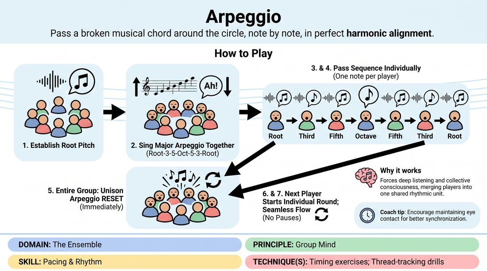

# Vocal Arpeggio

{ .game-hero }

> Pass a broken musical chord around the circle, note by note, in perfect harmonic alignment.

## Overview
A musical ensemble warm-up where players collectively construct a major chord arpeggio. By passing the sequence note-by-note around a circle and periodically reuniting in unison, the group builds deep auditory focus and shared rhythmic timing.

## What It Trains
- **Domain:** D4 — The Ensemble
- **Principle(s):** Group Mind; Make Your Partner a Genius
- **Skill(s):** Pacing & Rhythm; Peripheral Awareness; Active Listening; Vocal Craft
- **Technique(s):** Timing exercises; Thread-tracking drills
- **Focus:** skill_drill

**Objective:** To develop group mind, active listening, and vocal precision by requiring players to match pitch, maintain a steady tempo, and anticipate their entry within a shared musical structure.

## At a Glance
| Aspect | Detail |
|---|---|
| Players | 3+ (ideal 8-15) |
| Time | ~5 min |
| Complexity | 2/5 |
| Skill level | competent |
| Energy | medium |
| Physicality | low |
| Modality | in_person |
| Space | minimal |
| Props | none |
| Audience | not required |

## Setup
Players stand in a circle facing inward. No instruments or props are required, though the facilitator may use a pitch pipe or hum a starting note to establish the key.

## How to Play
1. Gather the group in a circle and establish a comfortable starting pitch (the root note) for a major scale.
2. Lead the entire group in singing a major arpeggio up and down together using a simple vowel sound like 'ah' (Root, Third, Fifth, Octave, Fifth, Third, Root).
3. Explain that the group will now pass this seven-note sequence around the circle, with each player singing exactly one note in the sequence.
4. The first player sings the Root, the second sings the Third, the third sings the Fifth, and so on, continuing around the circle until the sequence is complete.
5. Immediately after the seventh note (the final Root) is sung individually, the entire group must instantly sing the entire seven-note arpeggio together in unison to reset the key.
6. Once the unison reset is complete, the next player in the circle (immediately following the person who ended the previous individual round) starts the next individual sequence.
7. Continue this pattern of individual passing followed by a collective unison reset, aiming for a seamless, fluid rhythm without pauses between players.

## Facilitation Notes
- Side-coaching cue: 'Listen to the pitch before yours to find your interval. Don't just wait for your turn; feel the wave of the chord.'
- Common Pitfall: Players rushing their note or dropping the tempo. Fix: Have the group gently clap or sway to a steady 4/4 or 3/4 pulse to anchor the rhythm.
- Common Pitfall: Losing the key or singing flat as the sequence passes. Fix: Emphasize the unison reset as a moment to recalibrate and lock back into the correct pitch.
- Encourage players to maintain eye contact and physical presence, using subtle body language to hand off the note to the next person.

## Variations
- Minor Shift: Change the arpeggio to a minor chord to practice adjusting to a different emotional and harmonic quality.
- Blind Arpeggio: Have players close their eyes, requiring them to pass the notes across the circle using purely auditory cues and breath awareness instead of physical order.
- Speed Run: Gradually increase the tempo of the passes, challenging the group to maintain pitch accuracy at high speeds.

## Debrief
- How did your listening change when you were waiting for your note versus when we sang in unison?
- What physical or auditory cues helped you anticipate your entry without hesitating?
- How does this exercise mirror the way we support and build on each other's ideas in a non-musical scene?

## Safety & Inclusion
Ensure players know they do not need to be 'good singers' to participate; the focus is on listening and support, not vocal perfection. Offer a humming option for those uncomfortable singing aloud, or allow players to step back and support the rhythm physically.

## Why It Works
This game forces players to step out of their own heads and merge into a collective consciousness. Because each note relies entirely on the pitch and timing of the preceding note, players must practice extreme active listening and peripheral awareness, embodying the core principle of making their partners look like geniuses.
