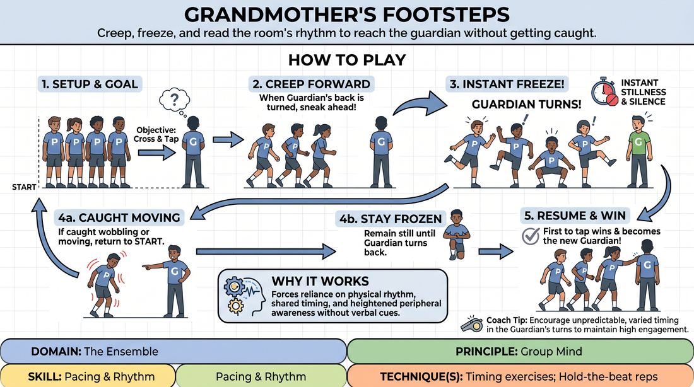

# Grandmother's Steps

{ .game-hero }

> Creep, freeze, and read the room's rhythm to reach the guardian without getting caught.

## Overview
A classic physical game of stealth and sudden stillness where players attempt to cross a room to touch a designated Guardian whose back is turned. The Guardian can spin around at any moment, forcing players to instantly freeze in place; anyone caught moving must return to the starting line. It builds a shared physical rhythm, heightened peripheral awareness, and the ability to find stillness under pressure.

## What It Trains
- **Domain:** D4 — The Ensemble
- **Principle(s):** Group Mind; Commit 100%; Fail Joyfully
- **Skill(s):** Peripheral Awareness; Pacing & Rhythm; Silence & Stillness; Physicality & Space Work
- **Technique(s):** Timing exercises; Hold-the-beat reps; Character Walks/Centers
- **Focus:** connection

**Objective:** To develop group mind, physical control, and collective pacing by learning to read the subtle physical cues of the group and the Guardian, mastering the transition between high-energy movement and absolute stillness.

## Setup
A large, open room with a clear starting line at one end and a designated spot for the Guardian at the opposite end. No props are required. All players except the Guardian line up behind the starting line.

## How to Play
1. Designate one player as the Guardian who stands at the far end of the room, facing away from the rest of the group.
2. Instruct the remaining players to line up shoulder-to-shoulder at the opposite end of the space, behind the starting line.
3. Explain that the objective for the creeping players is to cross the room and gently tap the Guardian on the shoulder.
4. The Guardian may turn around at any moment to face the group, using unpredictable timing to surprise the players.
5. The moment the Guardian turns, all creeping players must instantly freeze in their current physical posture, holding absolute stillness and silence.
6. If the Guardian catches any player moving, wobbling, or losing balance, they point that player out, and that player must immediately return to the starting line.
7. Once the Guardian turns their back again, players may resume sneaking forward.
8. The first player to successfully reach and gently tap the Guardian on the shoulder wins the round and becomes the new Guardian for the next game.

## Facilitation Notes
- Side-coach players to move as a cohesive unit rather than rushing individually; when the group moves in a shared rhythm, it is harder for the Guardian to isolate targets.
- Encourage the Guardian to vary their timing—sometimes turning quickly, sometimes waiting a long time—to challenge the group's anticipation and reaction times.
- Pitfall: Players rushing and falling over. Fix: Remind them that physical control and low, stable stances make it easier to freeze instantly.
- Side-coach: 'Embrace the freeze!' Encourage players to hold whatever awkward, dynamic physical shape they are caught in, celebrating the physical comedy of the frozen moment.

## Variations
- Character Walk: Players must sneak forward using a specific physical character archetype (e.g., zombies, high-society aristocrats, or secret agents), maintaining this physicality even when frozen.
- Soundscape Sneak: The creeping players must make a continuous collective sound (like a hum or a hiss) that must instantly stop whenever the Guardian turns around.
- Shared Energy: If any single player is caught moving, the entire group must return to the starting line, forcing extreme collective responsibility and group mind.

## Debrief
- How did you use your peripheral vision to coordinate your movements with the rest of the group?
- What did it feel like to transition instantly from high-energy sneaking to absolute stillness?
- How did you read the Guardian's physical cues or timing to predict when they would turn?

## Safety & Inclusion
Ensure the floor is clear of tripping hazards. For players with mobility challenges, the game can be adapted to focus on upper-body movement, or the 'freeze' can be defined as stopping any active progression rather than requiring rigid physical balance. Remind players that the final touch on the Guardian's shoulder must be a gentle tap, not a push.

## Why It Works
This game works because it strips away verbal communication, forcing players to rely entirely on physical rhythm, peripheral awareness, and shared timing. The high stakes of being sent back to the start demand total commitment to the physical action, while the sudden freezes build muscle memory for stillness and stage presence.
