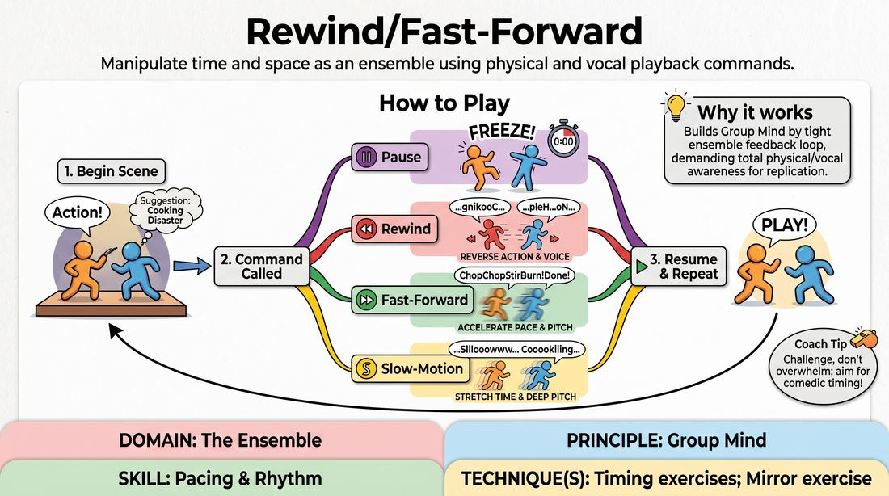

# Remote Control Playback

{ .game-hero }

> Manipulate time and space as an ensemble using physical and vocal playback commands.

## Overview
In this high-energy comedy game, two players perform an action-oriented scene while the off-stage ensemble acts as a collective remote control. By calling out commands like rewind, fast-forward, pause, and play, the off-stage players force the performers to physically and vocally manipulate their performance in real-time.

## What It Trains
- **Domain:** D4 — The Ensemble
- **Principle(s):** Group Mind; Follow the Follower; Commit 100%; Make Your Partner a Genius
- **Skill(s):** Pacing & Rhythm; Peripheral Awareness; Physicality & Space Work; Vocal Craft; Active Listening; Single-Partner Empathy & Mirroring
- **Technique(s):** Timing exercises; Mirror exercise
- **Focus:** comedy_game

**Objective:** To develop group mind, physical precision, and impeccable timing by instantly adapting to external pacing cues and mirroring a partner's exact physical and vocal trajectory.

## At a Glance
| Aspect | Detail |
|---|---|
| Players | 3+ (ideal 6-12) |
| Time | ~5 min |
| Complexity | 3/5 |
| Skill level | competent |
| Energy | high |
| Physicality | high |
| Modality | in_person |
| Space | moderate |
| Props | none |
| Audience | not required |

## Setup
An open performance space with a clear stage area. Two players stand on stage to begin a scene, while the remaining players stand off-stage or in a semi-circle, ready to call out commands.

## How to Play
1. Two players step onto the stage and begin a standard, action-oriented scene based on a simple suggestion.
2. The off-stage players watch closely, tracking every physical movement, vocal inflection, and line of dialogue.
3. At any point, an off-stage player can shout a playback command: 'Pause', 'Rewind', 'Fast-Forward', 'Slow-Motion', or 'Play'.
4. Upon hearing 'Pause', the on-stage players must instantly freeze, holding their physical positions and expressions perfectly still.
5. Upon hearing 'Rewind', the players must reverse their actions and dialogue, speaking phonetically backward or repeating their lines in reverse order while retracing their physical steps.
6. Upon hearing 'Fast-Forward', the players accelerate their movements and speech to a high-pitched, rapid pace, skipping ahead in the narrative timeline.
7. Upon hearing 'Slow-Motion', the players drop their vocal pitch and stretch their physical movements into exaggerated, slow-tempo actions.
8. Upon hearing 'Play', the scene resumes at normal speed and direction from whatever point in time the players have landed.
9. The off-stage players must work as a cohesive unit, calling commands that challenge the performers without overwhelming them, aiming to create comedic timing and physical comedy.

## Facilitation Notes
- Encourage on-stage players to use distinct physical actions and clear, declarative dialogue early on, as this makes rewinding and fast-forwarding much more satisfying and legible.
- Side-coach off-stage players to avoid overlapping commands; they should listen to each other and let a command play out for 5-10 seconds before calling a new one.
- If players struggle with 'Rewind', remind them to focus on physical backtracking first (e.g., putting a cup back on the table) and then approximate the reverse dialogue.
- Watch out for 'Pause' commands where players drop their physical commitment; challenge them to hold difficult, off-balance physical poses.

## Variations
- Director's Cut: Assign a single 'director' or facilitator to hold the remote control to focus purely on the performers' physical execution before opening it up to the whole ensemble.
- Language Track: Add commands like 'Mute' (physical acting only) or 'Foreign Dub' (gibberish with emotional intensity).
- Glitch Mode: Introduce a 'Skip' or 'Buffer' command where players must repeat a single micro-movement or syllable rapidly like a scratched DVD.

## Debrief
- How did paying close attention to your partner's physical movements make it easier to rewind or fast-forward accurately?
- What did it feel like to surrender control of your scene's pacing to the off-stage ensemble?
- How did the physical limitations of 'Slow-Motion' or 'Rewind' actually help generate comedic moments?

## Safety & Inclusion
Ensure the stage is clear of tripping hazards, as players will be moving backward and at high speeds. Encourage players to be mindful of their physical boundaries and avoid highly precarious physical balances during pauses if they have joint or mobility concerns.

## Why It Works
This game builds group mind by forcing the off-stage and on-stage players into a tight feedback loop. The performers must maintain absolute physical and vocal awareness to replicate their own history in reverse, while the callers must read the room to time their commands for maximum comedic and dramatic effect. It transforms individual scene-work into a collective timing exercise.
