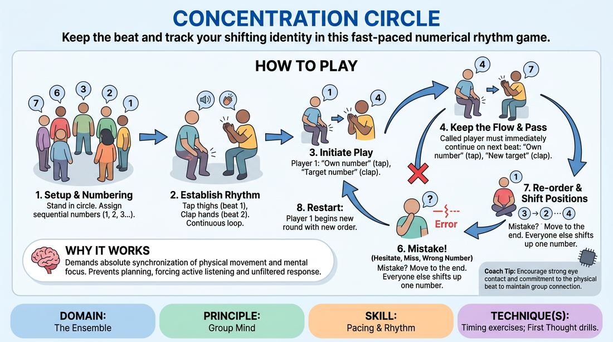

# Rhythmic Number Pass

{ .game-hero }

> Keep the beat and track your shifting identity in this fast-paced numerical rhythm game.

## Overview
A high-focus ensemble warm-up where players stand in a circle, assign themselves numbers, and pass a verbal cue on a collective physical beat. When a player misses a beat or forgets their current number, they move to the end of the sequence, causing everyone's numbers to dynamically shift.

## What It Trains
- **Domain:** D4 — The Ensemble
- **Principle(s):** Group Mind; Fail Joyfully; Assume Competence
- **Skill(s):** Pacing & Rhythm; Peripheral Awareness; Unfiltered Spontaneity; Active Listening
- **Technique(s):** Timing exercises; First Thought drills
- **Focus:** skill_drill

**Objective:** To develop deep group mind, peripheral awareness, and rhythmic precision by forcing players to listen actively and adapt instantly to changing roles without breaking the collective tempo.

## Setup
Players stand in a circle. Number the players sequentially from 1 to the total number of players (e.g., 1 to 12), going clockwise. No props or special materials are required.

## How to Play
1. Arrange the group in a standing circle and assign each person a number sequentially starting from 1, moving clockwise around the circle.
2. Establish a simple, continuous physical rhythm as a group, such as tapping thighs on beat one and clapping hands on beat two.
3. Player 1 initiates the game by calling out their own number on the first beat (thigh tap) and another player's number on the second beat (clap).
4. The player whose number was called must immediately take over on the next cycle, calling their own number on the tap and a new target number on the clap.
5. The passing of numbers must continue in strict alignment with the established physical rhythm, requiring players to remain highly focused.
6. If a player hesitates, misses their cue, calls a non-existent number, or breaks the rhythm, they must leave their spot and move to the highest-numbered position in the circle.
7. When a player moves to the end, everyone between their old spot and their new spot shifts up one position, taking on a new number.
8. Once the circle is re-ordered and players have identified their new numbers, Player 1 restarts the rhythm and begins a new round.

## Facilitation Notes
- Side-coach the physical rhythm: Keep the physical beat slow and steady at first. A frantic beat leads to early frustration rather than flow.
- Pitfall: Players get confused about their new numbers after a shift. Fix: Have the shifted players quickly call out their new numbers aloud before restarting play.
- Encourage a 'fail joyfully' attitude: When someone makes a mistake, celebrate the shift with a quick cheer or clap rather than groans, then immediately reset.
- Side-coach focus: Remind players to keep their eyes scanning the whole circle, using peripheral awareness to anticipate who might be targeted next.

## Variations
- Double Pass: Players must call two numbers on the clap beat, requiring both targeted players to respond simultaneously on the next beat.
- Silent Rhythm: Eliminate the physical clapping/tapping and rely entirely on an internal, shared silent pulse to pass the numbers.
- Word Association: Instead of numbers, players use category words (e.g., fruits or animals) that shift positions when someone misses a beat.

## Debrief
- How did your focus change when your number shifted versus when you stayed in the same position?
- What did it feel like when the group successfully maintained a long, unbroken rhythm?
- How does celebrating mistakes help the ensemble recover and find the rhythm again quickly?

## Safety & Inclusion
Ensure the physical rhythm chosen (e.g., clapping, snapping, or swaying) is accessible to all participants. If physical movement is a barrier, the group can establish a purely vocal rhythm, such as a collective 'sh-sh' sound, to mark the beats.

## Why It Works
This exercise builds group mind by demanding absolute synchronization of physical movement and mental focus. The constant shifting of numbers prevents players from planning ahead, forcing them into a state of active listening and unfiltered spontaneity where they must react to the present moment.
