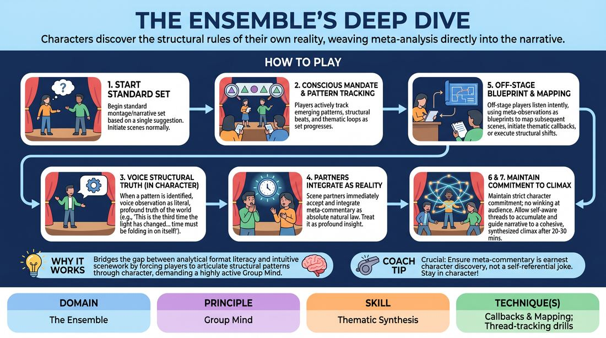

# The Conscious Universe

{ .game-hero }

> Characters discover the structural rules of their own reality, weaving meta-analysis directly into the narrative.

## Overview
A sophisticated long-form training game where players perform a standard montage or narrative set while their characters gradually become aware of the structural patterns, recurring motifs, and thematic loops of their own universe. Instead of breaking the fourth wall, characters treat these structural observations as profound, literal laws of their reality, forcing the ensemble to collaboratively map and synthesize the show's architecture from the inside out.

## What It Trains
- **Domain:** D4 — The Ensemble
- **Principle(s):** Group Mind; Serve the Piece; Serve the Story
- **Skill(s):** Peripheral Awareness; Support Work; Thematic Synthesis; Format Literacy; Game Identification; Narrative Architecture
- **Technique(s):** Thread-tracking drills; Callbacks & Mapping; Harold; Montage; Finding & Playing the Game; Story Spine
- **Focus:** mixed

**Objective:** To develop high-level thematic synthesis, format literacy, and group mind by training players to track narrative architecture in real-time and validate structural callbacks as organic world-building.

## At a Glance
| Aspect | Detail |
|---|---|
| Players | 3–8 (ideal 3-8) |
| Time | ~30 min |
| Complexity | 4/5 |
| Skill level | proficient |
| Energy | medium |
| Physicality | low |
| Modality | in_person |
| Space | moderate |
| Props | none |
| Audience | not required |

## Setup
A moderate performance space with a clear stage area and an off-stage line-up area for 3 to 8 proficient players. No props or materials are required. The facilitator secures a single, open-ended suggestion from the group to launch a standard 20-to-30-minute long-form montage.

## How to Play
1. Begin a standard long-form montage or narrative set based on a single suggestion, with players initiating scenes normally.
2. Introduce the 'Conscious Mandate': as the set progresses, players must actively track emerging patterns, structural beats (like edits, pacing shifts, or climaxes), and recurring thematic motifs.
3. When a player identifies a structural pattern, they must voice this observation in character as a literal, philosophical, or physical truth of their world (e.g., 'Every time we speak of our father, a sudden chill enters the room').
4. Scene partners must immediately accept and integrate this meta-commentary as absolute reality, treating it as a profound insight or a natural law of their universe rather than a joke.
5. Off-stage players must listen intently to these meta-observations, using them as blueprints to map subsequent scenes, initiate thematic callbacks, or execute structural edits.
6. Maintain strict character commitment throughout; players must never wink at the audience, break character, or use meta-commentary for cheap, self-referential laughs.
7. Conclude the set after 20 to 30 minutes, allowing the natural accumulation of these self-aware threads to guide the narrative to a cohesive, synthesized climax.

## Facilitation Notes
- Side-coaching cue: 'Play it with absolute gravity!' Remind players that if a character notices a narrative loop, it should feel like a chilling realization or a spiritual awakening, not a comedy sketch gag.
- Pitfall: Players using meta-commentary to bypass actual relationship building or emotional stakes. Fix: Side-coach them to connect the structural observation directly to their character's immediate emotional needs or fears.
- Pitfall: Overloading the scene with too many meta-comments, causing narrative paralysis. Fix: Instruct players to limit meta-observations to one or two key structural pivots per scene, allowing the rest of the time for organic character play.
- Side-coaching cue: 'Map the callback!' Encourage off-stage players to immediately edit or enter a scene to physically or narratively validate a previously stated meta-rule.

## Variations
- The Designated Oracle: One off-stage player acts as the 'Oracle' and can call out prompts like 'Pattern!' or 'Theme!' to challenge the active on-stage players to instantly find and voice a structural observation.
- Silent Architecture: Instead of verbalizing the meta-commentary, players must use physical staging, mirroring, or spatial patterns to comment on and callback the structural loops of the show.
- Genre Tropes: Apply the game to a specific genre (e.g., Film Noir or Shakespearean Tragedy), where characters become hyper-aware of and struggle against the inevitable narrative tropes of their specific genre.

## Debrief
- How did treating structural patterns as literal laws of physics change your commitment to the scene's reality?
- In what ways did the in-character commentary help the off-stage players map and edit the overall show?
- How did we balance the analytical task of tracking the show's architecture with the emotional task of staying present in our characters?

## Safety & Inclusion
Ensure that meta-commentary does not target or make light of real-world sensitive topics, personal boundaries, or player identities. If a meta-comment accidentally touches a sensitive boundary, players should gracefully steer the narrative back to safe, fictional structural elements (like weather, timing, or physical objects) without breaking the flow.

## Why It Works
By forcing players to articulate the structural and thematic patterns of the show through their characters, the game bridges the gap between analytical format literacy and intuitive scenework. It demands a highly active Group Mind, as players must collectively track, validate, and map callbacks, transforming abstract narrative architecture into concrete, playable reality.
