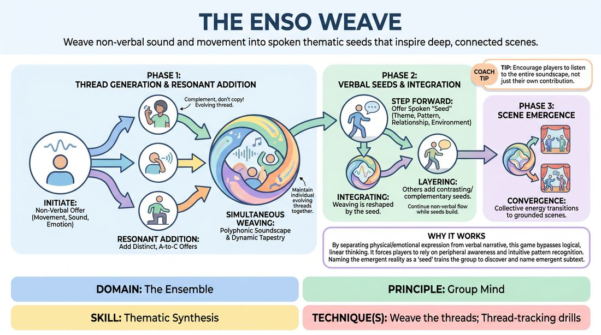

# The Resonance Weave

{ .game-hero }

> Weave non-verbal sound and movement into spoken thematic seeds that inspire deep, connected scenes.

## Overview
A multi-layered ensemble exercise where players build a complex, non-verbal tapestry of physical movement, sound, and emotion before crystallizing these patterns into spoken thematic 'seeds.' Players transition from abstract, simultaneous physical play to grounded scenes, training the group to discover and name emergent subtext.

## What It Trains
- **Domain:** D4 — The Ensemble
- **Principle(s):** Group Mind; Follow the Follower; Serve the Piece
- **Skill(s):** Thematic Synthesis; Peripheral Awareness; Suggestion Deconstruction (A-to-C); Pacing & Rhythm
- **Technique(s):** Weave the threads; Thread-tracking drills; A-to-C drills
- **Focus:** connection

**Objective:** To develop Group Mind and Thematic Synthesis by training players to track multiple simultaneous non-verbal threads, identify emergent patterns, and articulate those patterns as collective offers that guide scene work.

## At a Glance
| Aspect | Detail |
|---|---|
| Players | 3–8 (ideal 4-8) |
| Time | ~20 min |
| Complexity | 4/5 |
| Skill level | competent |
| Energy | medium |
| Physicality | medium |
| Modality | in_person |
| Space | moderate |
| Props | none |
| Audience | not required |

## Setup
An open, moderate-sized physical space. Three to eight players stand in a loose circle or scattered throughout the space, facing inward so everyone has clear sightlines and auditory awareness of the entire group.

## How to Play
1. Phase 1 (Thread Generation): One player initiates a simple, repetitive, non-verbal offer using a physical movement, a sustained vocal sound, or an embodied emotional posture.
2. Resonant Addition: One by one, other players add their own distinct non-verbal offers. Rather than directly copying or mirroring, each player makes an 'A-to-C' leap, contributing a sound or movement that feels atmospherically or emotionally related to the whole.
3. Simultaneous Weaving: All players maintain their individual, evolving non-verbal threads simultaneously, creating a rich, polyphonic soundscape and dynamic physical picture while remaining highly aware of the collective energy.
4. Phase 2 (Verbal Seeds): At any point, when a player senses a clear theme, relationship, environment, or emotional pattern emerging from the tapestry, they step forward and state a single, concise phrase (a 'verbal seed') that names this reality (e.g., 'The long winter' or 'A forgotten promise'). This is a meta-offer, not scene dialogue.
5. Integrating the Seed: The group continues their non-verbal weaving, allowing their movements and sounds to be subtly reshaped, slowed, or colored by the newly spoken verbal seed.
6. Layering Seeds: Other players may step forward to offer additional, contrasting, or complementary verbal seeds as the non-verbal tapestry continues to evolve, creating multiple thematic anchors.
7. Phase 3 (Scene Emergence): When the ensemble feels a collective convergence of energy, they organically transition from the abstract tapestry into short, interconnected scenes. Players step into the space to initiate dialogue, drawing directly from the established verbal seeds and physical/emotional threads.

## Facilitation Notes
- Side-coaching cue: 'Don't copy—resonate.' Remind players to make A-to-C leaps rather than mimicking the physical movements or sounds of others.
- Pitfall: Players intellectualize the verbal seeds, trying to be clever. Fix: Coach them to speak from impulse, naming the literal feeling or atmosphere present in the room rather than inventing a plot.
- Side-coaching cue: 'Let the seed land.' Ensure the group actually allows their physical and vocal threads to change in response to a spoken seed before anyone offers a new one.
- Pitfall: The non-verbal phase goes on too long without any verbal seeds. Fix: If the group gets stuck in a loop, the facilitator can gently prompt: 'What is the story of this space? Someone name it.'

## Variations
- Silent Seeds: Instead of speaking a verbal phrase, the player who steps forward performs a highly specific, symbolic physical gesture or distinct sound that encapsulates the emergent pattern.
- Contrasting Threads: Challenge players to deliberately introduce a verbal seed that directly contrasts with the current emotional tone (e.g., introducing 'A sudden hope' into a somber, heavy physical tapestry) to explore dramatic tension.
- Audience Catalyst: Use a single audience suggestion as the very first verbal seed, challenging the ensemble to immediately build a non-verbal tapestry that justifies and explores that suggestion.

## Debrief
- How did it feel to build a shared subtextual world non-verbally before speaking any dialogue?
- What cues helped you realize it was time to step forward and offer a verbal seed?
- How did the verbal seeds change the physical and vocal choices of the players who were still weaving?
- In what ways did the final scenes feel different from scenes initiated with a standard verbal suggestion?

## Safety & Inclusion
Ensure players are mindful of physical boundaries and mobility levels when moving simultaneously in a shared space. Encourage vocal and physical adaptations so that players of all physical abilities can fully participate in the weaving phase.

## Why It Works
By separating physical/emotional expression from verbal narrative, this game bypasses logical, linear thinking. It forces players to rely on peripheral awareness and intuitive pattern recognition. Naming the emergent reality as a 'seed' teaches the ensemble to treat subtext as an active, shared offer, leading to highly synthesized, thematic scene work.
