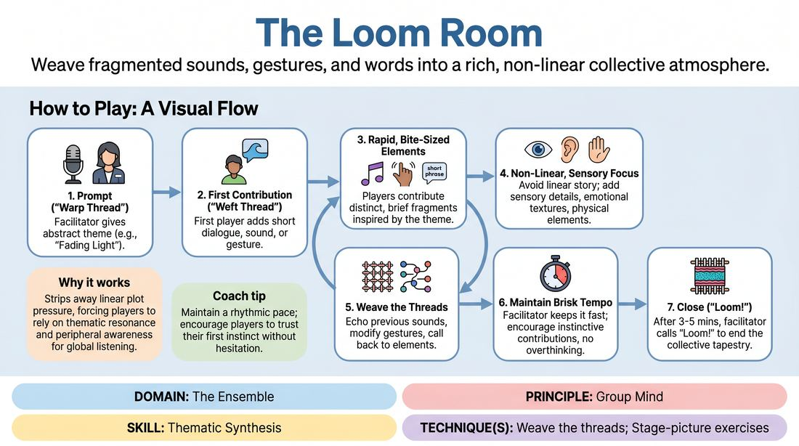

# The Loom Room

{ .game-hero }

> Weave fragmented sounds, gestures, and words into a rich, non-linear collective atmosphere.

## Overview
A fast-paced ensemble exercise where players construct a multi-sensory thematic environment rather than a linear story. Standing in a circle, participants contribute rapid, bite-sized fragments of sound, movement, or dialogue inspired by a central concept. The result is a rich, impressionistic tapestry of a shared world, built entirely through collective intuition.

## What It Trains
- **Domain:** D4 — The Ensemble
- **Principle(s):** Group Mind; Follow the Follower; Serve the Piece
- **Skill(s):** Unfiltered Spontaneity; Active Listening; Peripheral Awareness; Support Work; Pacing & Rhythm; Thematic Synthesis
- **Technique(s):** Stage-picture exercises; Thread-tracking drills; Callbacks & Mapping; Weave the threads
- **Focus:** connection

**Objective:** To develop Group Mind and thematic synthesis by training players to track, echo, and connect disparate physical and verbal threads without falling into traditional, sequential narrative habits.

## Setup
Players stand in a comfortable circle facing inward, ensuring everyone has clear sightlines and physical space to move. No props or materials are required. The facilitator stands ready to offer an abstract prompt and guide the pacing.

## How to Play
1. The facilitator introduces an evocative, abstract prompt (the 'warp thread') such as 'Fading Light' or 'A Clockwork Heart' to establish the core theme.
2. The first player initiates play by offering a single, brief contribution (the 'weft thread') which can be a short line of dialogue (under five words), a physical gesture, a sound effect, or a piece of silent object work.
3. Play moves rapidly around the circle, with each subsequent player immediately contributing their own distinct, bite-sized element inspired by either the original prompt or any of the preceding contributions.
4. Players must avoid building a linear, chronological story; instead, they should focus on adding sensory details, emotional textures, or physical elements that flesh out the atmosphere.
5. In subsequent rotations, players are encouraged to actively weave the threads by echoing previous sounds, repeating and modifying gestures, or calling back to earlier spoken phrases.
6. The facilitator maintains a brisk, rhythmic tempo, encouraging players to contribute instinctively without pausing to overthink or plan their input.
7. The game continues for three to five minutes of continuous, rapid-fire weaving until the facilitator calls 'Loom!' to bring the tapestry to a close.

## Facilitation Notes
- Side-coaching cue: 'Keep it brief!' Remind players that a single word, a sigh, or a simple hand movement is more valuable to the tapestry than a long sentence.
- Pitfall: Players trying to build a sequential plot (e.g., 'And then I opened the door'). Fix: Intervene gently and coach them to offer a sensory fragment instead, like the sound of a creaking hinge or the feeling of cold air.
- Side-coaching cue: 'Echo and vary.' Encourage players to take a physical gesture introduced by someone else and repeat it with a different speed, size, or emotional quality.
- Pitfall: Hesitation and overthinking, which breaks the rhythmic flow. Fix: Encourage players to jump in on impulse, reminding them that there are no 'wrong' threads in a tapestry.

## Variations
- Silent Tapestry: Play the game entirely without spoken words, relying solely on physical movement, facial expressions, and non-verbal vocalizations to build the atmosphere.
- Dynamic Scale (Zoom In/Out): The facilitator calls out 'Zoom In' to prompt players for hyper-specific, microscopic details, and 'Zoom Out' to shift contributions toward grand, sweeping, abstract concepts.
- Emotional Shift: Assign a collective emotional trajectory (e.g., starting with quiet curiosity, building to frantic tension, and resolving in serene stillness) that the ensemble must collectively navigate.
- Architectural Weaving: Players focus their contributions on physically defining and interacting with the invisible architecture, objects, and geography of the emerging space.

## Debrief
- What central themes, moods, or sensory environments emerged naturally without anyone planning them?
- How did it feel to contribute a tiny fragment rather than trying to control or drive a complete narrative?
- Where did you notice the 'Group Mind' taking over, where the ensemble instinctively aligned on a shift in tone or rhythm?
- How can we bring this style of non-linear, thematic support into our standard scene work?

## Safety & Inclusion
Ensure the physical space is clear of obstacles so players can move safely. If players have mobility or sensory limitations, encourage the group to adapt by emphasizing vocalizations, facial expressions, or small-scale gestures, ensuring all contributions are equally valued and integrated into the tapestry.

## Why It Works
By stripping away the pressure of linear plot progression, this game forces players to rely on pure thematic resonance and peripheral awareness. It exercises the 'Group Mind' because players must listen globally—not just to the person immediately before them, but to the entire history of the circle. This builds the habit of 'weaving' threads, teaching improvisers how to support a scene's atmosphere and subtext rather than just its literal action.
