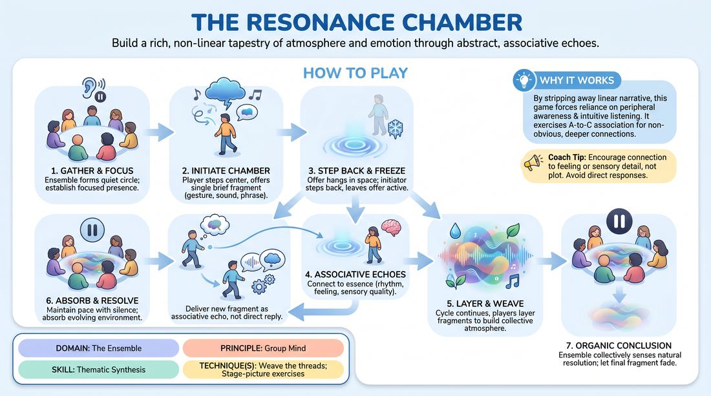

# The Resonance Chamber

{ .game-hero }

> Build a rich, non-linear tapestry of atmosphere and emotion through abstract, associative echoes.

## Overview
An ensemble-focused exercise where players construct a shared, atmospheric chamber using brief, non-linear fragments of sound, movement, or spoken word. Instead of building a direct narrative, players offer associative echoes that match the underlying feeling or sensory quality of previous contributions, cultivating a deep, intuitive group mind.

## What It Trains
- **Domain:** D4 — The Ensemble
- **Principle(s):** Group Mind; Follow the Follower; Serve the Piece; The First Thought Is a Gift
- **Skill(s):** Peripheral Awareness; Suggestion Deconstruction (A-to-C); Pacing & Rhythm; Thematic Synthesis; Unfiltered Spontaneity; Active Listening
- **Technique(s):** Stage-picture exercises; Thread-tracking drills; Premise brainstorm rounds; Weave the threads
- **Focus:** connection

**Objective:** To develop the ensemble's ability to synthesize abstract themes and track multiple emotional threads simultaneously, moving past literal yes-and responses into deep, non-linear group connection.

## At a Glance
| Aspect | Detail |
|---|---|
| Players | 4–8 (ideal 4-8) |
| Time | ~20 min |
| Complexity | 3/5 |
| Skill level | competent |
| Energy | medium |
| Physicality | medium |
| Modality | in_person |
| Space | moderate |
| Props | none |
| Audience | not required |

## Setup
Players stand in a loose, comfortable circle in a quiet, open space. No props or materials are required. The center of the circle serves as the active playing space.

## How to Play
1. Begin with the ensemble standing in a wide circle, facing inward, establishing a quiet, focused group presence.
2. One player steps into the center of the circle to initiate the chamber with a single, brief fragment—a physical gesture, a distinct sound, a short evocative phrase, or a silent emotional expression lasting no more than ten seconds.
3. The initiating player then freezes in place or steps subtly back to the edge of the circle, leaving their offer hanging in the space.
4. Any player who feels a strong intuitive connection to the previous offer steps forward to deliver a new fragment that acts as an associative echo rather than a literal continuation.
5. Ensure the echo connects to the essence of the previous offer—such as its rhythm, emotional undertone, or sensory imagery—without initiating direct dialogue or starting a linear scene.
6. Continue this cycle with players stepping in one by one, layering new fragments that build upon the collective atmosphere and weave together the emerging thematic threads.
7. Maintain a fluid but deliberate pace, allowing moments of silence between offers so the ensemble can fully absorb and feel the evolving environment before responding.
8. Conclude the exercise organically when the ensemble collectively senses a natural resolution or emotional saturation point, letting the final fragment fade into a shared, silent pause.

## Facilitation Notes
- Side-coach players to avoid literal narrative connections. If a player says 'It's cold out here,' the next player should not say 'Yes, put on a coat.' Instead, they should offer a physical shiver, a sound of wind, or a word like 'isolation' to echo the feeling.
- Encourage physical and vocal variety. Remind players that a fragment can be a simple posture shift, a rhythmic tap, or a single whispered word, keeping the contributions diverse and sensory.
- Watch for rushing. If players are stepping in too quickly, coach them to take one full breath after a fragment ends before anyone moves to offer the next echo.
- If the chamber becomes disjointed, pause and ask the players to identify the core emotion currently in the room, then resume with a focus on matching that specific emotional frequency.

## Variations
- Silent Resonance: Run the entire exercise without any spoken words, relying exclusively on physical movement, gestures, breath, and non-verbal sounds to build the atmosphere.
- Thematic Anchor: The facilitator provides a single abstract prompt (such as decay, anticipation, or gravity) that players must subtly weave into their associative fragments throughout the round.
- Collective Tableau: At any point, the facilitator can call 'Freeze,' prompting the entire group to instantly step in and form a unified physical tableau that captures the current emotional state of the chamber.

## Debrief
- How did it feel to connect through abstract association rather than logical, linear storytelling?
- What specific thematic threads or emotional shifts did you notice emerging and evolving throughout the chamber?
- How did you determine the right moment to step in, and how did you practice following the follower?
- What did you notice about the group's collective rhythm and how we arrived at our final resolution?

## Safety & Inclusion
Ensure players are mindful of physical spacing when stepping into the center, maintaining comfortable boundaries. Encourage participants to use low-impact movements and self-regulate their physical choices to accommodate all mobility levels.

## Why It Works
By stripping away the pressure of linear narrative and direct dialogue, this game forces players to rely on their peripheral awareness and intuitive listening. It exercises the A-to-C association skill, requiring players to find non-obvious but deeply felt connections. This shared focus on atmosphere and subtext builds a powerful sense of Group Mind, where the ensemble learns to serve the collective piece rather than individual ideas.
